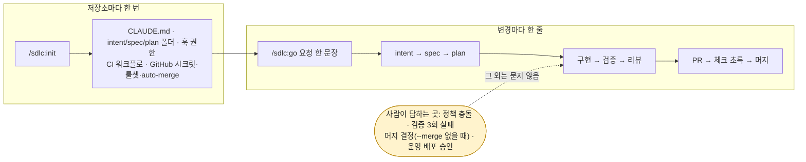

# ai-native-sdlc — Claude Code 플러그인 마켓플레이스

Anthropic 의 블로그 글 [The AI-native SDLC playbook](https://claude.com/blog/the-ai-native-sdlc-playbook)(Louis Claxton, 2026-08-21; acknowledgments Jim Blackhurst, Will Steuk, Jamal Arif)을
어느 저장소에나 설치할 수 있는 **Claude Code 플러그인**으로 옮긴 마켓플레이스입니다.
플레이북의 요지는 한 문장입니다. 코드 작성은 더 이상 병목이 아니므로, 그 앞뒤의 계획·검토·배포 단계도
같은 속도로 돌아가야 하고, 그 방법은 **모든 단계가 커밋되는 아티팩트로 끝나는 루프**(intent → spec → plan → diff+tests → PR+review → incident)를 만들되
사람은 판단이 필요한 지점에만 서 있는 것입니다.

쓰는 쪽에서 보이는 것은 두 명령입니다. 저장소마다 `/sdlc:init` 한 번, 변경마다 `/sdlc:go "요청 한 문장"` 한 줄. 훅 가드레일·AI 리뷰·evals·배포 게이트는 그 밑에서 플레이북대로 자동으로 걸립니다.



이 마켓플레이스에는 플러그인이 하나 있습니다.

| 플러그인 | 설명 | 설명서 |
|---|---|---|
| `sdlc` | `/sdlc:init` 한 번으로 새 프로젝트든 기존 프로젝트든 비파괴로 채택하고(GitHub 원격·1인 저장소·CI 인증 자동 감지, 시크릿·룰셋·auto-merge 설정), 변경마다 `/sdlc:go "요청 한 문장"` 이 intent → spec → plan → 구현 → 검증 → 리뷰 → PR 을 한 세션에서 끝냅니다. 스킬 19종(`/sdlc:run` 무인 루프 포함)·에이전트 5종·훅 7종·CI 템플릿 7종·기업 관리형 설정 템플릿 | [plugins/sdlc/README.md](plugins/sdlc/README.md) |

## 설치 (3줄)

```bash
claude plugin marketplace add freewisl/ai-native-sdlc   # 이 저장소(github.com). 로컬 체크아웃으로 시험할 때는 경로를 대신 넣습니다
claude plugin install sdlc@ai-native-sdlc
# 아무 저장소에서 claude 를 열고:  /sdlc:init   →   /sdlc:go "요청 한 줄" --autopilot --merge
```

`/sdlc:init` 이 GitHub 원격·협업자 수·보관된 구독 토큰을 감지해 워크플로·시크릿·룰셋·auto-merge 까지 설정하고 채택 커밋을 PR 로 올립니다. 사람이 하는 것은
계정당 한 번의 GitHub 로그인 승인과 구독 토큰 발급뿐입니다. 그 뒤로 `/sdlc:go` 는 정책 충돌 · 검증 3회 실패 · 머지(`--merge` 없을 때) · production 배포에서만 사람에게 묻습니다.
설치 후에는 어느 프로젝트에서든 `/sdlc:` 로 시작하는 스킬을 쓸 수 있고, 훅은 자동으로 등록됩니다.

## 설치 없이 로컬에서 시험

```bash
claude --plugin-dir /path/to/ai-native-sdlc/plugins/sdlc
```

플러그인 루트를 직접 지정하면 마켓플레이스에 등록하지 않고도 그 세션에서 스킬·훅·에이전트를 모두 사용할 수 있습니다.
플러그인을 고치면서 바로 확인할 때 쓰는 방법입니다. 매니페스트 검증은 다음과 같이 합니다.

```bash
claude plugin validate plugins/sdlc --strict
claude plugin validate . --strict          # 마켓플레이스(.claude-plugin/marketplace.json) 검증
```

## 팀·기업 배포

- **팀**: 프로젝트의 `.claude/settings.json` 에 `extraKnownMarketplaces` 와 `enabledPlugins` 를 넣으면 저장소를 여는 모든 팀원에게 설치가 안내됩니다.
- **기업**: 관리형 설정의 `strictKnownMarketplaces` 로 승인된 마켓플레이스만 허용하고, `disableSideloadFlags` 로 `--plugin-dir` 같은 우회를 막습니다.

자세한 절차는 [플러그인 README 의 설치 절](plugins/sdlc/README.md#설치)과 [docs/ENTERPRISE.md](docs/ENTERPRISE.md) 를 보십시오.

## 문서

| 문서 | 내용 |
|---|---|
| [plugins/sdlc/README.md](plugins/sdlc/README.md) | 플러그인 사용 설명서: 설치, 빠른 시작, 플레이 대응표, 스킬·훅 표, 설정 레퍼런스, CI 템플릿, 측정, FAQ |
| [docs/ENTERPRISE.md](docs/ENTERPRISE.md) | 규제 기업용 3계층(permissions / sandbox / managed) 배포 가이드, OTel, Managed MCP, Bedrock·Vertex·Foundry |
| [docs/PLAYBOOK-MAPPING.md](docs/PLAYBOOK-MAPPING.md) | 블로그 요구사항(R-ID) → 플러그인 구성요소 대응표(감사 산출물) |
| [docs/eli5.html](docs/eli5.html) | 그림으로 보는 설명(플레이북 6단계) |
| [docs/eli5-plugin.html](docs/eli5-plugin.html) | 그림으로 보는 설명(이 플러그인이 하는 일) |
| [plugins/sdlc/CHANGELOG.md](plugins/sdlc/CHANGELOG.md) | 변경 이력 |

## 저장소 구성

```
.claude-plugin/marketplace.json   마켓플레이스 매니페스트 (name: ai-native-sdlc)
plugins/sdlc/                     플러그인 루트 — skills/ agents/ hooks/ scripts/ templates/ evals/ tests/
docs/                             ENTERPRISE.md · PLAYBOOK-MAPPING.md · eli5.html · eli5-plugin.html
_workspace/                       요구사항 매트릭스·설계서·감사 보고·최종 검토와 반영 기록(작업 문서)
```

라이선스: MIT (`plugins/sdlc/LICENSE`). 원문 플레이북의 저작권은 Anthropic 에 있으며, 이 플러그인은 그 절차를 도구로 옮긴 것입니다.

## 갱신(릴리스) 절차

설치본은 마켓플레이스에서 **복사된 스냅숏**(`~/.claude/plugins/cache/ai-native-sdlc/sdlc/<version>/`)이라 소스를 고쳐도 자동 반영되지 않습니다. 바꾼 뒤에는:

```bash
# 1) 버전 올리기 — plugins/sdlc/.claude-plugin/plugin.json 과 .claude-plugin/marketplace.json 의 version (같은 버전이면 update 가 "already latest")
# 2) 사용자 쪽
claude plugin marketplace update ai-native-sdlc
claude plugin update sdlc@ai-native-sdlc      # → "Restart to apply changes"; 열려 있는 세션은 /reload-plugins 또는 재시작
```
`bash plugins/sdlc/tests/run.sh` 와 `claude plugin validate plugins/sdlc --strict` 를 통과한 뒤 올리십시오.
