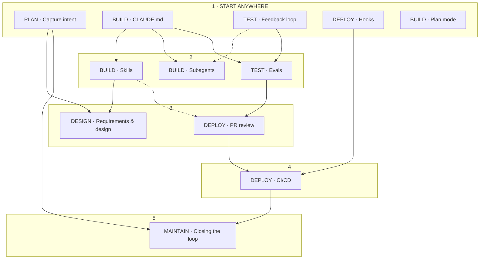

# 01 — Requirements matrix: "The AI-Native SDLC playbook" → Claude Code plugin

Source: Anthropic blog, "The AI-Native SDLC playbook" (Louis Claxton, August 21, 2026),
https://claude.com/blog/the-ai-native-sdlc-playbook — text dump `_workspace/blog_text.md`,
raw HTML `_workspace/blog_raw.html` (code blocks re-extracted from `<pre>` with original
indentation; four figures downloaded and read for captions, labels and the dependency graph).

Purpose: one row per distinct, checkable statement in the blog so a plugin implementing the
playbook can be audited line-by-line. Nothing here is invented; where a requirement is only
implied by the text (or by a figure) the Type is `implied`.

## 0. Legend

### 0.1 ID scheme
- `R-<stage>.<play>.<seq>` — stage plays (see play index below).
- `R-H.<section>.<seq>` — horizontal sections: `INTRO` (framing), `SHIFT` (shifts table),
  `ART` (artifact chain, play structure, triggers, audit trail = commit history),
  `DEP` (dependency graph / adoption order), `SOT` (legacy systems & source of truth —
  Stage 3 sidebar), `PERM` (permissions & sandbox layers — Stage 5 worked example
  "Managed settings for a regulated enterprise"), `MCP` (MCP surface across the blog),
  `OTEL` (OpenTelemetry / monitoring across the blog).
- `R-X.<seq>` — Resources & setup list at the end.

### 0.2 Play index (blog headings)
| Stage | Play | Blog heading |
|---|---|---|
| 1 Plan | 1.1 | Capture as intent.md |
| 2 Design | 2.1 | Requirements and design |
| 3 Build | 3.1 | Claude Code plan mode as the default starting point |
| 3 Build | 3.2 | Claude Code on auto mode |
| 3 Build | (H.SOT) | Sidebar: Legacy systems and the source of truth |
| 3 Build | 3.3 | The CLAUDE.md |
| 3 Build | 3.4 | Skills as institutional knowledge |
| 3 Build | 3.5 | Hooks as build-time guardrails |
| 3 Build | 3.6 | Parallel sessions and subagents |
| 4 Test | 4.1 | Give Claude a feedback loop |
| 4 Test | 4.2 | Continuous evals in CI |
| 5 Deploy | 5.1 | AI in the PR review loop |
| 5 Deploy | 5.2 | Hooks as approval gates |
| 5 Deploy | (H.PERM) | Worked example: Managed settings for a regulated enterprise |
| 5 Deploy | 5.3 | CI/CD integration and deployment |
| 6 Maintain | 6.1 | Maintenance and closing the loop / Closing the loop |
| 6 Maintain | 6.2 | Recurring codebase scans |
| 6 Maintain | 6.3 | Claude on call with Claude Tag |

### 0.3 Type vocabulary
`process` (a step or rule of procedure) · `artifact` (a file, template or field) · `infra`
(something that must exist in the environment) · `governance` (control, evidence, approver,
logging) · `measure` (leading / lagging indicator) · `doc` (narrative statement a plugin should
carry in its documentation) · `example-code` (a code block to be matched verbatim — see
Appendix) · `implied` (not stated outright; inferred from text or figure).

### 0.4 Row counts
| Section | Rows |
|---|---|
| Stage 1 Plan | 30 |
| Stage 2 Design | 21 |
| Stage 3 Build | 79 |
| Stage 4 Test | 35 |
| Stage 5 Deploy | 48 |
| Stage 6 Maintain | 46 |
| Horizontal (H.*) | 72 |
| Resources (X.*) | 18 |
| **Total** | **349** |

---

## 1. Horizontal — framing (R-H.INTRO)

| ID | Stage/Play | Type | Requirement | How a plugin could satisfy it | Acceptance check |
|---|---|---|---|---|---|
| R-H.INTRO.1 | Intro: Code is no longer the bottleneck | doc | The SDLC has six stages — planning, design, building, testing, deploying, maintaining. Traditionally each is a discrete phase owned by a different role (PMs write requirements, architects design, engineers build, QA at regulated enterprises verifies, release teams ship, operations monitors); work moves between phases through documents, tickets and sign-offs. | doc (plugin overview / README) | Overview names the six stages and the traditional handoff model. |
| R-H.INTRO.2 | Intro | doc | Traditional SDLC controls assume every step is performed by humans and were designed when writing code was the most time-consuming stage; PRDs, estimation rituals and product security reviews existed to force alignment across weeks/months/quarters of build. | doc | Overview states why the old controls existed. |
| R-H.INTRO.3 | Intro | doc | When code is no longer the bottleneck, three things become true: (1) the bottleneck moves to the steps left and right of build — mainly plan, review/test and deploy, which still run at human speed; (2) the controls stop matching reality — reviewing each line by hand can't keep up once agents write most of the diff; (3) governance costs increase because exceptions still route through meetings and committees that meet weekly or monthly. | doc | Overview lists the three consequences. |
| R-H.INTRO.4 | Intro (figure 1) | doc | Figure: "Before agents — every stage runs at human speed" vs "After agents — build runs at agent speed"; labels under stages: requirements (Plan/Design), review (Test), release (Deploy); "cycle time reclaimed". Caption: "Build is no longer the constraint — the human-speed steps around it are. Human-speed stages keep their length while build collapses to hours." | doc | Overview reproduces the claim (text or diagram). |
| R-H.INTRO.5 | Intro | doc | Security-bottleneck example: security teams are sized for human output, so when agents multiply code output either the review queue builds or code ships under-reviewed; a regulated organization can't accept either, so security and policy checks have to keep pace with the agents. | doc | Rationale for automated security/policy checks present. |
| R-H.INTRO.6 | What is an AI-native SDLC? | doc | The AI-native SDLC combines the old control objectives with new enforcement; the linear flow becomes a loop with AI embedded at each point; it promotes automated handover and triggering of subsequent plays. Also called the agentic SDLC, the AI SDLC, or agentic software development. | doc | Definition and synonyms present. |
| R-H.INTRO.7 | What is an AI-native SDLC? (figure 2) | doc | Figure: "Traditional — the line. One slow loop back is a new release cycle." vs "AI-native — the loop. Hours, not weeks, with humans above the loop instigating, directing and governing." (Plan → Design → Build → Test → Deploy → Maintain → Plan, Claude at the centre). | doc | Line-vs-loop framing and "humans above the loop" present. |
| R-H.INTRO.8 | Closing thoughts | doc | The transformation keeps human judgement central and considers governance and regulation requirements of large enterprises. "The loop keeps running. Human judgement stays above it." | doc | README states the human-judgement principle. |

## 2. Horizontal — the shifts table (R-H.SHIFT)

| ID | Stage/Play | Type | Requirement | How a plugin could satisfy it | Acceptance check |
|---|---|---|---|---|---|
| R-H.SHIFT.1 | Shifts table — Plan | doc | Traditional: "Requirements gathered by committee, distilled through workshops and sign-offs, written up by hand". AI-native: "Claude synthesizes pain points straight from the sources and captures them within intent.md which is human readable and machine actionable". | doc + template (intent.md) | Table row present; intent.md template exists. |
| R-H.SHIFT.2 | Shifts table — Design | doc | Traditional: "Spec written by analysts, parsed by designers". AI-native: "Requirements and design compressed into one working session with an agent, guided by standards encoded as skills, versioned in git". | doc | Table row present. |
| R-H.SHIFT.3 | Shifts table — Build | doc | Traditional: "Tests and code are handwritten and documentation is written after the main development happens". AI-native: "Tests and code are generated by AI and institutional knowledge is maintained as versioned machine-readable CLAUDE.md files and skills". | doc | Table row present. |
| R-H.SHIFT.4 | Shifts table — Test | doc | Traditional: "QA gates at stage boundaries". AI-native: "Continuous evals woven through implementation". | doc | Table row present. |
| R-H.SHIFT.5 | Shifts table — Deploy | doc | Traditional: "Humans review every line of code and governance occurs in review cycles, often inconsistently". AI-native: "Layers of agentic review with human review reserved for regulated and critical code. Governance is enforced as the AI acts, with hooks as approval gates". | doc | Table row present. |
| R-H.SHIFT.6 | Shifts table — Maintain | doc | Traditional: "Humans watch production for bugs". AI-native: "Agents monitor live deployments. Any breached control band is diagnosed and written back into the loop as a new intent.md". | doc | Table row present. |
| R-H.SHIFT.7 | Shifts table | doc | The table shows the ends of the spectrum; "Most organizations sit somewhere between the two columns." | doc | Adoption described as a spectrum, not binary. |

## 3. Horizontal — artifact chain, play structure, triggers, audit trail (R-H.ART)

| ID | Stage/Play | Type | Requirement | How a plugin could satisfy it | Acceptance check |
|---|---|---|---|---|---|
| R-H.ART.1 | Artifact chain | governance | The committed artifact is the thread through the AI-native column: "Each stage ends by writing one to version control … and the next stage begins by reading it." | skills (every stage skill ends with a commit and starts by reading the prior artifact) | Each stage skill's final step commits; its first step reads the upstream file. |
| R-H.ART.2 | Artifact chain | artifact | The named artifacts: intent.md, spec.md, plan.md, the diff and its tests, the PR with its review findings, and the incident record. | templates (intent.md, spec.md, plan.md) + PR/CI conventions | Templates exist for the three .md artifacts; PR/incident conventions documented. |
| R-H.ART.3 | Artifact chain | doc | For the early stages .md files are the predominant artifact because a product owner and an agent can both read and act on the same file; from Build onward the artifact is code and its records. | doc | Documented. |
| R-H.ART.4 | Audit trail = commit history | governance | "The chain of commits is also the audit trail: who asked for what, what the agent produced, and who approved it." and "Together, the intent, the spec, the plan, the diff and the review findings are the audit trail." | skills commit artifacts (preserving author/timestamp) + doc | Artifacts are committed, not left as loose files; author and timestamp recoverable from git log. |
| R-H.ART.5 | Accountability | governance | "Humans remain accountable for every decision that requires judgment." Human attention shifts along with the artifacts that must be reviewed. | doc; every gate names a human approver | Each play doc names who approves. |
| R-H.ART.6 | Plays — stage triggers | process | "An accepted intent.md triggers the requirements and design pass, an approved spec.md triggers plan mode, a merged PR triggers the pipeline, and a breached control band in production writes the next intent.md and so the loop continues." | skills (manual) + CI templates (automated triggers) | Trigger map documented; CI templates exist for intent-merge → spec job and band-breach → intent. |
| R-H.ART.7 | Plays — adoption path | process | "First, you prompt each step by hand with the end state being a loop in which each accepted artifact fires the next gate. Human attention concentrates at the gates, reviewing what the agent flagged rather than starting each stage from scratch." | slash commands (manual path) + CI templates (automated path) | Both a manual command and an automation template exist per stage transition. |
| R-H.ART.8 | Plays — structure | doc | Each play covers: What changes; Getting started (Prerequisites, Infrastructure); Concrete steps for implementation; Governance considerations; How you measure whether it worked (leading and lagging indicator). | doc (per-play docs share this structure) | Every play doc has these sections. |
| R-H.ART.9 | Plays — modularity | doc | "The steps are modular and organizations may choose to prioritize transforming different stages at different times"; each play names its dependencies under "Prerequisites". | doc | Each play doc has a Prerequisites line. |
| R-H.ART.10 | Plays — stages | doc | Plays are grouped into six non-linear stages (Plan, Design, Build, Test, Deploy, Maintain) covering the complete lifecycle. | doc; plugin layout mirrors six stages | Plugin structure/indices organised by the six stages. |

## 4. Horizontal — dependency graph & adoption order (R-H.DEP)

Source: figure 3 (2048×1638 PNG, no alt text; transcribed by reading the image) plus its caption:
"The plays are listed with stage; the arrows give the order to adopt them in. The two are not the
same. Start with any clay play — nothing points into it, so it needs nothing first. For any other
play, the arrows pointing into it are the plays to adopt before it." Full transcription in Appendix A.16.

| ID | Stage/Play | Type | Requirement | How a plugin could satisfy it | Acceptance check |
|---|---|---|---|---|---|
| R-H.DEP.1 | Dependency graph | doc | A play's stage and its adoption order are not the same thing; arrows give the order to adopt. "Start with any clay play — nothing points into it, so it needs nothing first." (clay = the orange level-1 boxes). | doc (adoption guide) | Guide separates stage membership from adoption order. |
| R-H.DEP.2 | Graph level 1 "START ANYWHERE" | process | Five entry plays with no incoming arrows: PLAN Capture intent; BUILD CLAUDE.md; TEST Feedback loop; DEPLOY Hooks; BUILD Plan mode. | doc + onboarding command listing them | Guide names exactly these five as start-anywhere. |
| R-H.DEP.3 | Graph level 2 | process | BUILD Skills ← BUILD CLAUDE.md (solid arrow). Note: text prerequisites for Skills say "None required. Having a CLAUDE.md helps … but a skill does not depend on it" — record both. | doc | Skills doc lists CLAUDE.md as helpful; graph edge noted. |
| R-H.DEP.4 | Graph level 2 | process | BUILD Subagents ← CLAUDE.md (solid) and ← TEST Feedback loop (dotted = "also helps"). | doc | Documented. |
| R-H.DEP.5 | Graph level 2 | process | TEST Evals ← CLAUDE.md (solid) and ← Feedback loop (solid). | doc | Documented. |
| R-H.DEP.6 | Graph level 3 | process | DESIGN Requirements & design ← PLAN Capture intent (solid) and ← BUILD Skills (solid). | doc | Documented. |
| R-H.DEP.7 | Graph level 3 | process | DEPLOY PR review ← TEST Evals (solid) and ← BUILD Skills (dotted). Text prerequisites additionally name "An updated CLAUDE.md file from Stage 3: Build; skills if the review passes enforce written policies, defined subagents." — record both. | doc | PR-review doc lists graph edges and text prerequisites. |
| R-H.DEP.8 | Graph level 4 | process | DEPLOY CI/CD ← DEPLOY PR review (solid) and ← DEPLOY Hooks (solid). | doc | Documented. |
| R-H.DEP.9 | Graph level 5 | process | MAINTAIN Closing the loop ← DEPLOY CI/CD (solid) and ← PLAN Capture intent (solid). | doc | Documented. |
| R-H.DEP.10 | Graph — plays without a node | implied | Not drawn in the graph: Auto mode, the source-of-truth sidebar, Hooks as build-time guardrails, the managed-settings worked example, Recurring codebase scans, Claude Tag. Their ordering must come from their own text prerequisites (e.g. scans: PR review gate + hooks + intent.md format), not from invented graph positions. | doc | Adoption guide does not fabricate positions for these. |
| R-H.DEP.11 | Recommended adoption order | process | Follow the arrows level by level: (1) any of the five start-anywhere plays → (2) Skills, Subagents, Evals → (3) Requirements & design, PR review → (4) CI/CD → (5) Closing the loop. | doc (onboarding checklist) | Checklist ordered this way. |
| R-H.DEP.12 | Resources ordering | doc | The resources list at the end is "in roughly the order you would roll them out" (admin setup → settings → managed settings → permissions → sandboxing → hooks → skills → plugins/marketplaces → managed MCP → enterprise deployment → network → monitoring → analytics → compliance API → security model). | doc (platform setup guide) | Setup guide follows this order. |

## 5. Horizontal — legacy systems and the source of truth (R-H.SOT; Stage 3 sidebar)

| ID | Stage/Play | Type | Requirement | How a plugin could satisfy it | Acceptance check |
|---|---|---|---|---|---|
| R-H.SOT.1 | Sidebar (Stage 3) | governance | "Applies to every artifact the process produces." Existing systems already track artifacts — work items in Jira, requirements in a tool with regulatory traceability, designs in Figma, change approvals with a change board — and are hard to displace because auditors and regulators accept them and other teams depend on them; the AI-native SDLC has to fit around what exists. | doc | Documented. |
| R-H.SOT.2 | Sidebar | governance | "for every artifact the process produces, name one system as the source of truth, with everything else holding a copy or a link to the original"; the choice may differ per artifact. | template/config (per-artifact source-of-truth declaration) + doc | A place exists to declare source of truth per artifact (e.g. a config file or template field). |
| R-H.SOT.3 | Sidebar — option A | process | The repo as the source of truth: markdown artifacts are the authoritative record and the legacy system references files within commits; cleanest for engineering-led organizations — all records in one tool with one timestamp authority. | doc / selectable mode | Option documented. |
| R-H.SOT.4 | Sidebar — option B | process | The legacy system as the source of truth: Jira, ServiceNow or the requirements tool holds the authoritative record; markdown artifacts are working copies; "Claude reads the record at the start of the session and writes the outcome back through an MCP connector in the same session that produced the spec or the plan." | skill steps (read record first, write back last) + MCP integration doc | Design/plan skills contain read-at-start and write-back-at-end steps when this mode is chosen. |
| R-H.SOT.5 | Sidebar — option C | process | Linkage as the minimum bar: "All artifacts note the record ID and all legacy records contain the commit SHA of the markdown file." Good starting point, accepting two sources of truth. | template field (record ID) + doc (write SHA back) | intent/spec/plan templates carry a record-ID field. |
| R-H.SOT.6 | Sidebar | governance | Both systems can coexist "so long as there is a link between the two or one is declared the source of truth." | doc | Documented. |
| R-H.SOT.7 | Stage 1 cross-reference | doc | Stage 1 Infrastructure: "The Stage 3: Build sidebar covers how this home relates to a Jira or requirements tool that already holds the record." | doc link | Stage 1 doc links to the source-of-truth section. |

## 6. Horizontal — permissions & sandbox layers (R-H.PERM; Stage 5 worked example)

| ID | Stage/Play | Type | Requirement | How a plugin could satisfy it | Acceptance check |
|---|---|---|---|---|---|
| R-H.PERM.1 | Worked example: Managed settings for a regulated enterprise | governance | "Deployed by the platform team via MDM or the admin console; engineers cannot edit or override any of it." | example file (e.g. `examples/managed-settings.json`) + doc | File shipped with deployment instructions; not placed in project/user settings. |
| R-H.PERM.2 | Worked example | example-code | The full managed settings JSON (Appendix A.12) reproduced verbatim. | example file | Content matches Appendix A.12. |
| R-H.PERM.3 | permissions.deny | governance | `"deny": ["Read(.env*)", "Read(./secrets/**)", "WebFetch", "Bash(curl *)", "Bash(wget *)"]` — "keeps secrets out of the agent's context and blocks arbitrary network egress through tools". | example file + doc | Keys/values present with explanation. |
| R-H.PERM.4 | permissions.allow | governance | `"allow": ["Bash(git *)", "Bash(make build)", "Bash(make test)", "Bash(make lint)"]` — "pre-approves the safe inner loop so the deny list doesn't turn into prompt fatigue". | example file + doc | Present. |
| R-H.PERM.5 | disableBypassPermissionsMode / allowManagedPermissionRulesOnly | governance | `"disableBypassPermissionsMode": "disable"` plus `"allowManagedPermissionRulesOnly": true` "means no engineer, project file or command-line flag can widen the rules". | example file + doc | Present. |
| R-H.PERM.6 | sandbox (network) | governance | `"sandbox": {"enabled": true, …, "network": {"allowedDomains": ["git.internal.example.com", "registry.npmjs.org"]}}` — "closes the gap permissions cannot. A tool-level deny on WebFetch doesn't stop a shell command reaching the network; the OS-level domain allowlist blocks egress outright." | example file + doc | Present. |
| R-H.PERM.7 | sandbox gate | governance | `"failIfUnavailable": true` and `"allowUnsandboxedCommands": false` "make the sandbox a gate: Claude Code refuses to start when the sandbox cannot initialize, and a command that fails inside the sandbox cannot be retried outside it." | example file + doc | Present. |
| R-H.PERM.8 | sandbox.credentials | governance | `"credentials": {"files": [{"path": "~/.ssh", "mode": "deny"}, {"path": "~/.aws/credentials", "mode": "deny"}], "envVars": [{"name": "GITHUB_TOKEN", "mode": "deny"}]}` — permissions.deny governs Claude's file tools but a sandboxed shell command could still read ~/.ssh or ~/.aws/credentials; "this block denies those reads and strips the named secrets from the environment of every sandboxed command." | example file + doc | Present. |
| R-H.PERM.9 | allowManagedHooksOnly | governance | `"allowManagedHooksOnly": true` "means the approval gates from this play are the only hooks that run; nothing local can add to or replace them." | example file + doc | Present. |
| R-H.PERM.10 | disableSideloadFlags / strictKnownMarketplaces | governance | `"disableSideloadFlags": true` and `"strictKnownMarketplaces": [{"source": "github", "repo": "example-corp/approved-plugins"}]` "mean every skill, agent, hook and MCP server on an engineer's machine arrived through the organization's approved plugin marketplace, never from a home directory." | example file + plugin distribution doc | Present; plugin README explains marketplace distribution. |
| R-H.PERM.11 | allowManagedMcpServersOnly | governance | `"allowManagedMcpServersOnly": true` "makes the agent's tool surface an allowlist owned by the platform team." | example file + doc | Present. |
| R-H.PERM.12 | requiredMinimumVersion | governance | `"requiredMinimumVersion": "2.1.193"` "refuses to start on a version below the approved floor, so the controls are enforced by a build the organization has actually assessed." | example file | Present. |
| R-H.PERM.13 | Caveat | governance | "Consider the above a starting point to tailor, rather than a recommendation to copy. Every deny trades against capability, and the right balance depends on the data classification of the repo." | doc (header comment / README) | Caveat present next to the example. |
| R-H.PERM.14 | Reference | doc | "The settings reference documents every key, including the managed-only ones: code.claude.com/docs/en/settings". | doc link | Link present. |
| R-H.PERM.15 | Interaction with team hooks | implied | Because `allowManagedHooksOnly` means "nothing local can add to or replace" hooks, the team-level hooks the plugin ships in `.claude/settings.json` (R-5.2.7) will not run in an organization that sets it; such organizations must deliver the plugin's gate hooks through managed settings / the approved marketplace. | doc | Plugin doc flags this deployment consideration. |
| R-H.PERM.16 | Permission tuning for parallel sessions | governance | Stage 3.6 Infrastructure: "permission settings tuned so sessions are not waiting on approval prompts for commands the organization considers safe." | settings template (`permissions.allow` for safe inner loop) | Template exists. |

## 7. Horizontal — MCP surface (R-H.MCP)

| ID | Stage/Play | Type | Requirement | How a plugin could satisfy it | Acceptance check |
|---|---|---|---|---|---|
| R-H.MCP.1 | 1.1 infra | infra | "a connector to the version-control system (e.g. GitHub) lets Claude commit markdown files on their behalf from claude.ai or Cowork" for contributors without git experience. | external product – document only | Documented in Stage 1 setup. |
| R-H.MCP.2 | H.SOT option B | infra | Claude "writes the outcome back through an MCP connector in the same session that produced the spec or the plan" when a legacy system is the source of truth. | doc + skill step | Documented; skill step present when mode selected. |
| R-H.MCP.3 | 4.1 infra | infra | For UI work "a way for Claude to see the result is crucial, either a browser tool or a screenshot utility wired in via MCP." | doc (+ optional `.mcp.json` example) | Documented. |
| R-H.MCP.4 | 5.3 step 4 / infra | infra | "Expose deployment through MCP. Deploy, status, and rollback become tools, scoped per environment, so the agent's deployment powers are an allowlist rather than a shell script with credentials." Infrastructure: "MCP servers for the deployment targets". | doc (external MCP servers – document only) | Documented with per-environment scoping. |
| R-H.MCP.5 | H.PERM.11 / Resources | governance | `allowManagedMcpServersOnly` and the Managed MCP doc ("central control of the agent's tool surface", code.claude.com/docs/en/managed-mcp). | example file + doc link | Present. |
| R-H.MCP.6 | 6.3 | infra | "Through access to MCP Claude verifies the metric is back at baseline and confirms it in the thread"; "Tagged on a ticket over MCP, … Claude triages the work the same way." | external product – document only | Documented. |

## 8. Horizontal — OpenTelemetry / monitoring / logging (R-H.OTEL)

| ID | Stage/Play | Type | Requirement | How a plugin could satisfy it | Acceptance check |
|---|---|---|---|---|---|
| R-H.OTEL.1 | 4.1 governance "Where it is logged" | infra | The session transcript, "which the OpenTelemetry export forwards to the organization's observability stack", and the PR's check run. | doc (enable OTel export; link code.claude.com/docs/en/monitoring-usage) | Doc explains enabling the export. |
| R-H.OTEL.2 | 3.6 leading indicator | measure | Concurrent sessions per engineer "counted from the OpenTelemetry export". | measurement guide | Guide names OTel export as the data source. |
| R-H.OTEL.3 | 5.2 leading indicator | measure | "Every hook decision is written to the OpenTelemetry export with a timestamp and an allow or block verdict, so the wait is visible per gate." | measurement guide + hook logging | Guide names the source; hooks emit decision + timestamp. |
| R-H.OTEL.4 | 3.4 governance | governance | "Skill invocations are logged in session traces". | doc | Documented. |
| R-H.OTEL.5 | 3.6 governance | governance | "what a session does is logged and attributed to the engineer who ran it." | doc | Documented. |
| R-H.OTEL.6 | 6.1 governance | governance | "Invocations, findings and triage decisions are logged with a timestamp." | runner script logging | Runner writes timestamped log entries. |

## 9. Stage 1 — Plan (R-1.1 Capture as intent.md)

| ID | Stage/Play | Type | Requirement | How a plugin could satisfy it | Acceptance check |
|---|---|---|---|---|---|
| R-1.1.1 | 1.1 stage summary | doc | "Ideas stop waiting for someone to write them up. Intent is captured once, in the originator's own words, as a version-controlled artifact the next stage can act on." | doc | Stage doc carries the summary. |
| R-1.1.2 | 1.1 entry routes | process | intent.md can enter through different routes: "A person has an idea, a ticket is filed, or an incident is surfaced via an alert (see Stage 6: Maintenance)." | skill accepts idea / ticket / incident as input | Skill or doc names the three entry routes. |
| R-1.1.3 | 1.1 | process | When a person has an idea they brainstorm with Claude and produce a markdown proto-spec; "The proto-spec generated by Claude is human readable, version-controlled, and immediately consumable by the next stage. The proto-spec is saved as an intent.md." | skill (e.g. `/intent`) | Skill produces intent.md. |
| R-1.1.4 | 1.1 | governance | "Regardless of whether the intent originates from an event trigger or an agent, the same steps apply: the product owner reviews and corrects the agent-written intent.md before it is committed." | skill step + doc | PO review/correction step exists before commit, including for agent-originated intents. |
| R-1.1.5 | 1.1 Traditional vs AI-native | doc | Traditional: idea passes through backlog entries, user stories, story points, refinement meetings; ownership transfers at each handoff. AI-native: originator brainstorms with Claude and writes intent.md, "a proto-spec in the originator's own terms. The artifact contains what is wanted, why, and under which constraints. Repeat processes are encoded via skills." | doc | Play doc carries both columns. |
| R-1.1.6 | 1.1 artifact content | artifact | intent.md contains what is wanted, why, and under which constraints. | template | Template fields cover want/why/constraints. |
| R-1.1.7 | 1.1 prerequisites | process | "Prerequisites: None." | doc | Documented. |
| R-1.1.8 | 1.1 infrastructure | infra | "Claude access for people who are not engineers (claude.ai or Cowork)". | external product – document only | Listed. |
| R-1.1.9 | 1.1 infrastructure | artifact | "an agreed intent.md template". | template file | Template shipped. |
| R-1.1.10 | 1.1 infrastructure | infra | "a shared, version-controlled home for intent that the product owner watches." | scaffold script / doc | Scaffold creates the home. |
| R-1.1.11 | 1.1 infrastructure | infra | "For a single product the simplest home is an intent/ folder in the product repo. This setup keeps the artifact chain next to the code derived from it. A dedicated intent repo is only worth the overhead when intent spans many repositories, and in a monorepo it is a directory." | scaffold default `intent/` + doc on alternatives | Default path is `intent/`; alternatives documented. |
| R-1.1.12 | 1.1 setup | process | Setup is "a one-time task for the platform or engineering team. A technical team member needs to stand up the intent home and decide who can write to it, since many contributors will come from across the organization." | setup guide | Guide includes write-access decision. |
| R-1.1.13 | 1.1 setup | infra | "contributors without git experience don't need to use git directly. Instead a connector to the version-control system (e.g. GitHub) lets Claude commit markdown files on their behalf from claude.ai or Cowork." | external product – document only | Documented. |
| R-1.1.14 | 1.1 step 1 | process | "The originator describes the problem to Claude in their own words. The originator may describe what they cannot do today, who is affected by the idea, what better looks like, or what is out of scope. No formal language is required." | skill opening prompt | Skill invites these four aspects without formal language. |
| R-1.1.15 | 1.1 step 2 | process | "Brainstorm until the idea is concrete. Claude asks the questions an analyst would ask: scope, users, constraints, and what success looks like." | skill | Skill instructs Claude to probe scope, users, constraints, success. |
| R-1.1.16 | 1.1 step 3 | process | "Ask Claude to write the result as intent.md using the organization's template, which can be encoded as a skill set up by a technical team member and signed off by a lead. This can cover the problem, proposed outcome, affected users and systems, constraints, and open questions." | skill + template | Skill writes the template's sections; template ownership/sign-off documented. |
| R-1.1.17 | 1.1 step 4 | process | "The originator corrects anything Claude misunderstood." | skill step | Skill pauses for originator correction. |
| R-1.1.18 | 1.1 step 5 | process | "Commit intent.md to the shared home. Author and timestamp join the record, and the product owner picks the idea up from there." | skill commit step | Skill commits (author/timestamp in git). |
| R-1.1.19 | 1.1 intent.md example | artifact | Header: `# Intent: <title>` followed by `Author: <name> (<team>). Status: draft.` | template | Template has title, Author line, Status. |
| R-1.1.20 | 1.1 intent.md example | artifact | Section `## Problem`. | template | Present. |
| R-1.1.21 | 1.1 intent.md example | artifact | Section `## Proposed outcome`. | template | Present. |
| R-1.1.22 | 1.1 intent.md example | artifact | Section `## Affected users and systems`. | template | Present. |
| R-1.1.23 | 1.1 intent.md example | artifact | Section `## Constraints`. | template | Present. |
| R-1.1.24 | 1.1 intent.md example | artifact | Section `## Open questions`. | template | Present. |
| R-1.1.25 | 1.1 intent.md example | example-code | Full example (Appendix A.1) — "claims status self-service", J. Ortiz, five sections with sample content. | example file | Matches Appendix A.1. |
| R-1.1.26 | 1.1 governance | governance | "The evidence is the committed intent.md, which lists the author, the timestamp and the full revision history. It's logged in the git history of the intent home." | skill commits; doc | Verifiable from git log. |
| R-1.1.27 | 1.1 governance | governance | "The product owner approves, and the accept or reject decision that sends the intent into Stage 2: Design is recorded as the merge or the closing review." | PR-based acceptance flow + doc | Intent accepted by merge / rejected by closed review. |
| R-1.1.28 | 1.1 leading indicator | measure | "Time from first conversation to a committed intent.md, read from git history on the intent home, which records author and time stamp. The expectation is to fall from a multi-week elicitation and refinement cycle to hours." | measurement doc / script over git log | Metric defined with source. |
| R-1.1.29 | 1.1 lagging indicator | measure | "The survival rate, or the share of intent.md files that the product owner accepts into Stage 2: Design rather than closes." (merge vs closed review). | measurement doc / script | Metric defined. |
| R-1.1.30 | 1.1 lagging indicator (2) | measure | "the number of changes made to the intent.md that are made after the first spec.md commit for the same change." | measurement script over git log | Metric defined. |

## 10. Stage 2 — Design (R-2.1 Requirements and design)

| ID | Stage/Play | Type | Requirement | How a plugin could satisfy it | Acceptance check |
|---|---|---|---|---|---|
| R-2.1.1 | 2.1 stage summary | doc | "Requirements and design collapse into one session. Policy is applied while the spec is written, not discovered in a review weeks later." | doc | Stage doc carries the summary. |
| R-2.1.2 | 2.1 | process | "Once approved by the product owner, Claude takes the accepted intent.md and produces a requirements and design spec. This is guided by the organization's skills for brand, security, compliance, and UX." | skill (e.g. `/spec`) that loads org policy skills | Skill reads intent.md and applies the four policy areas. |
| R-2.1.3 | 2.1 | governance | "The product owner reviews that spec, but doesn't write it. The goal … is to create a spec the engineering team can plan against, with flagged areas of concern." | skill output + spec template | spec.md has an areas-of-concern section. |
| R-2.1.4 | 2.1 front-end | process | "Once the intent.md is accepted, the product owner mocks the design up in Claude Design (beta) from the intent.md, iterates on the mock, and then exports it to Claude Code to build." | external product – document only | Documented. |
| R-2.1.5 | 2.1 Traditional vs AI-native | doc | Traditional: separate phases/teams, "slow and lossy". AI-native: "Both phases happen in a single prompted session. Claude takes intent.md and produces a requirements and design spec, constrained by the organization's skills, with areas of concern flagged." | doc | Play doc carries both. |
| R-2.1.6 | 2.1 prerequisites | process | "Write an intent.md file, with brand, security, compliance, and UX policies written as skills." | doc + skill pre-check | Skill checks intent.md exists and reports which policy skills are loaded. |
| R-2.1.7 | 2.1 infrastructure | infra | "A product owner with Claude access. No engineering skill is required." | doc | Documented. |
| R-2.1.8 | 2.1 step 1 | process | "The product owner opens a session with the organization's skills available and attaches the intent.md." | skill (takes intent path) | Skill accepts the intent file. |
| R-2.1.9 | 2.1 step 2a | process | The PO's prompt "points at the intent.md, names the constraints, and demands flagged concerns. Run it by hand at first, then codify it as an organization-level slash command." | slash command | Command exists. |
| R-2.1.10 | 2.1 step 2b (automation) | process | "make the acceptance of intent.md in the intent home the trigger, with a non-interactive job that fires on the merge, run the pass with the organization's skills loaded, and commit spec.md as a pull request (the CI/CD play … covers the plumbing). From that point the product owner's first involvement is the review." | CI template (on merge to intent/** → `claude -p` → PR with spec.md) | Workflow template present. |
| R-2.1.11 | 2.1 step 3 | process | "The same product owner reviews the spec against the idea. Does the spec solve the stated problem, and are the open questions from intent.md answered or carried forward?" | review checklist (doc / skill) | Checklist has both questions. |
| R-2.1.12 | 2.1 step 4 | process | "Work through the flagged concerns first as they are the points an analyst would have escalated. The product owner resolves each one with its policy owner before engineering sees the spec." | spec template (concern → policy owner) + doc | Concerns carry a policy-owner field. |
| R-2.1.13 | 2.1 step 5 | process | "Commit spec.md alongside intent.md. The file pair records what was asked for and what was decided." | skill commit step | spec.md committed next to intent.md. |
| R-2.1.14 | 2.1 step 6 | governance | "The product owner decides whether the spec and intent progress to build, consulting a technical lead for anything the organization classes as higher risk. A human team mate always makes this call, and accepting the spec is what starts the plan mode play in Stage 3: Build." | doc (human gate) | Human decision step documented; no auto-progression. |
| R-2.1.15 | 2.1 the prompt | example-code | Verbatim prompt (Appendix A.2): "Read the attached intent.md and produce a requirements and design spec for integrating it into our existing codebase. Apply the skills available to you so the plan conforms to our brand guidelines, security policies and UX standards. Document the spec fully as spec.md, ready to hand to the engineering team. Describe clearly any areas of concern, especially where you cannot satisfy contradicting policies." | skill / command prompt | Prompt text matches. |
| R-2.1.16 | 2.1 governance | governance | "the live policy is read and applied while the spec is written. The organization's skills are applied as constraints on the spec." | skill loads policy skills | Verified in skill body. |
| R-2.1.17 | 2.1 governance | governance | "The spec, the prompt that produced it, and the skill versions in force are all logged in version control." | skill records prompt + skill versions (spec footer or commit message) | spec.md or its commit references prompt and skill versions. |
| R-2.1.18 | 2.1 governance | governance | "The product owner signs off the spec, and routes flagged concerns to the named policy owners." | template + doc | Concern routing documented. |
| R-2.1.19 | 2.1 leading indicator | measure | "Elapsed time between the intent.md commit and the spec.md commit for the same change (two git timestamps), compared with the old requirements-plus-design cycle." | measurement script | Metric defined. |
| R-2.1.20 | 2.1 lagging indicator | measure | "Requirements rework after build starts. Count spec.md commits dated after the first plan.md commit for the same change. Git log will give this directly." | measurement script | Metric defined. |
| R-2.1.21 | 2.1 spec.md content | implied | No spec.md example is given; from the text a spec.md must hold: requirements + design for integrating into the existing codebase; conformance to brand/security/compliance/UX skills; flagged areas of concern (especially contradicting policies) with policy owner; intent's open questions answered or carried forward. | template | spec.md template has these sections. |

## 11. Stage 3 — Build

### 11.1 R-3.1 Claude Code plan mode as the default starting point

| ID | Stage/Play | Type | Requirement | How a plugin could satisfy it | Acceptance check |
|---|---|---|---|---|---|
| R-3.1.1 | 3 stage summary | doc | "Nothing is implemented without an accepted plan. Institutional knowledge becomes files the agent reads, and the guardrails run as code rather than as habits." | doc | Stage doc carries the summary. |
| R-3.1.2 | 3.1 | process | "Engineers start Claude Code sessions in plan mode, give Claude the approved spec.md from Stage 2: Design, and let it interview them, iterating on the plan until the engineer is happy with it." | doc + skill/command (plan-mode workflow) | Documented; skill instructs interview loop. |
| R-3.1.3 | 3.1 Traditional vs AI-native | doc | Traditional: how the change will be made stays in the engineer's head or a ticket comment; first thing a reviewer sees is the finished diff. AI-native: "Work starts with a written plan that Claude produces in plan mode, where it can read the codebase without changing anything. The engineer corrects the plan before code is written, and the approved version is committed as plan.md for later stages to check against." | doc | Play doc carries both. |
| R-3.1.4 | 3.1 prerequisites | process | "The intent artifact (intent.md or spec.md) if one exists, and the CLAUDE.md file helps." | doc | Documented. |
| R-3.1.5 | 3.1 infrastructure | infra | "Claude Code with access to the repository." | doc | Documented. |
| R-3.1.6 | 3.1 step 1 | process | "The engineer starts the session in plan mode with Claude." | doc | Documented (how to enter plan mode). |
| R-3.1.7 | 3.1 step 2 | process | "The engineer gives Claude the intent.md and the spec.md and asks for an implementation plan that names the files that change, the order of the work, and the tests that prove it." | skill prompt | Skill asks for the three elements. |
| R-3.1.8 | 3.1 step 3 | process | "Interrogate the plan by asking what the change could break, which step is most risky, and what other options Claude chose not to do." | skill (three interrogation questions) | Skill includes all three. |
| R-3.1.9 | 3.1 step 4 | process | "Iterate until an engineer who has never seen the conversation could implement the change from the plan alone." | skill done-criterion | Stated as the plan's acceptance criterion. |
| R-3.1.10 | 3.1 step 5 | process | "Commit the approved plan as plan.md. The plan joins the audit trail, and the PR review play (Stage 5: Deploy) checks the eventual diff against it." | skill commit step | plan.md committed. |
| R-3.1.11 | 3.1 step 6 | process | "Accept the plan and let Claude implement. With a solid plan, the implementation is often a single pass." | doc | Documented. |
| R-3.1.12 | 3.1 step 7 | process | "When implementation departs from the plan, update plan.md in the same commit. Consider using a hook to enforce synchronization between the two." | hook (plan/code sync check) + doc | Hook exists or is documented as optional. |
| R-3.1.13 | 3.1 plan.md example | artifact | Header `# Plan: <title> (from intent.md <date>)`. | template | Header format present. |
| R-3.1.14 | 3.1 plan.md example | artifact | Section `## Files that change` (list; new files marked "(new)"). | template | Present. |
| R-3.1.15 | 3.1 plan.md example | artifact | Section `## Order of work` (numbered steps). | template | Present. |
| R-3.1.16 | 3.1 plan.md example | artifact | Section `## Risks`. | template | Present. |
| R-3.1.17 | 3.1 plan.md example | artifact | Section `## Proof` (which tests cover what; screenshot matches approved mock). | template | Present. |
| R-3.1.18 | 3.1 plan.md example | example-code | Full example (Appendix A.3) — claims status self-service, three files, three ordered steps, 50 rps risk, test_status.py proof. | example file | Matches Appendix A.3. |
| R-3.1.19 | 3.1 governance | governance | "Design review happens before any code is generated, when changing course is still a matter of editing a document. Plan mode enforces this itself, since Claude cannot edit files until the engineer accepts the plan." | doc | Documented. |
| R-3.1.20 | 3.1 governance | governance | "The plan and its revisions are logged along with who accepted it. Routine changes are approved by the engineer, and anything the organization classes as higher risk goes to a tech lead or architect." | doc + plan.md acceptance record (implied field) | Plan template records who accepted; risk routing documented. |
| R-3.1.21 | 3.1 leading indicator | measure | "Share of changes that merge from the first implementation pass, and time from plan approval to merged PR with the required data within the PR metadata." | measurement doc | Metric defined. |
| R-3.1.22 | 3.1 lagging indicator | measure | "Rework cycles per change, again from the PR metadata, and how often the merged diff still matches the committed plan.md." | measurement doc / script (diff vs plan.md files) | Metric defined. |

### 11.2 R-3.2 Claude Code on auto mode

| ID | Stage/Play | Type | Requirement | How a plugin could satisfy it | Acceptance check |
|---|---|---|---|---|---|
| R-3.2.1 | 3.2 | process | "Claude Code can also run in auto mode, where the engineer approves the plan and, once happy and iterated upon, Claude applies each change without a per-edit prompt." | doc | Documented. |
| R-3.2.2 | 3.2 readiness | governance | Auto-accept becomes the default for routine work only "As the guardrails from the later plays mature (a tuned CLAUDE.md, skills that encode policy, hooks that block unsafe actions, and a test suite Claude can run)" and for work with "a tight spec.md, a small blast radius, and code the tests already cover." | readiness checklist (doc) | Checklist lists four guardrails and three work criteria. |
| R-3.2.3 | 3.2 | doc | "The shift is now away from the user watching the agent make the edits and reviewing actions, towards the review of artifacts after longer autonomous sessions." | doc | Documented. |
| R-3.2.4 | 3.2 | doc | "Auto-accept mode further enables parallelism across individuals and the team when used with worktrees and is fundamental to running the SDLC autonomously and closing the loop as described in Stage 6: Maintenance." | doc | Documented. |

### 11.3 R-3.3 The CLAUDE.md

| ID | Stage/Play | Type | Requirement | How a plugin could satisfy it | Acceptance check |
|---|---|---|---|---|---|
| R-3.3.1 | 3.3 | doc | "CLAUDE.md gives Claude the context a new joiner would need, covering conventions, commands, architecture, and the mistakes the team sees most often." Knowledge from heads and wikis becomes a file read at the start of every session, "maintained by the whole team and iterated on whenever a mistake is made." | doc + template | Documented; template has the four areas. |
| R-3.3.2 | 3.3 prerequisites | process | "Prerequisites: None." | doc | Documented. |
| R-3.3.3 | 3.3 infrastructure | infra | "A repo, Claude Code installed, and one engineer who knows the codebase well." | doc | Documented. |
| R-3.3.4 | 3.3 step 1 | process | "Run /init in the repo. Claude generates a starting CLAUDE.md from what it finds." | doc (built-in command) | Documented. |
| R-3.3.5 | 3.3 step 2 | process | "Cut the generated file down to what a new joiner would need on day one. Keep the build, test and lint commands, the conventions that matter, and the things Claude keeps getting wrong." | skill (CLAUDE.md curation) / doc | Guidance present. |
| R-3.3.6 | 3.3 step 3 | process | "Check CLAUDE.md into git at the repo root so the whole team shares one version and changes are reviewed like code." | doc | Documented. |
| R-3.3.7 | 3.3 step 4 (working rule) | governance | "When Claude makes a mistake twice, the correction goes into CLAUDE.md." | doc + optional command (append correction) | Rule documented. |
| R-3.3.8 | 3.3 step 5 | process | "Keep it under a page, because Claude reads all of it at the start of a session and anything stale is taking up context for no benefit." | doc + optional size-check script | Rule documented; check optional. |
| R-3.3.9 | 3.3 CLAUDE.md example | artifact | Title line (example `# Payments service`). | template | Present. |
| R-3.3.10 | 3.3 CLAUDE.md example | artifact | `## Commands` — Build: `make build`; Test: `make test` (unit), `make itest` (integration, needs docker); Lint: `make lint` (runs in CI; fix before pushing). | template | Section present with build/test/lint. |
| R-3.3.11 | 3.3 CLAUDE.md example | artifact | `## Conventions` — "Java 21, Spring Boot 3. No new Lombok." "Money is always BigDecimal, never double." "Every endpoint needs an integration test in src/itest." | template (placeholders) | Section present. |
| R-3.3.12 | 3.3 CLAUDE.md example | artifact | `## Architecture` — "api/ holds REST controllers, core/ holds domain logic, adapters/ talks to external systems." "Kafka events are defined in schemas/; never edit generated classes." | template | Section present. |
| R-3.3.13 | 3.3 CLAUDE.md example | artifact | `## Things Claude gets wrong` — "Do not bump dependency versions; the platform team owns them." "The legacy v1/ package is frozen; changes go in v2/." | template | Section present. |
| R-3.3.14 | 3.3 CLAUDE.md example | example-code | Full example (Appendix A.4). | example file | Matches Appendix A.4. |
| R-3.3.15 | 3.3 governance | governance | "CLAUDE.md is version controlled, so the instructions the agent works to are reviewable and auditable. Team conventions are applied through the file, changes to it are logged in git history, and code owners approve those changes in PR review." | doc + CODEOWNERS example | CODEOWNERS guidance covers CLAUDE.md. |
| R-3.3.16 | 3.3 leading indicator | measure | "How often Claude repeats a mistake CLAUDE.md should have caught. The corrections or changes to the CLAUDE.md should be tracked within the git history." | measurement doc | Metric defined. |
| R-3.3.17 | 3.3 lagging indicator | measure | "Time to first merged PR for a new member of the team from PR history." | measurement doc | Metric defined. |

### 11.4 R-3.4 Skills as institutional knowledge

| ID | Stage/Play | Type | Requirement | How a plugin could satisfy it | Acceptance check |
|---|---|---|---|---|---|
| R-3.4.1 | 3.4 | doc | "Skills are how an organization makes its institutional knowledge operational. The instructions are explicit, version-controlled, applied broadly, and updated centrally when policy changes." | doc | Documented. |
| R-3.4.2 | 3.4 rule of thumb | governance | "write a skill for institutional knowledge that must be applied consistently; don't write a skill for components that belong in CLAUDE.md or a prompt." | doc (skill authoring guide) | Rule present. |
| R-3.4.3 | 3.4 prerequisites | process | "None required. Having a CLAUDE.md helps, because it keeps the agent's working knowledge in the repo, but a skill does not depend on it." | doc | Documented. |
| R-3.4.4 | 3.4 infrastructure | infra | "One policy with a named owner and a written source of truth." | skill template fields (owner, source of truth) | Template records owner and source. |
| R-3.4.5 | 3.4 step 1 | process | "Pick one piece of knowledge that is enforced inconsistently today. This could be a security standard, an API design convention, or a brand rule." | doc | Documented. |
| R-3.4.6 | 3.4 step 2 | process | "Write it as a skill, a folder containing a SKILL.md whose frontmatter says when it triggers and whose body says what to do. An engineer writes it from the policy owner's source of truth, using Claude to help." | skill template + authoring skill | Template has frontmatter (trigger) + body (what to do). |
| R-3.4.7 | 3.4 step 3 | process | "Put the skill in the repo at .claude/skills/<name>/ so it ships with the code, or distribute it organization-wide through a plugin." | doc + plugin packaging | Both distribution paths documented. |
| R-3.4.8 | 3.4 step 4 | process | "Test that the skill triggers. Ask Claude to do the relevant task in different ways and confirm the skill loads each time." | test procedure (doc) / trigger evals | Trigger test documented or automated. |
| R-3.4.9 | 3.4 step 5 | process | "When the policy changes, change the skill and have the policy owner sign off the change." | doc + CODEOWNERS on skills dir | Documented. |
| R-3.4.10 | 3.4 step 6 | process | "Engineers pick up the new version automatically in their next session." | doc | Documented. |
| R-3.4.11 | 3.4 SKILL.md example | example-code | `.claude/skills/secure-api-review/SKILL.md` frontmatter: `name: secure-api-review`; `description: Apply the API security standard. Use whenever creating or modifying an external-facing endpoint, reviewing API code, or generating an OpenAPI spec.` (Appendix A.5) | example skill shipped | Matches. |
| R-3.4.12 | 3.4 SKILL.md example | example-code | Body: `# Secure API review` / "When you create or change an API endpoint:" 1. Authentication (gateway JWT; no anonymous routes outside /health) 2. Input validation (validate request bodies against the OpenAPI schema and reject unknown fields) 3. Audit (every state-changing endpoint emits an audit event with actor, action, entity and timestamp) 4. Data classification (fields tagged pii must never appear in logs or error messages) / "Run scripts/check-endpoints.sh and include its output in your summary." | example skill | Matches Appendix A.5. |
| R-3.4.13 | 3.4 governance | governance | "A skill is a control, though an advisory one. It makes Claude likely to apply the policy while the code is written, and nothing forces a session to comply with it. A policy that must always hold needs something deterministic behind the skill, such as a hook that blocks the action or a review pass that re-checks the policy at the PR. The skill makes violations rare and the hook makes them close to impossible." | doc + skill↔hook pairing convention | Doc states advisory nature; at least one skill has a paired hook or review pass. |
| R-3.4.14 | 3.4 governance | governance | "Skill invocations are logged in session traces, and the policy owner reviews skill changes like code." | doc | Documented. |
| R-3.4.15 | 3.4 leading indicator | measure | "Time from the policy owner approving a policy change to the updated skill merging, taken from the PR on the skill folder." | measurement doc | Metric defined. |
| R-3.4.16 | 3.4 lagging indicator | measure | "PR reviews findings that cite the policy, which should fall towards zero once the skill is applying the policy while the code is written. Where the findings don't fall towards zero, either the skill isn't triggering or its text has drifted from the official policy." | measurement doc | Metric and diagnosis documented. |

### 11.5 R-3.5 Hooks as build-time guardrails

| ID | Stage/Play | Type | Requirement | How a plugin could satisfy it | Acceptance check |
|---|---|---|---|---|---|
| R-3.5.1 | 3.5 | doc | "A skill is an advisory control while a hook is the deterministic layer behind it. Most of Claude's actions are file edits and shell commands during implementation, so the build phase is where hooks can end up firing most often." | doc | Documented. |
| R-3.5.2 | 3.5 capability 1 | infra | Build-phase hooks can "Block edits to protected paths such as generated classes or a frozen package". | hook (PreToolUse Edit/Write path guard, configurable list) | Hook exists. |
| R-3.5.3 | 3.5 capability 2 | infra | "Run the formatter and linter after file edits so drift never accumulates". | hook (PostToolUse Edit/Write → format/lint changed file) | Hook exists. |
| R-3.5.4 | 3.5 capability 3 | infra | "Keep credentials out of the diff." | hook (secret pattern check on edited file / pre-commit) | Hook exists. |
| R-3.5.5 | 3.5 | governance | "Back any skill whose policy has to hold without exception." | doc (pairing table skill → hook) | Pairing documented. |
| R-3.5.6 | 3.5 performance rule | process | "A hook runs on each action that matches it, so build-phase hooks should be fast and scoped to the file that changed. Heavier checks such as the full test suite belong at the commit or the PR." | hook design | Build hooks act on the changed file only; no full-suite runs in edit hooks. |
| R-3.5.7 | 3.5 | governance | "A hook that asks a human for approval belongs with the gates in Stage 5: Deploy, because an approval prompt during the build puts a person back on the critical path of all the sessions running in parallel." | doc; build hooks only allow/block | No `ask` decisions in build-phase hooks. |

### 11.6 R-3.6 Parallel sessions and subagents

| ID | Stage/Play | Type | Requirement | How a plugin could satisfy it | Acceptance check |
|---|---|---|---|---|---|
| R-3.6.1 | 3.6 | doc | "One engineer can drive several streams of work at once." "A parallel session is another full Claude Code instance, working a separate task in its own git worktree. Each independent session knows nothing about the others, and the engineer steering them is the only thing they share." | doc | Documented. |
| R-3.6.2 | 3.6 | doc | "A subagent runs inside a single session as a scoped helper with its own context window and tool limits and suits jobs that recur in multiple tasks such as verifying the app runs as expected." | doc | Documented. |
| R-3.6.3 | 3.6 Traditional vs AI-native | doc | Traditional: one task at a time; context switching too tiring. AI-native: "One engineer runs several Claude sessions at once, each in its own worktree on its own task. Repeated jobs become subagents with their own context and tool limits. The engineer's job shifts to orchestrating, and eventually, to building and monitoring loops." | doc | Play doc carries both. |
| R-3.6.4 | 3.6 prerequisites | process | "The CLAUDE.md, since all sessions read the file. The feedback loop (Stage 4: Test) also helps here, because less supervision from the engineer is needed when a session can verify its own work." | doc | Documented. |
| R-3.6.5 | 3.6 infrastructure | infra | "A git repository, since isolation comes from worktrees and permission settings tuned so sessions are not waiting on approval prompts for commands the organization considers safe." | settings template (`permissions.allow`) + doc | Template present. |
| R-3.6.6 | 3.6 step 1 | process | "The engineer splits the work into tasks that touch different files, using the plan from the plan mode play (Stage 3: Build) to see where the work is independent. Tasks that share files run in a single session, one after another." | doc / optional helper reading plan.md "Files that change" | Guidance present. |
| R-3.6.7 | 3.6 step 2 | process | "Each parallel task gets its own worktree, for example claude --worktree feature-auth in one terminal and claude --worktree fix-rate-limit in another. A worktree is a separate checkout on its own branch, which stops sessions colliding on files." | doc | `claude --worktree <name>` documented. |
| R-3.6.8 | 3.6 step 3 | process | "Two or three sessions is a sensible starting point. The practical ceiling is how many streams one person can review properly, so add sessions only while review is keeping up." | doc | Guidance present. |
| R-3.6.9 | 3.6 step 4 | process | "Turn repeated jobs into subagents, as defined in markdown files in .claude/agents/, each with a name, a description of when to use it, and the tools it may touch." Examples: "a code simplifier that strips needless complexity after the main agent finishes, a verifier that runs the app and checks behavior, a researcher that explores the codebase and reports back without flooding the main context. Check the definitions into git so the whole team shares them." | agents (verifier, simplifier, researcher) | Three agent definitions shipped with name/description/tools. |
| R-3.6.10 | 3.6 verifier.md example | example-code | `.claude/agents/verifier.md`: frontmatter `name: verifier`, `description: Runs the app and checks the change works before the session reports done`, `tools: Bash, Read`; body: "Start the app with make run. Exercise the changed behavior and the two nearest neighboring flows. Report what you ran, what you saw, and any behavior that does not match plan.md. Do not fix anything; report only." (Appendix A.6) | agent file | Matches. |
| R-3.6.11 | 3.6 governance | governance | "More sessions means more output, so the controls have to come from configuration in the repo. Hooks and permission settings there apply to all sessions, and what a session does is logged and attributed to the engineer who ran it." | doc | Documented. |
| R-3.6.12 | 3.6 leading indicator | measure | "Concurrent sessions per engineer while review quality holds, counted from the OpenTelemetry export, and the share of the day spent steering rather than waiting." | measurement doc | Metric defined. |
| R-3.6.13 | 3.6 lagging indicator | measure | "Changes merged per engineer per week read alongside the rework rate as determined per the PR history." | measurement doc | Metric defined. |

## 12. Stage 4 — Test

### 12.1 R-4.1 Give Claude a feedback loop

| ID | Stage/Play | Type | Requirement | How a plugin could satisfy it | Acceptance check |
|---|---|---|---|---|---|
| R-4.1.1 | 4 stage summary | doc | "Every session checks its own work before a human sees it, and the configuration that steers the agent gets regression-tested like the code it writes." | doc | Stage doc carries the summary. |
| R-4.1.2 | 4.1 | process | "Always give Claude a way to verify its own work, whether tests, a build, or a screenshot diff. A session checks its own work and fixes its own mistakes before an engineer sees them." | CLAUDE.md template block + doc | Verification block present. |
| R-4.1.3 | 4.1 | doc | "The feedback loop should not be confused with a verifier subagent … The feedback loop runs through the whole task as many times as the work. The verifier subagent … is one way to package the final check by running a fresh context window once the session believes the work is done. This way the verdict is not colored by the assumptions that produced the code." | doc | Distinction documented. |
| R-4.1.4 | 4.1 Traditional vs AI-native | doc | Traditional: signal arrives late (CI minutes later, tester days later, production weeks later) so a person must check all agent output. AI-native: "Run the tests, run the build, take the screenshot. Claude iterates until the check passes, so what reaches the engineer has already passed it. Setting the loop up falls to the engineer running the session". | doc | Play doc carries both. |
| R-4.1.5 | 4.1 prerequisites | process | "Prerequisites: None." | doc | Documented. |
| R-4.1.6 | 4.1 infrastructure | infra | "A test suite and a build that run locally with one command each. For the UI work, a way for Claude to see the result is crucial, either a browser tool or a screenshot utility wired in via MCP." | doc | Documented. |
| R-4.1.7 | 4.1 step 1 | process | "If checking the work today takes a sequence of commands and some environment knowledge, wrap it in a single target such as "make test" or "npm test" that exits non-zero on failure." | doc / scaffold | Guidance present. |
| R-4.1.8 | 4.1 step 2 | process | "In the CLAUDE.md's Commands section, list each command with an example of a healthy output." | CLAUDE.md template | Commands section shows healthy-output examples. |
| R-4.1.9 | 4.1 step 3 | process | "State a target and make it quantifiable so Claude can check the work without asking you, for example: "All tests in test_status.py pass," "the screenshot matches the attached mock," or "the endpoint returns 200 with the new field"." | skill / plan.md Proof guidance | Guidance present with examples. |
| R-4.1.10 | 4.1 step 4 (bug fixes) | process | "write the failing test first. Ask Claude to reproduce the bug as a test, run it, and confirm it fails for the reason you expect. Commit that test. Only then ask Claude to make it pass without editing the test, with the test-file hook from the final step enforcing the restriction. A test that existed before the fix, and that the agent couldn't rewrite, is proof the bug is gone." | skill (bug-fix TDD flow) + hook (test-file guard) | Skill has the ordered steps; hook exists. |
| R-4.1.11 | 4.1 step 5 (UI) | process | "close the loop with a visual check. Give Claude a browser or screenshot tool, give it the mock, and let it iterate. Implement, screenshot, compare, and adjust. Two or three rounds is normal, and the result should improve with each one." | doc / skill | Guidance present. |
| R-4.1.12 | 4.1 step 6 | process | "Make verification part of "done." Instruction lives in CLAUDE.md. Run the tests before reporting a task complete, and show the output." | CLAUDE.md template | Instruction present. |
| R-4.1.13 | 4.1 step 7 | process | "the loop itself needs protecting, because an agent fixing code must not be able to weaken the check on that code. A hook that blocks edits to test files during a fix task does this. The alternative is to check the diff in review and reject any change that touches a test." | hook (block test-file edits in fix mode) + REVIEW.md alternative | Hook exists with an activation mechanism; review alternative documented. |
| R-4.1.14 | 4.1 CLAUDE.md verification block | example-code | `## Verifying your work` — "Build: make build (must finish with "Build succeeded")" / "Test: make test (all green; never skip or delete a failing test)" / "Lint: make lint (zero warnings)" / "Run all three before reporting any task complete, and paste the output. If a test fails, fix the code, not the test." (Appendix A.7) | template | Matches. |
| R-4.1.15 | 4.1 governance — what is enforced | governance | "Verification before a task is reported done, and the block on the agent editing test files during a fix, both implemented as hooks where the organization wants them guaranteed." | hooks (Stop/verification hook; test-file guard) | Both hooks available (optional). |
| R-4.1.16 | 4.1 governance — evidence | governance | "The literal output of "make test," the build log, or the screenshot diff that Claude ran and pasted, so the evidence comes from the toolchain." | skill / CLAUDE.md instruction to paste output | Instruction present. |
| R-4.1.17 | 4.1 governance — where logged | governance | "In the session transcript, which the OpenTelemetry export forwards to the organization's observability stack, and in the PR's check run, where the reviewer and any later auditor can both see it." | doc | Documented. |
| R-4.1.18 | 4.1 governance — who approves | governance | "The code owner reviewing the PR, who can concentrate on intent and risk because the mechanical evidence is already attached." | doc | Documented. |
| R-4.1.19 | 4.1 leading indicator | measure | "First-pass CI success rate for agent-written changes, which the CI system already supports." | measurement doc | Metric defined. |
| R-4.1.20 | 4.1 lagging indicator | measure | "Review time per PR (from the PR metadata), which should fall once the tests catch what reviewers used to catch, and the change failure rate from an incident tracker." | measurement doc | Metric defined. |

### 12.2 R-4.2 Continuous evals in CI

| ID | Stage/Play | Type | Requirement | How a plugin could satisfy it | Acceptance check |
|---|---|---|---|---|---|
| R-4.2.1 | 4.2 | doc | "Evals are the AI-native equivalent of stage-gate QA. In practice that means a suite that runs whenever the agent's configuration changes. When a new model is swapped in or a prompt is rewritten, the eval suite says whether the agent still does the work to the same standard." | doc | Documented. |
| R-4.2.2 | 4.2 | process | "The evals should be seen as a live suite. As models improve, cases that once discriminated stop doing so and new ones must be added that arise from ongoing monitoring." | doc | Documented. |
| R-4.2.3 | 4.2 | process | "some teams may prefer to run these evals offline on a set cadence rather than on every change. The steps below are for continuous evaluations." | CI template (schedule-only variant) / doc | Cadence option documented. |
| R-4.2.4 | 4.2 prerequisites | process | "The CLAUDE.md and feedback loop (Stage 4: Test)." | doc | Documented. |
| R-4.2.5 | 4.2 infrastructure | infra | "CI that can run Claude Code non-interactively, and an API key with budget for eval runs." | doc + CI template | Documented. |
| R-4.2.6 | 4.2 step 1 | process | "The platform engineer collects 20 to 50 real tasks from recent work with its expected/accepted outcome." | doc + `evals/` folder convention | Guidance present. |
| R-4.2.7 | 4.2 step 2 | artifact | "Write each task as an eval, meaning the prompt plus the checks that define acceptable (tests pass, lint clean, behavior unchanged, policy followed)." | eval JSON schema (`evals/*.json` with `.prompt` + checks) + example evals | Schema and at least one example eval exist. |
| R-4.2.8 | 4.2 step 3 | process | "The suite runs non-interactively in CI on a schedule and on any change to CLAUDE.md, skills or hooks, since that configuration steers the agent and deserves the regression testing that code gets." | CI template | Workflow triggers on schedule and on CLAUDE.md / .claude/** changes. |
| R-4.2.9 | 4.2 step 4 | governance | "Gate configuration changes on the results. A skill change that drops the pass rate gets reviewed before it merges." | CI required check + doc | Gate documented / configured. |
| R-4.2.10 | 4.2 step 5 | process | "Each production incident gets an eval, written by the team that owned the incident, and stays in the suite as a regression test." | doc + incident eval template | Template present. |
| R-4.2.11 | 4.2 workflow example | example-code | `.github/workflows/agent-evals.yml` (Appendix A.8): `name: Agent evals`; `on.pull_request.paths: ['CLAUDE.md', '.claude/**']`; `on.schedule: cron '0 2 * * *'`; job `evals` on `ubuntu-latest`; steps `actions/checkout@v4`, `npm install -g @anthropic-ai/claude-code`, "Run eval suite" with `ANTHROPIC_API_KEY: ${{ secrets.ANTHROPIC_API_KEY }}` looping `for eval in evals/*.json` → `claude -p "$(jq -r '.prompt' $eval)" --allowedTools "Read,Edit,Bash(make test)" --output-format json > result.json` → `./evals/check.sh "$eval" result.json`. | CI template | Matches Appendix A.8. |
| R-4.2.12 | 4.2 checker | artifact | `evals/check.sh <eval.json> result.json` — referenced by the workflow; evaluates the checks against the run result. | script | Script exists and is executable. |
| R-4.2.13 | 4.2 governance | governance | "Evals give QA a gate that keeps up with agent output. The pass-rate threshold is enforced as a merge check, runs are logged so results can be compared over time, and the team that owns the configuration change approves it." | CI template + doc | Threshold check and run logging documented. |
| R-4.2.14 | 4.2 leading indicator | measure | "The eval pass rate over time, reported by the suite on every run, and how long a production incident takes to become a permanent eval." | suite output + measurement doc | Suite reports pass rate; metric defined. |
| R-4.2.15 | 4.2 lagging indicator | measure | "Regressions caught in CI compared with regressions found in production derived from the incident tracker." | measurement doc | Metric defined. |

## 13. Stage 5 — Deploy

### 13.1 R-5.1 AI in the PR review loop

| ID | Stage/Play | Type | Requirement | How a plugin could satisfy it | Acceptance check |
|---|---|---|---|---|---|
| R-5.1.1 | 5 stage summary | doc | "Review runs in both directions, and governance is enforced as the agent acts. The agent does everything up to the production gate and nothing past it." | doc | Stage doc carries the summary. |
| R-5.1.2 | 5.1 | process | "Claude both gives and receives reviews. It reviews incoming PRs against the organization's policies and addresses review comments on its own PRs. This allows engineers to focus on behavior in their PR review, which boils down to judging intent and risk." | doc + CI template (review + @claude fix loop) | Both directions covered. |
| R-5.1.3 | 5.1 Traditional vs AI-native | doc | Traditional: review capacity planned around human output; quality varies with load; backlog grows. AI-native: "All PRs get an identical set of review passes, with findings ranked by severity. Human attention moves up a level, to whether the change does what the plan intended and whether the risk is acceptable." | doc | Play doc carries both. |
| R-5.1.4 | 5.1 prerequisites | process | "An updated CLAUDE.md file from Stage 3: Build; skills if the review passes enforce written policies, defined subagents." | doc | Documented. |
| R-5.1.5 | 5.1 infrastructure | infra | "A repo with the Claude integration installed, either the managed Code Review (research preview) service enabled by an admin or the claude-code-action running in your own CI, with model calls through AWS Bedrock, Google Vertex or Microsoft Foundry where needed … Branch protection policies that require a code owner's approval are also worthwhile." | doc + CI template (claude-code-action) | Both integration options and branch protection documented. |
| R-5.1.6 | 5.1 step 1 | process | "The managed Code Review service is the fastest start. An admin enables it and selects repositories. Run the review in your own CI with the claude-code-action when you need control of the pipeline or want API calls routed through your own cloud agreement". | doc (external product) + CI template | Documented. |
| R-5.1.7 | 5.1 step 2 | artifact | "The tech lead writes the review policy as REVIEW.md at the repo root, divided into the passes the organization cares about: bugs and logical errors; security and vulnerabilities; compliance against the spec (spec.md …), the implementation plan (plan.md …) and design principles. REVIEW.md also defines what counts as Important as opposed to a Nit, and what to skip." | REVIEW.md template | Template at repo root with passes, Important/Nit, skip list. |
| R-5.1.8 | 5.1 step 3 | governance | "The tech lead sets the human threshold. Findings do not approve or block a PR on their own, and branch protection still requires approval from a code owner. A platform engineer who wants to gate merges on findings can read the severity counts that the check run publishes as a machine-readable tally." | doc + optional CI gate on severity tally | Documented; optional gate script. |
| R-5.1.9 | 5.1 step 4a | process | "When a reviewer or the author tags @claude on a review comment, Claude addresses the comment and pushes the fix. The PR thread records both the request and the change. This fix loop runs through the claude-code-action. In the managed service, commenting @claude review requests a fresh review instead." | CI template (claude-code-action on comment) + doc | Documented; template present. |
| R-5.1.10 | 5.1 step 4b | process | "For PRs Claude opened, go further and let Claude babysit the PR to merge. Teams wrap the loop in a custom slash command that sweeps the unresolved review comments and failing checks on the PR, addresses them and pushes the fixes, until the PR is green and waiting only on code owner approval." | slash command (PR babysit) | Command exists and stops at code-owner approval. |
| R-5.1.11 | 5.1 step 5 | process | "Review findings feed back into CLAUDE.md. When a review flags a mistake for the second time, the correction goes into CLAUDE.md as part of that review, and because review reads CLAUDE.md the mistake is caught from the next PR onwards. Review also flags when a change has made CLAUDE.md outdated." | REVIEW.md / review agent instruction | Instruction present in review policy. |
| R-5.1.12 | 5.1 step 6 | process | "Once a month the tech lead tunes the setup by rating findings so the reviewer improves and by capping Nit volume in REVIEW.md. Generated paths and anything CI already enforces are excluded." | doc (monthly cadence checklist) | Cadence documented. |
| R-5.1.13 | 5.1 REVIEW.md example | example-code | `# Review instructions` / `## Passes` "Run three passes and tag each finding with its pass:" Bugs (logic errors, broken edge cases, subtle regressions); Security (injection risks, authentication gaps, PII in logs); Compliance (the change matches spec.md, plan.md and our design principles) / `## What Important means here` ("Reserve Important for findings that would break behavior, leak data or breach a policy. Style and naming are nits.") / `## Cap the nits` ("Report at most five nits per review; summarize the rest as a count.") / `## Do not report` ("Generated files under src/gen/ and anything CI already enforces.") (Appendix A.9) | template | Matches. |
| R-5.1.14 | 5.1 governance | governance | "Separation of duties is preserved, because the agent that wrote the code has no way to approve it. The review policy in REVIEW.md is applied to all PRs, and findings, fixes, ratings and approvals are logged in the PR history, so the PR is the audit record. Approval comes from a human through branch protection, informed by the findings." | doc + branch protection guidance | Documented. |
| R-5.1.15 | 5.1 reference | doc | "For how these controls compose at production scale, see securing an AI-native SDLC at Anthropic." | doc link | Reference present. |
| R-5.1.16 | 5.1 leading indicator | measure | "Time to first review, which should fall to minutes, and the share of review comments resolved without a human touching the branch with data stored directly on Git." | measurement doc | Metric defined. |
| R-5.1.17 | 5.1 lagging indicator | measure | "Defects and vulnerabilities caught before merge set against those escaping to production, from the PR history and the incident tracker." | measurement doc | Metric defined. |

### 13.2 R-5.2 Hooks as approval gates

| ID | Stage/Play | Type | Requirement | How a plugin could satisfy it | Acceptance check |
|---|---|---|---|---|---|
| R-5.2.1 | 5.2 | doc | "The build phase used hooks as guardrails, allowing or blocking actions with no human involved … A hook can also ask, pausing the action until a specific person approves, which is what release gating needs." | doc + hook capable of `ask` | Documented. |
| R-5.2.2 | 5.2 | process | "hooks are not deploy-specific: they run wherever Claude acts. For example, hooks can block edits to migrations and infra without a change ticket during Stage 3: Build, and stop the agent editing test files during a fix task in Stage 4: Test." | hooks (migration/infra change-ticket guard; test-file guard) | Both hooks exist or are documented. |
| R-5.2.3 | 5.2 prerequisites | process | "Prerequisites: None." | doc | Documented. |
| R-5.2.4 | 5.2 infrastructure | artifact | "A written list of the approvals the change process requires." | template (approval gates register) | Template exists. |
| R-5.2.5 | 5.2 step 1 | process | "Engineering leadership, with change management and compliance, lists the human approval gates that must survive, such as change management sign-off, release authorization, and edits to protected paths." | template / doc | Register lists these three example gates. |
| R-5.2.6 | 5.2 step 2 | process | "The platform engineer expresses each gate as a hook, a script that runs before Claude acts that can allow, ask, or block." | hook scripts | Hooks implement allow / ask / block outcomes. |
| R-5.2.7 | 5.2 step 3 | governance | "Team hooks go in .claude/settings.json in git, and non-negotiable hooks go in managed settings owned by the platform or IT admin, where individual engineers cannot switch them off." | settings template + managed-settings example | Both locations documented. |
| R-5.2.8 | 5.2 step 4 | process | "A block should explain itself, so when a hook stops an action the reason and the route to approval appear in Claude's output." | hook scripts (stderr message names reason + approval route) | Every block message states reason and route. |
| R-5.2.9 | 5.2 settings example | example-code | `.claude/settings.json` (Appendix A.10): `hooks.PreToolUse[0].matcher = "Bash"`, hook `{ "type": "command", "command": "${CLAUDE_PROJECT_DIR}/.claude/hooks/production-gate.sh" }`. | settings template | Matches. |
| R-5.2.10 | 5.2 gate script example | example-code | `.claude/hooks/production-gate.sh` (Appendix A.11): reads `jq -r '.tool_input.command' < /dev/stdin`; if command contains both "deploy" and "production" and `$RELEASE_APPROVAL` is empty → `echo "Production deploys need a release authorization." >&2; exit 2` (exit 2 blocks; message goes to Claude); otherwise `exit 0`. | hook script | Matches. |
| R-5.2.11 | 5.2 governance | governance | "Hooks are the approval gates. The gate condition is enforced every time, for everyone. Allow and block decisions are logged with a timestamp. The gate also defines what counts as approval, whether that's an approved change ticket or the release manager's sign-off." | doc + hook logging | Hooks log decisions with timestamp; approval definition documented. |
| R-5.2.12 | 5.2 worked example | doc | The "Managed settings for a regulated enterprise" worked example follows this play — see R-H.PERM.1–16. | cross-reference | Link present. |
| R-5.2.13 | 5.2 leading indicator (for the hooks themselves) | measure | "Time spent waiting on each approval gate. Every hook decision is written to the OpenTelemetry export with a timestamp and an allow or block verdict, so the wait is visible per gate." | measurement doc | Metric defined. |
| R-5.2.14 | 5.2 lagging indicator | measure | "Gate violations reaching production before and after hooks from the incident tracker." | measurement doc | Metric defined. |

### 13.3 R-5.3 CI/CD integration and deployment

| ID | Stage/Play | Type | Requirement | How a plugin could satisfy it | Acceptance check |
|---|---|---|---|---|---|
| R-5.3.1 | 5.3 | doc | "Run Claude Code non-interactively inside the CI/CD pipeline, sandbox the execution so long-running agents run safely, expose deployment through MCP integrations, and rehearse the rollback paths before the agent ever needs them." | doc | Four elements documented. |
| R-5.3.2 | 5.3 Traditional vs AI-native | doc | Traditional: deterministic scripts; judgment waits for a human (flaky test triage, changelog, why the build broke); rollback is a runbook under pressure. AI-native: "Claude runs non-interactively inside the pipeline for the judgment steps, in a sandbox with scoped credentials. Deployment tooling is exposed to the agent through MCP, so the workflow that wrote and tested the change can also ship it and roll it back, inside gates the organization defines per environment." | doc | Play doc carries both. |
| R-5.3.3 | 5.3 prerequisites | process | "Claude in the PR review loop and hooks as approval gates, because the gates must exist before automation accelerates anything through them." | doc | Documented. |
| R-5.3.4 | 5.3 infrastructure | infra | "A CI platform with the claude-code-action installed, or any runner that can call claude -p; model access through the API, or Bedrock, Foundry, or Vertex where traffic must stay on the organization's cloud agreement; MCP servers for the deployment targets; a sandbox profile for agent jobs with no standing production credentials." | doc + CI templates | Four infrastructure items documented. |
| R-5.3.5 | 5.3 step 1 | process | "start with read-only judgment steps. Use claude -p in a pipeline job to triage a failed build, summarize a flaky test, or draft the changelog." | CI templates (three read-only steps) | Templates exist for triage / flaky summary / changelog. |
| R-5.3.6 | 5.3 step 2 | process | "Add write steps behind the existing gates for jobs like fixing lint, updating generated docs, or addressing review comments via the @claude mentions. Anything the agent writes arrives as a PR through branch protection, and the agent has no route to push to main." | CI templates + doc | Write steps open PRs; no push-to-main path. |
| R-5.3.7 | 5.3 step 3 | infra | "Execution is sandboxed. Agent jobs run in containers under a network policy with short-lived scoped tokens, and hold no production credentials by default." | CI template / doc | Documented. |
| R-5.3.8 | 5.3 step 4 | infra | "Expose deployment through MCP. Deploy, status, and rollback become tools, scoped per environment, so the agent's deployment powers are an allowlist rather than a shell script with credentials." | doc (external MCP servers) | Documented. |
| R-5.3.9 | 5.3 step 5 | governance | "Tier the autonomy by environment. In development, the agent deploys freely. In production, the agent prepares the release and the release manager authorizes it, and a hook enforces the production gate. Staging sits somewhere in the middle." | tier table (doc/config) + production-gate hook | Tiers documented; hook enforces production. |
| R-5.3.10 | 5.3 step 6 | process | "Rollback should be the most rehearsed path in the pipeline, a single command that the agent can run and that is exercised regularly in staging. The closing the loop play (Stage 6: Maintenance) calls this rollback when a control band is breached, so it has to be proven in advance." | runbook template (`rollback-deploy`) + doc | Single-command rollback runbook documented with staging rehearsal. |
| R-5.3.11 | 5.3 pipeline step example | example-code | `- name: Triage failed build` / `if: failure()` / `run: >` `claude -p "Read the build log at out/build.log. Identify the most likely cause, say whether the failure looks flaky or real, and write a three-line summary for the PR thread." >> triage.md` (Appendix A.13) | CI template | Matches. |
| R-5.3.12 | 5.3 governance principle | governance | "The governing principle is that the agent may act up to the production gate and cannot pass it." | doc | Stated. |
| R-5.3.13 | 5.3 governance control 1 | governance | "Branch protection turns anything the agent writes into a PR, with no direct path to main." | doc (branch protection guidance) | Documented. |
| R-5.3.14 | 5.3 governance control 2 | governance | "The production deploy hook blocks the release until a named release manager authorizes it. Each non-interactive run acts under the agent's own identity, so the pipeline log separates what the agent did from what the engineer who triggered it did." | hook + CI identity guidance | Hook present; agent identity documented. |
| R-5.3.15 | 5.3 governance control 3 | governance | "Per-environment permission tiers set how much the agent may do on the way to the gate." | per-environment settings / allowedTools (doc) | Documented. |
| R-5.3.16 | 5.3 leading indicator | measure | "The share of pipeline failures triaged without paging a human taken from the CI/CD pipeline logs." | measurement doc | Metric defined. |
| R-5.3.17 | 5.3 lagging indicator | measure | "DevOps Research and Assessment (DORA) measures, which the CI system and deployment tooling already emit." | measurement doc | Metric defined. |

## 14. Stage 6 — Maintain

### 14.1 R-6.1 Maintenance and closing the loop / Closing the loop

| ID | Stage/Play | Type | Requirement | How a plugin could satisfy it | Acceptance check |
|---|---|---|---|---|---|
| R-6.1.1 | 6 stage summary | doc | "The loop closes. A trigger invokes Claude with no person in the invocation path, and what it finds re-enters the pipeline as intent.md." Other stages required a human to launch the initial steps; this stage "shifts the focus to autonomous running of Claude to close the loop." | doc | Stage doc carries the summary. |
| R-6.1.2 | 6.1 headless chain | process | "a continuously running monitoring agent could, off the back of a bug ticket being raised, create an intent.md, and flow through the requirements, plan, build test and review phases. Stage 6: Maintenance runs headless, with an independent confidence gate between stages, a deterministic check or an adversarial reviewing agent, deciding whether the previous stage's output continues or is escalated to a human." | gate script and/or adversarial reviewer agent + doc | Confidence-gate mechanism exists between automated stages; escalation path to a human. |
| R-6.1.3 | 6.1 Traditional vs AI-native | doc | Traditional: reactive; alert at 3 a.m. missed; ticket sits; post-mortem actions may never reach the codebase. AI-native: "A trigger such as a control-band breach, a ticket, a channel message or a schedule invokes Claude without a person in the path. Claude diagnoses, acts only through gated routes, and writes what it finds as intent.md … People triage and review that work, and no longer have to start it." | doc | Play doc carries both. |
| R-6.1.4 | 6.1 pattern | process | "A deterministic script watches production and invokes Claude when a control band is breached." | detection script | Script exists. |
| R-6.1.5 | 6.1 prerequisites | process | "Intent.md which gives the loop a structured output to restart. Claude accelerated PR reviews, hooks as an action boundary, and a rollback path for CI/CD (which the highest autonomy tier invokes)." | doc | Documented. |
| R-6.1.6 | 6.1 infrastructure | infra | "A metrics store the detection script can query (Prometheus, the CI system's API, or equivalents), read access to the repository, a way to run Claude Code non-interactively in CI, or the Agent SDK for a service that receives webhooks." | doc + pluggable metric source | Documented. |
| R-6.1.7 | 6.1 step 1 | process | "The service owner or platform engineer picks one metric with a stable rolling baseline, such as CI test failure rate, post-deploy 5xx rate, or PR cycle time." | config (bands.yaml `metric`) + doc | Metric configurable; three examples documented. |
| R-6.1.8 | 6.1 step 2 | process | "They write the detection script, typically mean and standard deviation over a rolling window with rules (Western Electric or similar) so the bands catch slow drift as well as spikes. The script is version controlled and unit tested, and detection stays entirely deterministic, with no model involved." | script (mean/σ over rolling window, Western Electric rules) + unit tests | Script has tests; no model call in detection path. |
| R-6.1.9 | 6.1 step 3 | governance | "Response tiers are defined in version-controlled config (bands.yaml below). At 1σ the script only logs, at 2σ it invokes Claude read-only to diagnose, and at 3σ Claude may act, though only by opening a PR into the review gate or triggering a pre-approved runbook." | bands.yaml template + runner honoring tiers (allowedTools / routes) | Runner maps 1σ→log, 2σ→read-only diagnose, 3σ→PR or pre-approved runbook only. |
| R-6.1.10 | 6.1 step 4 | infra | "The trigger layer can be a scheduled workflow in GitHub or GitLab, a webhook from the existing monitoring stack, or a Cron Job inside the network. Claude runs stateless, either as a non-interactive step on a CI runner or as an Agent SDK service in a sandboxed container … Because the run is stateless and non-interactive, a loop can begin and end without anyone starting it." | CI template (scheduled workflow) + doc for webhook/cron/Agent SDK | At least the scheduled-workflow trigger shipped; others documented. |
| R-6.1.11 | 6.1 step 5 | artifact | "The agent writes its diagnosis as intent.md in the Stage 1: Plan format, covering the anomaly and its evidence, a proposed outcome, the affected systems and any open questions. From there the finding goes through the pipeline like anything else." | runner prompt / intent template (incident variant) | Generated intent.md has anomaly+evidence, proposed outcome, affected systems, open questions. |
| R-6.1.12 | 6.1 step 6 | process | "The service owner or on-call engineer triages the queue, routing product-facing findings to the product owner. Fix now, schedule, or dismiss. Dismissals tune the bands and help to reduce noise." | doc + triage convention (PRs/labels) | Triage options documented; dismissal feeds band tuning. |
| R-6.1.13 | 6.1 step 7 | process | "When a fix ships, add an eval for the incident (the continuous evals play) to ensure that such issues are protected against going forwards." | doc + eval template | Documented. |
| R-6.1.14 | 6.1 bands.yaml example | example-code | `metric: ci_test_failure_rate` / `baseline: rolling_30d` / `rules: western_electric` / `tiers:` `1sigma: { action: log }` `2sigma: { action: diagnose, tools: "Read,Grep,Bash(gh run view *)" }` `3sigma: { action: propose, routes: [pull_request, runbook:rollback-deploy] }` (Appendix A.14) | template | Matches. |
| R-6.1.15 | 6.1 governance | governance | "The tier boundaries are enforced from version-controlled config, with permissions and managed settings denying production access. Invocations, findings and triage decisions are logged with a timestamp. A service owner triages and approves findings, resulting changes go through the normal PR review gate, and the runbooks the agent may trigger were approved in advance." | runner logging + runbook allowlist + doc | Runbook allowlist enforced; logs timestamped; production access denied in settings. |
| R-6.1.16 | 6.1 leading indicator | measure | "Time from band breach to an intent.md in the triage queue, against the old time from incident to post-mortem action. The detection script's log has the breach timestamp and tier of incident." | script log format | Log records breach timestamp and tier. |
| R-6.1.17 | 6.1 lagging indicator | measure | "The share of findings that become merged fixes (triage queue against actual PR history), and repeat incidents of the same class, which should fall as the fixes add cases to the eval suite." | measurement doc | Metric defined. |
| R-6.1.18 | 6.1 example 1 | doc | "When the CI test failure rate breaches 3σ, the agent quarantines the flaky test or opens a revert PR, and the review gate decides." | doc / runbook | Example documented. |
| R-6.1.19 | 6.1 example 2 | doc | "When the post-deploy 5xx rate breaches 3σ with a deployment in the window, the agent triggers the existing rollback pipeline." | doc / runbook `rollback-deploy` | Example documented. |
| R-6.1.20 | 6.1 example 3 | doc | "When PR cycle time trips a drift rule, the agent writes a report for engineering leadership, which shows the harness works for process metrics as well as production ones." | doc | Example documented. |
| R-6.1.21 | 6.1 principle | governance | "Detection stays deterministic. Claude is invoked once a band is breached, and the tier sets what it may do." | script design | Verified in script and runner. |

### 14.2 R-6.2 Recurring codebase scans

| ID | Stage/Play | Type | Requirement | How a plugin could satisfy it | Acceptance check |
|---|---|---|---|---|---|
| R-6.2.1 | 6.2 | doc | "A security scan is a point-in-time statement about a codebase under a particular model, and both halves go stale: the code changes every week, and each model generation finds vulnerabilities the previous one missed. The AI-native answer is to run the scan on a schedule, without a human in the invocation path, and to send what it finds through the same gates as any other change to the codebase." | doc | Documented. |
| R-6.2.2 | 6.2 product | infra | "Claude Security is the hosted form of scheduled scanning. Connect a GitHub repository, and scans run on Claude Mythos 5 in Anthropic's infrastructure, with each finding validated before it is reported and a confidence rating attached. Suggested patches are reviewed and applied in Claude Code on the web. The organization gets the findings without needing access to the model itself." | external product – document only | Documented. |
| R-6.2.3 | 6.2 Traditional vs AI-native | doc | Traditional: scanning is an event before a release or audit; backlog worked by hand. AI-native: "Scans run on a schedule against every connected repository, on the most capable model available, with findings validated before anyone reads them. Each finding is handled the way a breached control band is: a fix that fits in one PR goes through the review gate, and anything larger becomes an intent.md. Coverage is dated from the last run, not from the first". | doc | Play doc carries both. |
| R-6.2.4 | 6.2 prerequisites | process | "The PR review gate and hooks as approval gates (Stage 5: Deploy), so that findings go through review like any other change. The intent.md format from Stage 1: Plan for findings too large for a single PR." | doc | Documented. |
| R-6.2.5 | 6.2 infrastructure | infra | "Claude Security is available to Claude Enterprise organizations in public beta. It needs the Anthropic GitHub App installed on the target repositories (cloud-hosted github.com), Claude Code on the Web enabled, Extra Usage turned on with a spend limit set, premium seats for the people who run scans, and the feature switched on by an admin at claude.ai/admin-settings/claude-code. Scans are billed on consumption at Mythos 5 rates, so the spend limit should match the size and number of repositories." | external product – document only (setup checklist) | Checklist lists all six prerequisites and the billing note. |
| R-6.2.6 | 6.2 step 1 | process | "The security lead connects the repositories and organizes them into projects by repo, service, or team, so ownership of findings is clear from the start." | doc | Documented. |
| R-6.2.7 | 6.2 step 2 | process | "Run a first full scan of the most critical repositories, including ones that have been scanned before by other tools or by earlier models. Treat the first scan as the baseline. The first scan will likely surface findings in code that was considered clean." | doc | Documented. |
| R-6.2.8 | 6.2 step 3 | process | "Set a schedule per project. Weekly is a sensible default for actively developed services; scope scans to a directory or branch where a repository is large or mixed." | doc | Documented. |
| R-6.2.9 | 6.2 step 4 | process | "Triage findings with the confidence rating in hand. Dismiss with a reason, so the dismissal is recorded and the same finding does not return as new on the next run." | doc | Documented. |
| R-6.2.10 | 6.2 step 5 | process | "For a bounded finding, open the suggested patch in Claude Code on the Web, review it, and send it through the PR review gate like any other change. The agent that proposed the fix has no route to approve it." | doc | Documented. |
| R-6.2.11 | 6.2 step 6 | process | "For anything wider than one patch, such as an architectural weakness or a pattern repeated across services, write it up as intent.md in the Stage 1 format and start it at Plan." | intent template (security-finding variant) + doc | Template/instructions exist. |
| R-6.2.12 | 6.2 step 7 | process | "When a fix is released to production, add an eval for the vulnerability class to the suite from the continuous evals play, so the configuration that steers the agent is tested against that class from then on." | doc + eval template | Documented. |
| R-6.2.13 | 6.2 step 8 | process | "Export findings as CSV or Markdown, or use webhooks, to keep the organization's existing tracker and audit systems as the system of record where auditors already expect them." | doc | Documented. |
| R-6.2.14 | 6.2 governance | governance | "The scan runs under the organization's admin controls meaning what repositories are connected, who holds a scan seat, and the spend limit are all set centrally. Every finding has a validation result and a confidence rating, and every dismissal has a reason, so the scan history is an audit record of what was found, fixed, and consciously accepted." | doc | Documented. |
| R-6.2.15 | 6.2 governance | governance | "Fixes reach production through the PR review gate and branch protection rather than from the scan itself. Claude Security augments existing static analysis and dependency scanning. The deterministic checks stay in CI, and the model-driven scan covers the context-dependent vulnerabilities those checks are not built to find." | doc | Documented. |
| R-6.2.16 | 6.2 leading indicator | measure | "Share of connected repositories on a schedule, and time from a finding being reported to its patch entering the PR review gate, read from the scan history and the PR metadata." | measurement doc | Metric defined. |
| R-6.2.17 | 6.2 lagging indicator | measure | "Vulnerabilities found by the scheduled scan set against those found in production or by external report, from the incident tracker; and the trend in findings per scan on repositories that have been through several runs, which should fall as fixes and evals accumulate." | measurement doc | Metric defined. |

### 14.3 R-6.3 Claude on call with Claude Tag

| ID | Stage/Play | Type | Requirement | How a plugin could satisfy it | Acceptance check |
|---|---|---|---|---|---|
| R-6.3.1 | 6.3 | doc | "Incidents can also arrive via other means such as workplace communication apps, like Slack or Teams. Incidents can look like a 10pm Slack message for an urgent fix on an incident channel and can now be actioned immediately." | doc | Documented. |
| R-6.3.2 | 6.3 product | infra | "Claude Tag (public beta currently available in Slack) makes Claude a member of those channels under its own identity, so each new incident gets a first responder and the response itself becomes part of the loop and memory for future incidents." | external product – document only | Documented. |
| R-6.3.3 | 6.3 | process | "The conversation and institutional knowledge stay in the channel, with anyone in the channel able to guide and action the response. Any team member can test hypotheses, explore new options and investigate in real time with the channel history adding to the auditability." | doc | Documented. |
| R-6.3.4 | 6.3 | process | "Through access to MCP Claude verifies the metric is back at baseline and confirms it in the thread, writes the post-mortem to a version-controlled lessons file that future investigations can read." | doc + `lessons/` folder convention (figure example `lessons/2026-06-checkout-cache.md`) | Convention documented. |
| R-6.3.5 | 6.3 | process | "Incidents are not the only work Claude Tag picks up. Tagged on a ticket over MCP or asked in the channel, Claude triages the work the same way. A small, well-bounded fix arrives as a PR through the review gate, and anything larger is written up as intent.md for Stage 1: Plan, at which point the loop starts feeding itself." | doc | Documented. |
| R-6.3.6 | 6.3 reference | doc | "See: how Claude Tag runs on-call for CI/CD at Anthropic." | doc link | Reference present. |
| R-6.3.7 | 6.3 governance (figure caption) | governance | "The channel is the audit trail: request, diagnosis, human authorization and fix all stay where the incident was handled." | doc | Documented. |
| R-6.3.8 | 6.3 figure transcript | implied | The #inc-checkout figure shows the on-call pattern: human reports + tags @claude → Claude diagnoses and asks for authorization ("The rollback was rehearsed in staging this morning; shall I run it?") → human authorizes ("Go.") → Claude acts, confirms metric back inside its band, and writes the post-mortem to `lessons/…md`. Human authorization precedes the production action. (Appendix A.15) | doc (pattern) | Documented pattern; no autonomous production rollback without human "go". |

## 15. Resources & setup list (R-X)

| ID | Stage/Play | Type | Requirement | How a plugin could satisfy it | Acceptance check |
|---|---|---|---|---|---|
| R-X.0 | Source attribution | doc | Blog: "The AI-Native SDLC playbook", Louis Claxton, August 21, 2026, https://claude.com/blog/the-ai-native-sdlc-playbook; acknowledgments Jim Blackhurst, Will Steuk, Jamal Arif. | README citation | Source cited. |
| R-X.1 | Resources intro | doc | "The documentation below is what a platform team needs to set those controls up, in roughly the order you would roll them out." | doc (setup guide keeps this order) | Order preserved. |
| R-X.2 | Resource 1 | doc | "Set up Claude Code for your organization — the admin decision map; start here" — code.claude.com/docs/en/admin-setup | doc link | Present. |
| R-X.3 | Resource 2 | doc | "Settings reference and precedence, including every managed-only key" — code.claude.com/docs/en/settings | doc link | Present. |
| R-X.4 | Resource 3 | doc | "Server-managed settings from the Claude admin console" — code.claude.com/docs/en/server-managed-settings | doc link | Present. |
| R-X.5 | Resource 4 | doc | "Permissions" — code.claude.com/docs/en/permissions | doc link | Present. |
| R-X.6 | Resource 5 | doc | "Sandboxing — OS-level filesystem and network isolation" — code.claude.com/docs/en/sandboxing | doc link | Present. |
| R-X.7 | Resource 6 | doc | "Hooks — guide" — code.claude.com/docs/en/hooks-guide | doc link | Present. |
| R-X.8 | Resource 7 | doc | "Hooks — reference" — code.claude.com/docs/en/hooks | doc link | Present. |
| R-X.9 | Resource 8 | doc | "Skills" — code.claude.com/docs/en/skills | doc link | Present. |
| R-X.10 | Resource 9 | doc | "Plugins and private marketplaces — how skills and hooks are distributed organization-wide" — code.claude.com/docs/en/plugin-marketplaces | doc link | Present. |
| R-X.11 | Resource 10 | doc | "Managed MCP — central control of the agent's tool surface" — code.claude.com/docs/en/managed-mcp | doc link | Present. |
| R-X.12 | Resource 11 | doc | "Enterprise deployment overview — Bedrock, Vertex, Foundry" — code.claude.com/docs/en/third-party-integrations | doc link | Present. |
| R-X.13 | Resource 12 | doc | "Enterprise network configuration" — code.claude.com/docs/en/network-config | doc link | Present. |
| R-X.14 | Resource 13 | doc | "Monitoring (OpenTelemetry)" — code.claude.com/docs/en/monitoring-usage | doc link | Present. |
| R-X.15 | Resource 14 | doc | "The analytics dashboard" — code.claude.com/docs/en/analytics | doc link | Present. |
| R-X.16 | Resource 15 | doc | "Compliance API — Enterprise activity feed, chat retrieval and deletion" — platform.claude.com/docs/en/manage-claude/compliance-api | doc link | Present. |
| R-X.17 | Resource 16 | doc | "Security model" — code.claude.com/docs/en/security | doc link | Present. |

---

## Appendix A — Verbatim code blocks (re-extracted from `<pre>` in the raw HTML; indentation preserved)

### A.1 intent.md example (Stage 1, R-1.1.19–25)
```markdown
# Intent: claims status self-service
Author: J. Ortiz (claims operations). Status: draft.

## Problem
Customers phone the contact center to ask where their claim is.
Handlers spend roughly a third of call time on status-only queries.

## Proposed outcome
Customers see claim status, next step and expected date in the portal.

## Affected users and systems
Claims handlers, portal team, claims-core API.

## Constraints
No new PII in the portal session. Existing authentication only.

## Open questions
Do third-party loss adjusters need access too?
```

### A.2 The requirements-and-design prompt (Stage 2, R-2.1.15)
```text
Read the attached intent.md and produce a requirements and design spec for integrating it into our existing codebase. Apply the skills available to you so the plan conforms to our brand guidelines, security policies and UX standards. Document the spec fully as spec.md, ready to hand to the engineering team. Describe clearly any areas of concern, especially where you cannot satisfy contradicting policies.
```

### A.3 plan.md example (Stage 3.1, R-3.1.13–18)
```markdown
# Plan: claims status self-service (from intent.md 2026-06-02)

## Files that change
portal/src/claims/StatusPanel.tsx (new), claims-api/routes/status.py,
claims-api/tests/test_status.py

## Order of work
1. Add the status endpoint behind existing auth.
2. Panel against the endpoint.
3. Wire into the portal nav.

## Risks
The claims-core API rate-limits at 50 rps; the panel must cache.

## Proof
test_status.py covers the four claim states; screenshot matches the
approved mock.
```

### A.4 CLAUDE.md example (Stage 3.3, R-3.3.9–14)
```markdown
# Payments service

## Commands
- Build: make build
- Test: make test (unit), make itest (integration, needs docker)
- Lint: make lint (runs in CI; fix before pushing)

## Conventions
- Java 21, Spring Boot 3. No new Lombok.
- Money is always BigDecimal, never double.
- Every endpoint needs an integration test in src/itest.

## Architecture
- api/ holds REST controllers, core/ holds domain logic,
  adapters/ talks to external systems.
- Kafka events are defined in schemas/; never edit generated classes.

## Things Claude gets wrong
- Do not bump dependency versions; the platform team owns them.
- The legacy v1/ package is frozen; changes go in v2/.
```

### A.5 Skill example — `.claude/skills/secure-api-review/SKILL.md` (Stage 3.4, R-3.4.11–12)
```markdown
---
name: secure-api-review
description: Apply the API security standard. Use whenever creating or
  modifying an external-facing endpoint, reviewing API code, or
  generating an OpenAPI spec.
---
# Secure API review

When you create or change an API endpoint:
1. Authentication: every endpoint requires the gateway JWT;
   no anonymous routes outside /health.
2. Input validation: validate request bodies against the OpenAPI
   schema and reject unknown fields.
3. Audit: every state-changing endpoint emits an audit event with
   actor, action, entity and timestamp.
4. Data classification: fields tagged pii in the schema must never
   appear in logs or error messages.

Run scripts/check-endpoints.sh and include its output in your summary.
```

### A.6 Subagent example — `.claude/agents/verifier.md` (Stage 3.6, R-3.6.10)
```markdown
---
name: verifier
description: Runs the app and checks the change works before the session
  reports done
tools: Bash, Read
---
Start the app with make run. Exercise the changed behavior and the two
nearest neighboring flows. Report what you ran, what you saw, and any
behavior that does not match plan.md. Do not fix anything; report only.
```

### A.7 CLAUDE.md verification block (Stage 4.1, R-4.1.14)
```markdown
## Verifying your work

- Build: make build (must finish with "Build succeeded")
- Test: make test (all green; never skip or delete a failing test)
- Lint: make lint (zero warnings)

Run all three before reporting any task complete, and paste the output.
If a test fails, fix the code, not the test.
```

### A.8 Evals workflow — `.github/workflows/agent-evals.yml` (Stage 4.2, R-4.2.11)
```yaml
name: Agent evals
on:
  pull_request:
    paths: ['CLAUDE.md', '.claude/**']
  schedule:
    - cron: '0 2 * * *'
jobs:
  evals:
    runs-on: ubuntu-latest
    steps:
      - uses: actions/checkout@v4
      - run: npm install -g @anthropic-ai/claude-code
      - name: Run eval suite
        env:
          ANTHROPIC_API_KEY: ${{ secrets.ANTHROPIC_API_KEY }}
        run: |
          for eval in evals/*.json; do
            claude -p "$(jq -r '.prompt' $eval)" \
              --allowedTools "Read,Edit,Bash(make test)" \
              --output-format json > result.json
            ./evals/check.sh "$eval" result.json
          done
```

### A.9 REVIEW.md (Stage 5.1, R-5.1.13)
```markdown
# Review instructions

## Passes
Run three passes and tag each finding with its pass:
- Bugs: logic errors, broken edge cases, subtle regressions
- Security: injection risks, authentication gaps, PII in logs
- Compliance: the change matches spec.md, plan.md and our design principles

## What Important means here
Reserve Important for findings that would break behavior, leak data
or breach a policy. Style and naming are nits.

## Cap the nits
Report at most five nits per review; summarize the rest as a count.

## Do not report
Generated files under src/gen/ and anything CI already enforces.
```

### A.10 Hook registration — `.claude/settings.json` (Stage 5.2, R-5.2.9)
```json
{
    "hooks": {
      "PreToolUse": [
        {
          "matcher": "Bash",
          "hooks": [
            { "type": "command",
              "command": "${CLAUDE_PROJECT_DIR}/.claude/hooks/production-gate.sh" }
          ]
        }
      ]
    }
}
```

### A.11 The gate itself — `.claude/hooks/production-gate.sh` (Stage 5.2, R-5.2.10)
```bash
#!/bin/bash
# Production deploys require a named release authorization
cmd=$(jq -r '.tool_input.command' < /dev/stdin)
if [[ "$cmd" == *"deploy"* && "$cmd" == *"production"* ]]; then
   if [ -z "$RELEASE_APPROVAL" ]; then
     echo "Production deploys need a release authorization." >&2
     exit 2 # exit 2 blocks the action; the message goes to Claude
   fi
fi
exit 0
```

### A.12 Managed settings for a regulated enterprise (Stage 5 worked example, R-H.PERM.2)
Not in a `<pre>` in the HTML; extracted from the enclosing `<div>` with its line breaks intact.
```json
{
  "permissions": {
     "deny": [
        "Read(.env*)", "Read(./secrets/**)",
        "WebFetch", "Bash(curl *)", "Bash(wget *)"
     ],
     "allow": [
        "Bash(git *)", "Bash(make build)",
        "Bash(make test)", "Bash(make lint)"
     ],
     "disableBypassPermissionsMode": "disable"
  },
  "allowManagedPermissionRulesOnly": true,
  "sandbox": {
     "enabled": true,
     "failIfUnavailable": true,
     "allowUnsandboxedCommands": false,
     "network": { "allowedDomains": ["git.internal.example.com",
"registry.npmjs.org"] },
     "credentials": {
        "files": [
          { "path": "~/.ssh", "mode": "deny" },
          { "path": "~/.aws/credentials", "mode": "deny" }
        ],
        "envVars": [ { "name": "GITHUB_TOKEN", "mode": "deny" } ]
     }
  },
  "allowManagedHooksOnly": true,
  "disableSideloadFlags": true,
  "allowManagedMcpServersOnly": true,
  "strictKnownMarketplaces": [
     { "source": "github", "repo": "example-corp/approved-plugins" }
  ],
  "requiredMinimumVersion": "2.1.193"
}
```

### A.13 Pipeline step — triage failed build (Stage 5.3, R-5.3.11)
```yaml
- name: Triage failed build
  if: failure()
  run: >
    claude -p "Read the build log at out/build.log. Identify the most
    likely cause, say whether the failure looks flaky or real, and write a
    three-line summary for the PR thread." >> triage.md
```

### A.14 bands.yaml — monitoring CI test failure rate (Stage 6.1, R-6.1.14)
```yaml
metric: ci_test_failure_rate
baseline: rolling_30d
rules: western_electric
tiers:
  1sigma: { action: log }
  2sigma: { action: diagnose,
            tools: "Read,Grep,Bash(gh run view *)" }
  3sigma: { action: propose,
            routes: [pull_request, runbook:rollback-deploy] }
```

### A.15 Figure transcript — Claude Tag in `#inc-checkout` (Stage 6.3, R-6.3.8)
Transcribed from the figure (1400×637 PNG). Header: "#inc-checkout — incident channel · Claude is a member under its own identity".
```text
R. Mehta  22:04  Checkout 5xx rate has been climbing since the 21:40 deploy. @claude take a look?
Claude    22:07  On it — comparing error signatures against the deploy diff. Cause looks like the new cache
                 key dropping the tenant id. The rollback was rehearsed in staging this morning; shall I run it?
R. Mehta  22:08  Go.
Claude    22:12  Rolled back. The 5xx rate is back inside its band, and the post-mortem is written to
                 lessons/2026-06-checkout-cache.md.
```
Caption: "The channel is the audit trail: request, diagnosis, human authorization and fix all stay where the incident was handled."

### A.16 Figure transcript — play dependency graph (R-H.DEP)
Transcribed from the figure (2048×1638 PNG). Orange ("clay") boxes = level 1 "START ANYWHERE"; black boxes = levels 2–5. Solid arrow = prerequisite; dotted arrow = "helps".

Edge list (12 edges): CLAUDE.md→Skills; CLAUDE.md→Subagents; Feedback loop⇢Subagents (dotted); CLAUDE.md→Evals; Feedback loop→Evals; Capture intent→Requirements & design; Skills→Requirements & design; Evals→PR review; Skills⇢PR review (dotted); PR review→CI/CD; Hooks→CI/CD; CI/CD→Closing the loop; Capture intent→Closing the loop. Plan mode has no outgoing arrow in the figure.

### A.17 Figure transcripts — framing figures (R-H.INTRO.4, R-H.INTRO.7)
- Figure 1 (1400×538): row "Before agents — every stage runs at human speed": Plan, Design, Build (wide, orange), Test, Deploy, Maintain. Row "After agents — build runs at agent speed": Plan, Design, Build (thin orange sliver), Test, Deploy, Maintain, dashed box "cycle time reclaimed"; sub-labels "requirements" (under Plan/Design), "review" (under Test), "release" (under Deploy).
- Figure 2 (2048×1296): left "Traditional — the line. One slow loop back is a new release cycle." (Plan→Design→Build→Test→Deploy→Maintain vertical); right "AI-native — the loop. Hours, not weeks, with humans above the loop instigating, directing and governing." (six stages in a circle around a Claude mark).

## Appendix B — Text-vs-figure discrepancies an implementer should not "fix" silently
| # | Where | Text says | Figure says | Handling in this matrix |
|---|---|---|---|---|
| B-1 | Skills prerequisites | "None required. Having a CLAUDE.md helps … a skill does not depend on it." | Solid arrow CLAUDE.md → Skills | Both recorded (R-H.DEP.3, R-3.4.3). |
| B-2 | PR review prerequisites | "An updated CLAUDE.md …; skills if the review passes enforce written policies, defined subagents." | Arrows Evals → PR review (solid), Skills ⇢ PR review (dotted); no direct CLAUDE.md/subagent arrow | Both recorded (R-H.DEP.7, R-5.1.4). |
| B-3 | Closing the loop prerequisites | intent.md, PR reviews, hooks, rollback path for CI/CD | Arrows CI/CD → Closing the loop, Capture intent → Closing the loop (PR review and hooks reach it transitively via CI/CD) | Both recorded (R-H.DEP.9, R-6.1.5). |
| B-4 | Caption wording | "Start with any clay play" | Level-1 boxes are orange/clay coloured | Interpreted as the five level-1 plays (R-H.DEP.1–2). |
