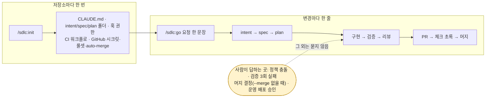
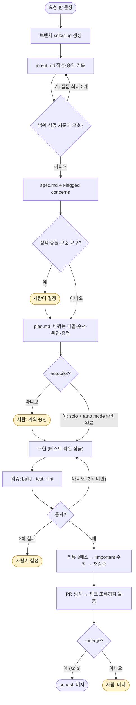
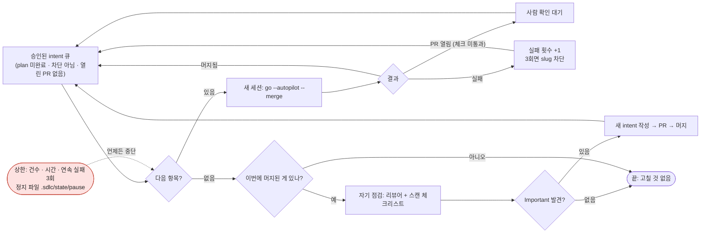
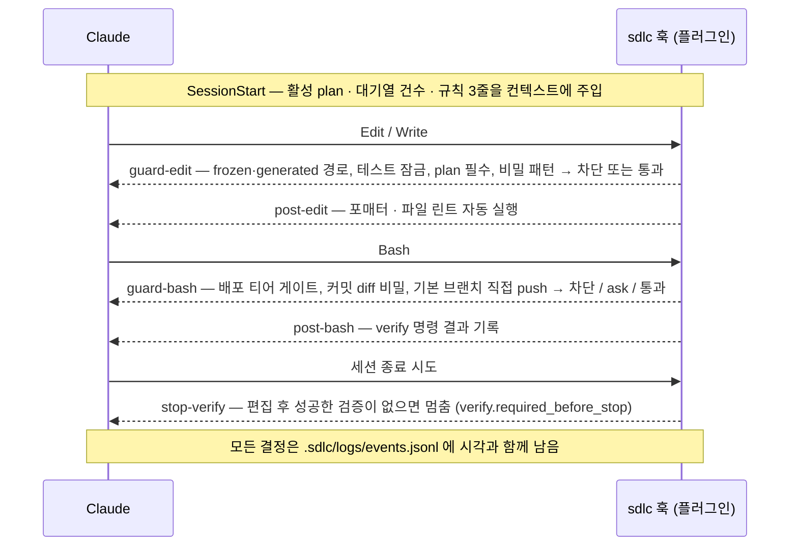

# sdlc — AI-native SDLC 플레이북을 실행하는 Claude Code 플러그인

> 원문: Anthropic, [The AI-native SDLC playbook](https://claude.com/blog/the-ai-native-sdlc-playbook) — Louis Claxton, 2026-08-21 (acknowledgments: Jim Blackhurst, Will Steuk, Jamal Arif)
> 쓰는 법은 두 명령입니다. 저장소마다 `/sdlc:init` 한 번, 변경마다 `/sdlc:go "요청 한 문장"` 한 줄.
> 설치: `claude plugin marketplace add freewisl/ai-native-sdlc && claude plugin install sdlc@ai-native-sdlc`

## 요약

플레이북의 출발점은 "코드는 더 이상 병목이 아니다"입니다. 에이전트가 빌드 단계를 몇 시간으로 줄이면 병목은 그 앞뒤의
계획·설계·리뷰·배포로 옮겨가고, 사람이 모든 줄을 읽는 통제는 현실과 맞지 않게 됩니다(서론 "Code is no longer the bottleneck").
플레이북의 답은 여섯 단계(Plan → Design → Build → Test → Deploy → Maintain)를 **선형 절차가 아닌 루프**로 다시 짜고,
**모든 단계가 커밋되는 아티팩트로 끝나게** 하는 것입니다. intent.md → spec.md → plan.md → diff 와 테스트 → 리뷰 지적이 붙은 PR →
인시던트 기록. 다음 단계는 앞 단계의 아티팩트를 읽으며 시작하고, 커밋 체인이 곧 감사 추적("누가 무엇을 요청했고, 에이전트가 무엇을
만들었고, 누가 승인했는가")이 됩니다. 사람은 판단이 필요한 게이트에만 서서, 에이전트가 표시한 것을 검토합니다.
이 플러그인은 그 루프를 스킬(권고) · 훅(결정론적 강제) · 관리형 설정(우회 불가)의 세 층으로 어느 저장소에나 설치합니다.
쓰는 쪽에서 보이는 것은 두 명령입니다. `/sdlc:init` 이 저장소를 한 번 차리고(GitHub 원격·1인 저장소·CI 인증을 알아서 감지해 시크릿·룰셋·auto-merge 까지),
그 뒤로는 변경마다 `/sdlc:go` 한 줄이 intent → spec → plan → 구현 → 검증 → 리뷰 → PR 을 한 세션에서 끝냅니다. 단계별 스킬(`/sdlc:intent` … `/sdlc:review`)은
`go` 가 내부에서 부르는 부품이고, 팀 저장소에서 승인 지점을 다른 사람이 소유할 때 손으로도 씁니다.

원문의 진단을 조금 더 옮기면 이렇습니다. 전통적으로 각 단계는 다른 역할이 소유했습니다 — 프로덕트 매니저가 요구사항을, 아키텍트가 설계를,
엔지니어가 빌드를, (규제 기업에서는) QA 가 검증을, 릴리스 팀이 배포를, 운영이 감시를 — 그리고 단계 사이는 문서·티켓·서명으로 이어졌습니다.
PRD·추정 의식·제품 보안 리뷰는 코드 작성이 가장 느리고 비쌌던 시절, 수 주·수 개월·분기에 걸친 개발 동안 정렬을 강제하기 위해 존재했습니다.
코드가 병목이 아니게 되면 세 가지가 참이 됩니다: ① 병목이 빌드의 좌우(계획, 리뷰/테스트, 배포)로 옮겨간다 ② 사람이 한 줄씩 읽는 통제는
에이전트가 diff 의 대부분을 쓰는 순간 현실과 어긋난다 ③ 예외가 여전히 주·월 단위로 모이는 위원회를 거치므로 거버넌스 비용이 늘어난다.
이 전환을 agentic SDLC, AI SDLC, agentic software development 라고도 부릅니다 — 이름은 달라도 같은 것을 가리킵니다.

## 전통 SDLC → AI-native SDLC (원문 전환표)

| Stage | 전통 SDLC | AI-native SDLC |
|---|---|---|
| Plan | 요구사항을 위원회가 모아 워크숍과 서명을 거쳐 손으로 정리 | Claude 가 원천에서 pain point 를 종합해 사람이 읽고 기계가 실행할 수 있는 intent.md 로 포착 |
| Design | 분석가가 스펙을 쓰고 디자이너가 다시 해석 | 요구사항과 설계를 에이전트와의 한 세션으로 압축, 스킬로 인코딩된 표준이 안내, git 에 버전 관리 |
| Build | 테스트와 코드를 손으로 쓰고 문서는 개발이 끝난 뒤 | 테스트와 코드를 AI 가 생성, 제도적 지식은 버전 관리되는 기계 판독 CLAUDE.md 와 스킬로 유지 |
| Test | 단계 경계의 QA 게이트 | 구현 사이사이에 짜여 들어간 연속 evals |
| Deploy | 사람이 모든 코드 줄을 리뷰, 거버넌스는 리뷰 주기마다 들쭉날쭉 | 에이전트 리뷰를 겹겹이 두고 사람 리뷰는 규제·핵심 코드에 집중, 거버넌스는 AI 가 행동하는 순간 훅(승인 게이트)으로 강제 |
| Maintain | 사람이 프로덕션의 버그를 지켜봄 | 에이전트가 라이브 배포를 감시, 밴드 위반은 진단되어 새 intent.md 로 루프에 다시 기록 |

대부분의 조직은 두 열 사이 어딘가에 있습니다. 초기 단계의 아티팩트가 `.md` 인 이유는 프로덕트 오너와 에이전트가 같은 파일을 읽고 행동할 수
있기 때문이고, Build 부터는 코드와 그 기록(diff·테스트·PR·인시던트)이 아티팩트입니다.

## 목차

1. [설치](#설치)
2. [빠른 시작](#빠른-시작)
3. [채택 순서](#채택-순서)
4. [플레이북 플레이 → 플러그인 구성요소 대응표](#플레이북-플레이--플러그인-구성요소-대응표)
5. [스킬 19종](#스킬-19종)
6. [병렬 세션과 서브에이전트](#병렬-세션과-서브에이전트)
7. [훅 7종](#훅-7종)
8. [설정 레퍼런스](#설정-레퍼런스)
9. [아티팩트 체인 운영](#아티팩트-체인-운영)
10. [CI 템플릿](#ci-템플릿)
11. [닫힌 루프](#닫힌-루프)
12. [측정](#측정)
13. [기업 배포 요약](#기업-배포-요약)
14. [자주 묻는 질문](#자주-묻는-질문)
15. [손길 최소화 — 사람이 해야 하는 것](#손길-최소화--사람이-해야-하는-것은-정확히-무엇인가)
16. [더 읽기](#더-읽기)
17. [제한과 비범위](#제한과-비범위)

## 설치

| 필수/선택 | 항목 | 이유 |
|---|---|---|
| 필수 | bash 3.2+ (macOS 기본 포함), git | 훅·스크립트·감사 추적 |
| 필수 | python3 3.9+ | `init.sh` 렌더·설정 병합, `doctor`/`status`, `monitor.py`, `metrics.py`, jq 없을 때 훅 폴백 |
| 선택 | jq | 훅 속도(기본 경로). 없으면 python3 폴백 |
| 선택(GitHub 저장소면 사실상 필수) | gh | `init` 의 GitHub 자동 설정(시크릿·룰셋·auto-merge), `go` 의 PR 생성·체크 대기·머지, `/sdlc:review --pr`, 3σ `pull_request` 라우트, PR 지표 |
| 선택 | claude (로그인 상태) | `run-evals.sh`, monitor 의 2σ/3σ 진단. CI 에서는 `ci.auth` 가 정한 시크릿으로 인증 |
| 플랫폼 | macOS · Linux · WSL2 | 네이티브 Windows 는 WSL2 사용(훅은 bash, sandbox 미지원) |


### 마켓플레이스에서 설치

```bash
# 이 저장소 (github.com/freewisl/ai-native-sdlc)
claude plugin marketplace add freewisl/ai-native-sdlc
# 다른 곳에 미러링했다면 그 저장소를 — GitHub 이 아니면 Git URL(.git) 로
claude plugin marketplace add https://<git 호스트>/<미러 경로>/ai-native-sdlc.git
# 로컬 체크아웃으로 시험할 때
claude plugin marketplace add /path/to/ai-native-sdlc

claude plugin install sdlc@ai-native-sdlc
```

설치가 끝나면 저장소에서 `/sdlc:init` → `/sdlc:go` 순서로 씁니다. 모든 프로젝트에서 `/sdlc:<스킬>` 을 쓸 수 있고, 훅 7종은 플러그인이 등록하므로 프로젝트의 `.claude/settings.json` 에
훅을 넣을 필요가 없습니다. 훅은 `.sdlc/config.json` 이 없는 프로젝트에서는 안전한 기본값으로만 조용히 동작합니다(비밀 스캔과 production 기본 게이트).

### 설치 없이 로컬 시험

```bash
claude --plugin-dir /path/to/ai-native-sdlc/plugins/sdlc
claude plugin validate /path/to/ai-native-sdlc/plugins/sdlc --strict
```

### 팀 배포

프로젝트의 `.claude/settings.json` 에 마켓플레이스와 플러그인을 선언하면, 저장소를 여는 팀원에게 설치가 안내되고 모든 세션이 같은 버전을 씁니다.

```json
{
  "extraKnownMarketplaces": {
    "ai-native-sdlc": { "source": { "source": "github", "repo": "freewisl/ai-native-sdlc" } }
  },
  "enabledPlugins": { "sdlc@ai-native-sdlc": true }
}
```

### 기업 배포

관리형 설정(`managed-settings.json`)의 `strictKnownMarketplaces` 에 승인된 마켓플레이스만 적고 `disableSideloadFlags: true` 로
`--plugin-dir` 같은 우회를 막으면, 엔지니어 기기의 스킬·에이전트·훅·MCP 서버는 전부 조직이 승인한 경로로만 들어옵니다.
OS 별 파일 경로·MDM·서버 관리형 콘솔·sandbox·OTel 은 [docs/ENTERPRISE.md](../../docs/ENTERPRISE.md) 에 있습니다.

## 빠른 시작

### 두 명령이 전부입니다

```text
/sdlc:init                                    # 저장소마다 한 번
/sdlc:go "청구 상태를 포털에서 보이게 해줘"        # 변경마다 한 줄 (1인 저장소: --autopilot --merge)
```



**`/sdlc:init`** 은 플래그 없이 저장소를 읽어 결정합니다. GitHub 원격이면 CI 워크플로 7종과 CODEOWNERS 를 설치하고, 협업자가 1명이면 `roles.solo` 를 켜고,
보관된 구독 토큰이 있으면 CI 인증을 `oauth` 로 잡아 `ci.auth` 에 기록합니다. 이어서 `github-setup.sh` 로 시크릿 등록 · auto-merge 설정 · 기본 브랜치 ruleset(요금제가
허용할 때)을 처리하고, `doctor` 표와 "다음 할 일"을 보여 준 뒤 채택 커밋을 브랜치+PR 로 올립니다. 사람이 하는 것은 계정당 한 번의 GitHub 로그인 승인과 구독 토큰
발급(둘 다 브라우저)뿐입니다.

**`/sdlc:go`** 는 한 문장 요청으로 intent → spec → plan → 구현 → 검증(최대 3회 재시도) → 리뷰 → PR → 체크 초록까지 한 세션에서 이어 돌립니다. 사람에게 묻는 곳은
정책 충돌(또는 모순 요구사항) · 검증 3회 실패 · 머지(`--merge` 없을 때) · production 배포뿐이고, 팀 저장소(`roles.solo: false`)는 intent·plan 승인 지점이 남습니다.
`--autopilot` 은 1인 저장소이고 doctor 의 auto mode 준비도가 ✓ 이며 사용자가 직접 입력했을 때만 plan 정지를 건너뜁니다. 아티팩트·훅·리뷰·브랜치 보호는 그대로이고
"응" 을 누르는 의식만 없앴습니다. 노란 상자가 사람이 답하는 자리이고, 나머지는 전부 자동입니다.



플러그인을 갱신한 뒤에는 `/reload-plugins`(또는 세션 재시작) 후 `/sdlc:init` 을 다시 실행하면 됩니다. 있는 파일은 건너뛰고 새 설정 키(`ci.auth`, `protect.default_branch`)만
병합하며, 워크플로의 인증 줄이 `ci.auth` 와 다르면 그 줄만 맞춥니다.

### 새 프로젝트

```bash
mkdir my-service && cd my-service && git init
claude
```

```text
/sdlc:init --lang ko
/sdlc:go "첫 기능을 한 문장으로"
```

빈 저장소에서도 진입점은 같습니다. 빌드 도구가 아직 없으면 CLAUDE.md 의 명령 항목은 TODO 로 남고, 나중에 `.sdlc/config.json` 의 `commands` 를 채우면 훅과 검증 단계가 그 명령을 사용합니다.

### 기존 프로젝트

`/sdlc:init` 은 항상 비파괴입니다. 있는 파일은 절대 덮어쓰지 않고, 생성·병합·건너뜀 목록을 표로 보고합니다. 그 뒤의 사용법은 새 프로젝트와 같습니다.

| 대상 | 이미 있을 때의 동작 |
|---|---|
| `CLAUDE.md` | `<!-- sdlc:begin <section> -->` 마커로 **빠진 섹션만** 추가(Commands · Conventions · Architecture · Things Claude gets wrong · Verifying your work). 기존 내용은 그대로 |
| `.claude/settings.json` | `permissions.allow` / `permissions.deny` 배열을 **합집합**으로 병합. 훅은 추가하지 않음(플러그인이 제공) |
| `.github/workflows/` | 기존 워크플로 보존. `sdlc-*.yml` 중 **없는 파일만** 복사(`--github`·GitHub 원격 감지·`.github/` 존재 시). 이미 있는 `sdlc-*.yml` 이 `ci.auth` 와 다른 시크릿을 쓰면 **인증 줄만** 교체(MERGED 로 보고), 다른 워크플로는 건드리지 않음 |
| `REVIEW.md`, `intent/ spec/ plan/`, `.sdlc/` | 없을 때만 생성 |
| `evals/` | 다른 용도의 `evals/` 가 이미 있으면 `sdlc-evals/` 를 사용하고 `config.paths.evals` 에 반영 |
| `.gitignore` | `.sdlc/logs/` `.sdlc/state/` `evals/results/` 세 줄만 추가 |

`--dry-run` 으로 실제 쓰기 없이 계획만 볼 수 있고, 감지 결과를 뒤집을 때만 플래그를 씁니다: `--no-github`, `--solo` / `--no-solo`, `--auth api|oauth`.
`--sandbox --managed --mcp` 는 sandbox 설정 예시 · 관리형 설정 예시 · 배포 MCP 예시를 함께 받습니다.

### 단계별로 쓰기 — 팀 저장소, 크거나 위험한 변경

`go` 가 내부에서 부르는 스킬은 하나씩 직접 호출할 수도 있습니다. 승인 지점을 다른 사람이 소유하는 팀 저장소나 한 PR 에 담기지 않는 큰 변경에서는 이 정지 지점들이 오히려 필요합니다.

```text
/sdlc:intent                    # 브레인스토밍 → intent/<slug>.md → 커밋 (프로덕트 오너 승인: status: approved)
/sdlc:spec <slug>               # 승인된 intent → spec/<slug>.md (Flagged concerns 포함) → 커밋
/sdlc:plan <slug>               # 플랜 모드 → plan/<slug>.md 승인·커밋 → 구현 (활성 plan 등록)
/sdlc:verify                    # build/test/lint 실행, 출력 붙이기, sdlc-verifier 신선한 컨텍스트 검증
/sdlc:review                    # REVIEW.md 3 패스 → 사람이 승인
/sdlc:release staging           # 티어 확인 후 배포 → production 은 RELEASE_APPROVAL 필요
/sdlc:monitor                   # 밴드 감시 → 위반 시 intent/triage/ 에 intent 초안
```

### 무인 루프 — `/sdlc:run` (선택, 1인 저장소)

`go` 는 한 문장에 한 변경입니다. 백로그를 통째로 맡기려면 `.sdlc/config.json` 에서 `loop.enabled` 를 켜고 `/sdlc:run` 을 칩니다. 승인된 intent 를 만든 순서로 한 건씩,
매번 **새 세션**의 `go --autopilot --merge` 로 처리하고, 머지된 결과를 리뷰어와 보안 체크리스트로 다시 점검해 Important 만 새 intent(PR 경유)로 큐에 넣습니다. 큐가 비면 끝납니다.
사람에게 남는 것은 사후 검토입니다 — 머지된 PR 목록과 `loop.item` 로그. 상한(`max_items` 5 · `max_minutes` 120 · 연속 실패 3회), slug 별 차단, 정지 파일(`touch .sdlc/state/pause`)이
폭주를 막고, 팀 저장소에서는 스크립트가 거부합니다. 세션 없이 돌리려면 `sdlc-autopilot.yml`(30분마다 1건, `SDLC_GH_TOKEN` 필요)을 켭니다. `/sdlc:run --dry-run` 이 큐와 명령을 먼저 보여 줍니다.



## 채택 순서

원문은 "플레이는 스테이지별로 나열되지만, 화살표(의존성 그래프)가 채택 순서를 준다 — 둘은 같지 않다"고 말합니다. 아무 것도 가리키지 않는
1층 플레이는 어디서든 시작할 수 있고, 다른 플레이는 자기를 가리키는 화살표의 플레이를 먼저 채택합니다. `doctor.sh`·`init.sh` 의 "Next steps" 가
이 순서의 단일 출처입니다.

| 층 | 플레이 | 플러그인 진입점 |
|---|---|---|
| 0 준비 | git 저장소, `/sdlc:init` | `git init`, `/sdlc:init` |
| 1 시작 가능(전제 없음) | Capture intent · CLAUDE.md · Feedback loop · Hooks(승인 게이트 목록) · Plan mode | `/sdlc:intent` · `/sdlc:init`(CLAUDE.md) · `commands.*` · `.sdlc/APPROVALS.md`+훅 · `/sdlc:plan` |
| 2 | Skills · Subagents · Evals | `/sdlc:policy` · 에이전트 5종·`claude --worktree` · `/sdlc:evals` |
| 3 | Requirements & design · PR review | `/sdlc:spec` · `/sdlc:review` + `sdlc-review.yml` + CODEOWNERS |
| 4 | CI/CD | `sdlc-evals.yml` · `sdlc-ci-triage.yml` · `sdlc-spec-on-intent.yml` · `/sdlc:release` |
| 5 | Closing the loop · Recurring scans · Claude Tag | `/sdlc:monitor` · `/sdlc:triage` · `/sdlc:scan` · `/sdlc:postmortem` |

`/sdlc:go` 한 번이 1~3층(intent · plan · 서브에이전트 · spec · 리뷰)을 한 변경 안에서 실제로 지나가므로, 첫 변경부터 이 층들은 채택된 상태가 됩니다.
`doctor` 의 "다음 할 일"은 아직 켜지 않은 것 — 정책 스킬, evals 스위트, CI 워크플로, 밴드·런북 — 을 가리킵니다.

원문 텍스트와 그림이 어긋나는 네 곳은 어느 쪽도 고르지 않고 함께 적습니다.

| 지점 | 텍스트 | 그림 | 플러그인 |
|---|---|---|---|
| Skills 의 전제 | "None required. CLAUDE.md 가 있으면 도움이 되지만 스킬은 그에 의존하지 않는다" | CLAUDE.md → Skills 실선 | `/sdlc:policy` 는 CLAUDE.md 없이도 동작, 있으면 참고 |
| PR review 의 전제 | 갱신된 CLAUDE.md, 정책 스킬, 정의된 서브에이전트 | Evals → PR review 실선, Skills ⇢ PR review 점선 | `/sdlc:review` 는 REVIEW.md 만 요구; evals·스킬은 권장 |
| Closing the loop 의 전제 | intent.md, PR 리뷰, 훅, 롤백 경로 | CI/CD 를 경유 | `/sdlc:monitor` 는 CI 없이도 실행되나 3σ 라우트는 PR·런북(=CI/CD)을 전제 |
| "clay" 색 시작 플레이 | 본문에서 "any clay play" 로 지칭 | 그림의 1층 5개(Plan mode 포함) | 1층에 Plan mode 포함 |

## 플레이북 플레이 → 플러그인 구성요소 대응표

유형: **S** 스킬 · **H** 훅 · **X** 스크립트 · **T** 템플릿 · **A** 에이전트 · **D** 문서. "호스팅 제품"은 Anthropic 이 운영하는 서비스라 플러그인이 구현하지 않고 절차만 안내합니다.

| Stage | 플레이 | 담당 구성요소 | 호스팅 제품(문서 안내) |
|---|---|---|---|
| 1 Plan | Capture as intent.md | **S** `intent`(`--from-ticket`, `--from-incident`) · **T** `intent.md`, `intent-README.md` · 프론트매터 `source`/`record_id` | claude.ai · Cowork + GitHub 커넥터(비엔지니어 커밋 경로) |
| 2 Design | Requirements and design | **S** `spec`(블로그 프롬프트 내장, `config.policies` 호출, Flagged concerns 필수) · **T** `spec.md` · **T** `sdlc-spec-on-intent.yml`(intent 머지 → spec PR 자동) | Claude Design(목업 → Claude Code 내보내기) |
| 2 Design | 정책을 스킬로(brand·security·compliance·UX) | **S** `policy` · **T** `policies/secure-api-review/` · 설정 `policies[]` | — |
| 3 Build | Plan mode as the default starting point | **S** `plan`(EnterPlanMode, 4섹션, 자문 질문, 승인 후 커밋) · **T** `plan.md` · **H** guard-edit ③(`plan.require_for_edits`) · **H** stop-verify(`plan.enforce_sync`) · 상태 `.sdlc/state/active-plan` | — |
| 3 Build | Auto mode | **T** `settings.project.json`(안전한 내부 루프 사전 승인) · **H** 전체(자율 세션의 통제는 설정에서) · **S** `plan`(auto mode 준비도 체크리스트) · `doctor` 의 `auto mode readiness` 행. worktree 와 함께 쓰면 개인·팀 병렬성이 생기고 Stage 6 자율 실행의 전제가 됨 | — |
| 3 Build | 사이드바: Legacy systems and the source of truth | 설정 `source_of_truth.mode`(repo/legacy/linkage) · 프론트매터 `record_id` · **S** `intent --from-ticket` | Jira·ServiceNow 등 MCP 커넥터(조직 제공) |
| 3 Build | The CLAUDE.md | **S** `init`(4섹션 + Verifying 블록을 저장소 조사로 채움) · **S** `lesson`("두 번 틀리면 CLAUDE.md") · **T** `CLAUDE.sections.md` · **H** session-start(규칙 3줄 주입) | — |
| 3 Build | Skills as institutional knowledge | **S** `policy`(스캐폴드 → `config.policies` 등록 → 트리거 3회 테스트) · **T** `secure-api-review` 원문 예시 | 조직 플러그인 마켓플레이스 배포 |
| 3 Build | Hooks as build-time guardrails | **H** guard-edit ①(frozen/generated) ④(비밀) · **H** post-edit(포매터) · **H** guard-bash ②(커밋 diff 비밀) · **T** `frozen-paths.txt` · **X** `secret-scan.sh` | — |
| 3 Build | Parallel sessions and subagents | **A** `sdlc-verifier`(블로그 verifier.md 원형, 원문은 `.sdlc/examples/verifier.md`) · `sdlc-simplifier` · `sdlc-researcher` · `sdlc-reviewer` · `sdlc-diagnoser` · **H** session-start/end(세션 수 측정) · **S** `plan`(독립 작업 묶음 제안) · [병렬 세션과 서브에이전트](#병렬-세션과-서브에이전트) | `claude --worktree` 는 Claude Code 기본 기능 |
| 4 Test | Give Claude a feedback loop | **S** `verify`(`--bugfix` 실패 테스트 먼저, `--ui` 스크린샷 루프) · **T** Verifying 블록 · **H** post-bash(verify 결과 기록) · **H** stop-verify(`verify.required_before_stop`) · **H** guard-edit ②(수정 중 테스트 파일 잠금) · **A** `sdlc-verifier` | 브라우저·스크린샷 MCP(조직 제공) |
| 4 Test | Continuous evals in CI | **S** `evals`(add/run/list/report) · **X** `run-evals.sh` · **T** `evals/cases/` 3건 · **T** `sdlc-evals.yml`(블로그 워크플로 원형) · 히스토리 `eval_pass_rate.jsonl` | — |
| 5 Deploy | AI in the PR review loop | **S** `review`(3 패스, Important/Nit, nit ≤ 5, `--pr <n>` babysit) · **A** `sdlc-reviewer`(승인 권한 없음) · **T** `REVIEW.md`(원문 4섹션) · **T** `sdlc-review.yml`(claude-code-action) · **X** `review-gate.sh`(집계 `SDLC_REVIEW_TALLY` 로 선택적 머지 게이트) · **T** `CODEOWNERS` | Claude Code Review(관리형 서비스) |
| 5 Deploy | Hooks as approval gates | **H** guard-bash ①(free/constrained/gated, `RELEASE_APPROVAL`, 롤백 항상 허용) · **H** guard-edit(`protect.ticketed_paths` + `CHANGE_TICKET` — 마이그레이션·인프라 변경 티켓) · **T** `APPROVALS.md`(승인 게이트 등록부) · **T** `examples/settings.hooks.json`·`production-gate.sh`(원문) · **S** `release` · 로그 `gate.log` · 설정 `environments` | — |
| 5 Deploy | Managed settings for a regulated enterprise | **T** `managed-settings.json`(블로그 JSON 그대로) · **T** `settings.sandbox.json` · `init --managed --sandbox` · **D** `docs/ENTERPRISE.md` | MDM · claude.ai 관리자 콘솔 |
| 5 Deploy | CI/CD integration and deployment | **T** 워크플로 7종(autopilot 포함) · **T** `sdlc-ci-triage.yml`(블로그 pipeline step 원문) · **T** `mcp.deploy.example.json`(`--mcp`) · 설정 `environments`·`commands.rollback` | Bedrock · Vertex · Foundry(모델 경로) |
| 6 Maintain | Closing the loop | **X** `monitor.py`(WE 규칙, 1σ log / 2σ diagnose / 3σ propose) · **T** `bands.json`(블로그 bands.yaml 의 JSON 판) · **S** `monitor`, `triage` · **A** `sdlc-diagnoser` · **T** `sdlc-monitor.yml` · 큐 `intent/triage/` | Prometheus 등 메트릭 스토어(조직 제공) |
| 6 Maintain | Recurring codebase scans | **S** `scan`(자체 스캔 → 한 PR 크기면 수정 제안, 크면 intent; Claude Security 도입 체크리스트 내장) · **T** `sdlc-scan.yml`. 원문의 근거: 보안 팀은 사람 산출량에 맞춰 편성되어 있어 에이전트가 출력을 늘리면 리뷰 큐가 쌓이거나 미검토 코드가 나가고, 규제 조직은 둘 다 받을 수 없다 | Claude Security(호스팅 스캔) |
| 6 Maintain | Claude on call with Claude Tag | **S** `postmortem`(LESSONS + lesson + evals add + intent --from-incident) · **T** `LESSONS.md` · 프론트매터 `source: channel` | Claude Tag(Slack 온콜) |
| 전체 | 무인 루프 · 측정 · 채택 순서 | **S** `run`(백로그 → go → 머지 → 자기 점검 반복, solo 전용, `loop.enabled`) · **T** `sdlc-autopilot.yml` · **X** `run-loop.sh` · **S** `metrics`(선행/후행 지표표) · **S** `doctor`(의존성 그래프 순 "다음 할 일") · **S** `status` · 로그 `events.jsonl` · **T** `otel.env` | OTel 수집기(조직 제공) |

R-ID 단위의 전수 대응표는 [docs/PLAYBOOK-MAPPING.md](../../docs/PLAYBOOK-MAPPING.md) 에 있습니다.

## 스킬 19종

모든 스킬은 `/sdlc:<이름>` 으로 호출합니다. 설명(description)에는 한국어 키워드도 병기되어 있어 자연어 요청으로도 트리거됩니다.

| 명령 | 단계 | 하는 일 | 산출물 | 승인자 |
|---|---|---|---|---|
| `/sdlc:init [--lang en\|ko] [--github\|--no-github] [--solo\|--no-solo] [--auth api\|oauth] [--sandbox] [--managed] [--mcp] [--dry-run] [--commands build=..,test=..,lint=..]` | 전환 | 감지(git·빌드 도구·CLAUDE.md·CI·언어 + GitHub 원격·협업자 수·보관된 토큰) → `init.sh` 비파괴 스캐폴드 → CLAUDE.md 4섹션 + Verifying 블록을 저장소 조사로 채움 → settings 병합 → `github-setup.sh`(시크릿·auto-merge·ruleset) → `doctor` → 채택 커밋을 브랜치+PR 로 | §2 프로젝트 파일 일체, GitHub 설정 | 플랫폼 엔지니어(1인 저장소는 본인) |
| `/sdlc:go <one-sentence request> [--autopilot] [--merge] [--no-pr] [--slug <slug>]` | 전체 | 한 문장 요청 → 브랜치 `sdlc/<slug>` → intent·spec·plan·구현·검증·리뷰·PR 을 한 세션에서. 정지는 정책 충돌·검증 3회 실패·머지(`--merge` 없을 때)·production 만. `--autopilot` 은 solo + doctor auto mode ✓ + 사용자가 직접 입력했을 때만 plan 정지 생략, `--merge` 는 체크 초록 뒤 squash 머지(auto-merge 가 거부되면 직접 머지) | 체인 전체 + PR(`approved_by`·`approval_basis` 기록) | solo 는 요청 자체가 승인, 팀은 intent/plan 승인 유지 |
| `/sdlc:run [--max-items N] [--max-minutes M] [--once] [--no-self-check] [--dry-run]` | 전체(무인) | 승인된 intent 큐를 한 건씩 **새 세션의** `go --autopilot --merge` 로 처리 → 머지된 결과를 리뷰어+스캔 체크리스트로 자기 점검 → Important 만 새 intent(PR 경유) → 큐가 빌 때까지. 상한(건수·시간·연속 실패 3회)·정지 파일·slug 별 차단. `roles.solo` + `loop.enabled` 필수, 사용자 직접 입력 전용 | 머지된 PR 들, `loop.run`/`loop.item` 이벤트 | 저장소 주인이 `loop.enabled` 를 켠 것이 승인. 머지 조건은 `go` 와 동일 |
| `/sdlc:doctor [--json]` | 전환 | 채택 상태표(항목별 ✓/△/✗), config 스키마 검사, 훅 자가시험(샘플 stdin), 의존성 순 "다음 할 일" | 상태 보고 | — |
| `/sdlc:intent [<title or idea>] [--from-ticket <id>] [--from-incident <ref>] [--from-scan <finding-id>] \| approve <slug> \| reject <slug> \"<reason>\"` | 1 | 분석가 질문(범위·사용자·제약·성공 기준)으로 브레인스토밍 → 템플릿으로 `intent/<slug>.md` → 발안자 교정 → 커밋 | intent.md | 프로덕트 오너(`status: approved` 커밋) |
| `/sdlc:spec <slug> [--force] \| approve <slug> \| reject <slug> \"<reason>\"` | 2 | 승인된 intent 읽기 → `config.policies` 정책 스킬 적용 → 요구사항·설계·Flagged concerns → PO 검토 포인트 → 커밋 | spec.md | 프로덕트 오너(고위험은 기술 리드 자문) |
| `/sdlc:plan <slug> [--allow-test-changes] [--no-implement]` | 3 | 플랜 모드 강제 → 파일·순서·위험·증명 → "무엇이 깨질 수 있나 / 가장 위험한 단계 / 택하지 않은 대안" 자문 → 승인 → 커밋 + 활성 plan 등록 → 구현. 벗어나면 같은 커밋에 plan.md 갱신 | plan.md, `.sdlc/state/active-plan` | 엔지니어(고위험은 기술 리드·아키텍트) |
| `/sdlc:verify [--bugfix] [--ui <mock-path>] [--no-agent]` | 4 | `commands` 로 build/test/lint 실행·정량 목표 확인·출력 붙이기. `--bugfix`: 실패 테스트 먼저 작성·커밋 → 테스트 잠금 상태로 수정. `--ui`: 스크린샷 비교 루프. 끝에 `sdlc-verifier` 로 신선한 컨텍스트 검증 | 검증 출력, events | PR 의 코드 오너 |
| `/sdlc:evals add [<name>] [--from task\|review\|incident\|scan] \| run [--case <glob>] [--model <m>] [--threshold <t>] [--max-turns <n>] [--dry-run] \| list \| report` | 4 | `add`: 최근 작업·인시던트·PR·취약점 클래스 → `cases/<name>/`. `run`: `run-evals.sh`(임계치 미달 exit 1). `list`/`report` | evals/cases, evals/results | 설정 변경을 소유한 팀 |
| `/sdlc:review [--base <ref>] [--pr <n>] [--slug <slug>] [--post]` | 5 | REVIEW.md 로드 → `sdlc-reviewer` 3 패스(Bugs/Security/Compliance vs spec·plan) → Important/Nit, nit ≤ 5 → 같은 실수 2회면 `lesson` → CLAUDE.md 낡음 경고. `--pr`: gh 로 미해결 코멘트·실패 체크 스윕→수정→푸시 반복 | 리뷰 보고, CLAUDE.md 갱신 | **사람**(코드 오너, 브랜치 보호). 에이전트 승인 금지 |
| `/sdlc:lesson \"<one-line correction>\" [--eval] [--section <heading>]` | 3/5 | "Things Claude gets wrong" 에 한 줄 추가(중복 검사), 필요 시 `evals add` 연계, 한 페이지 초과 경고 | CLAUDE.md | 코드 오너(PR 리뷰) |
| `/sdlc:release <dev\|staging\|production> [command] \| rollback` | 5 | 티어 확인 → production 은 `approval_env` 와 롤백 명령 존재 확인 후 진행(훅이 2중 강제) → 결정 로그 → 배포 후 `monitor` 1회 제안 | gate.log, events | 릴리스 매니저(`RELEASE_APPROVAL`) |
| `/sdlc:monitor [--dry-run] [--metric <name>] \| add <name>` | 6 | `monitor.py`: 관측 → 기준선 → Western Electric 규칙 → 티어 → log / diagnose / propose | `.sdlc/history/`, `intent/triage/` | — (탐지는 결정론, 3σ propose 도 PR 게이트 통과) |
| `/sdlc:triage [<file-or-slug>] [fix\|schedule <date>\|dismiss \"<reason>\"]` | 6 | `intent/triage/*.md` 큐 순회 → fix now(→ `plan`) / schedule / dismiss(사유 → 밴드 튠 메모) 기록 | intent status, events | 서비스 오너·온콜 |
| `/sdlc:scan [<path-or-dir>] [--since <ref>] [--report <file>]` | 6 | 보안 체크리스트로 코드베이스 스캔(발견별 신뢰도·근거) → 한 PR 크기면 수정 제안, 크면 `intent` → 배포 후 `evals add` 권고 | 스캔 보고, intent | 보안 리드(수정은 PR 게이트) |
| `/sdlc:postmortem <incident title> [--date YYYY-MM-DD] [--pr <n>]` | 6 | 인시던트 → `LESSONS.md` 항목 + `lesson` + `evals add` + 필요 시 `intent --from-incident` | LESSONS.md 등 | 인시던트 담당 팀 |
| `/sdlc:policy <name> [--owner <who>] [--source <url-or-doc>] [--example secure-api-review]` | 2/3 | 정책 스킬 스캐폴드(`.claude/skills/<name>/SKILL.md`: 오너·source of truth·트리거·검사 스크립트) → `config.policies` 등록 → 트리거 테스트 절차 | 정책 스킬 | 정책 오너 |
| `/sdlc:metrics [--since 90d] [--format md\|json]` | 전체 | `metrics.py`: 스테이지별 선행/후행 지표. 계산 가능한 것은 값, 외부 데이터가 필요한 것은 `source needed: …` | 마크다운 대시보드 | — |
| `/sdlc:status [<slug>]` | 전체 | 체인 상태(intent/spec/plan 존재·status·타임스탬프·spec 재작업 수·활성 plan) | 표 | — |

## 병렬 세션과 서브에이전트

한 엔지니어가 여러 작업 흐름을 동시에 이끕니다. **병렬 세션**은 자기 git worktree 에서 별도 작업을 하는 또 하나의 Claude Code 인스턴스이고,
서로의 존재를 모릅니다 — 공유하는 것은 그들을 조종하는 엔지니어뿐입니다. **서브에이전트**는 한 세션 안에서 자기 컨텍스트 창과 도구 제한을 가진
범위 한정 도우미로, 여러 작업에서 반복되는 일(예: 앱이 기대대로 뜨는지 검증)에 맞습니다.

- 전통: 한 엔지니어가 한 번에 한 작업, 하루의 상당 부분을 빌드·테스트·리뷰어 대기에 쓴다. 기다리며 작업을 바꿀 수는 있지만 컨텍스트 전환이 피곤해 거의 하지 않는다.
- AI-native: 한 엔지니어가 여러 Claude 세션을 각자의 worktree 에서 돌린다. 반복 작업은 자기 컨텍스트와 도구 제한을 가진 서브에이전트가 된다. 엔지니어의 일은 조율로, 그리고 결국 루프를 만들고 감시하는 일로 옮겨간다.
- 전제: CLAUDE.md(모든 세션이 읽음). 피드백 루프(Stage 4)가 있으면 세션이 스스로 검증하므로 감독이 덜 필요하다(그림: CLAUDE.md → Subagents 실선, Feedback loop ⇢ 점선).
- 실행: `/sdlc:plan` 의 **Files that change** 로 겹치지 않는 파일 집합을 나눈다 — 파일을 공유하는 작업은 한 세션에서 순차로. 작업마다 worktree 하나:
  터미널 A `claude --worktree feature-auth`, 터미널 B `claude --worktree fix-rate-limit`. **2~3 세션이 출발점**이며, 실질 상한은 한 사람이 제대로 리뷰할 수
  있는 흐름의 수다 — 리뷰가 따라오는 동안만 세션을 늘린다.
- 서브에이전트: 플러그인이 `agents/` 에 5종을 제공한다 — `sdlc-verifier`(앱 실행·동작 검증, 수정 금지), `sdlc-reviewer`(REVIEW.md 3 패스), `sdlc-researcher`(코드베이스 탐색 후 보고, 메인 컨텍스트 보호),
  `sdlc-simplifier`(구현 후 불필요한 복잡도 제거), `sdlc-diagnoser`(읽기 전용 진단). 프로젝트 고유 서브에이전트는 `.claude/agents/*.md` 에 이름·설명·도구를 적어 git 에 넣는다.
- 거버넌스: 세션이 늘수록 산출이 늘므로 통제는 저장소의 설정에서 온다 — 훅과 권한은 모든 세션에 적용되고, 세션이 한 일은 그 세션을 돌린 엔지니어에게 귀속되어 기록된다.
- 측정: 리뷰 품질이 유지되는 동안의 엔지니어당 동시 세션 수(OpenTelemetry 또는 로컬 `session.start/end` 이벤트)와 대기 대신 조종에 쓰는 시간; 후행으로 엔지니어당 주간 병합 수와 재작업률(PR 이력).

## 훅 7종

**What changes** — 전통: 규약은 습관이고 리뷰어가 기억할 때만 지켜진다. AI-native: "스킬은 권고 통제, 훅은 그 뒤의 결정론적 계층" — 구현 중 Claude 의 행동은 대부분 파일 편집과 셸 명령이므로 빌드 단계가 훅이 가장 자주 발동하는 곳이며, 훅은 보호 경로 편집 차단·편집 후 포매터/린터·자격증명의 diff 진입 차단을 예외 없이 수행한다. 빌드 단계 훅은 빠르고 변경 파일 범위에 머물며(전체 테스트는 커밋·PR 에서), 사람 승인을 요구하는 훅은 Stage 5 의 게이트에 둔다(빌드 중 승인 프롬프트는 병렬 세션 모두의 크리티컬 패스에 사람을 올린다).

플러그인 훅은 팀 공통(플러그인 버전에 고정)입니다. 프로젝트 고유 훅은 `.claude/settings.json` 에 두고(원문 예시 `.sdlc/examples/settings.hooks.json`·`production-gate.sh`),
타협 불가 훅은 플랫폼/IT 관리자의 관리형 설정에 둡니다 — "팀 훅은 git 의 `.claude/settings.json`, 비타협 훅은 관리형 설정"(Stage 5). 승인 게이트의 문서 목록은 `.sdlc/APPROVALS.md` 입니다.

훅은 `hooks/hooks.json` 에 등록되어 있고 `bash "${CLAUDE_PLUGIN_ROOT}/scripts/hooks/<이름>.sh"` 로 실행됩니다.
차단 메시지는 항상 같은 형식으로 **이유와 승인 경로**를 함께 말합니다(Stage 5 "A block should explain itself").

```text
[sdlc] BLOCKED: <무엇을>. Why: <어떤 규칙>. To proceed: <승인 경로>
```

한 세션에서 훅이 걸리는 자리입니다.



| # | 이벤트 (matcher) | 스크립트 | 하는 일 | 관련 설정 키 | 차단 시 해제 경로 |
|---|---|---|---|---|---|
| 1 | SessionStart | `session-start.sh` | events 로그(세션 수 측정) + 컨텍스트 주입: 활성 plan·상태, triage 큐 건수, verify 명령, 규칙 3줄(계획 없이 구현 금지 · 완료 전 검증 · 같은 실수 2번 → CLAUDE.md). `.sdlc/` 없으면 `/sdlc:init` 힌트 한 줄 | `hooks.session_context`, `hooks.log_events` | 차단 없음 |
| 2 | SessionEnd | `session-end.sh` | events 로그 | `hooks.log_events` | 차단 없음 |
| 3 | PreToolUse (Edit\|Write\|MultiEdit\|NotebookEdit) | `guard-edit.sh` | ① frozen/generated 경로 차단 ② 테스트 파일 보호 ③ `plan.require_for_edits` 시 승인된 활성 plan 없으면 차단(`exempt_paths` 제외) ④ 새 내용의 비밀 패턴 스캔 | `protect.*`, `plan.require_for_edits`, `plan.exempt_paths`, `secrets.scan_edits`, `secrets.extra_patterns` | ① `.sdlc/frozen-paths.txt` 에서 항목 제거(PR 리뷰를 거치는 것이 의도) ② `SDLC_ALLOW_TEST_EDIT=1` 또는 `.sdlc/state/allow-test-edit` 파일 또는 활성 plan 의 `test_changes: allowed` ③ `/sdlc:plan` 으로 승인 plan 활성화, 또는 `plan.require_for_edits: false` ④ 값을 환경변수·시크릿 스토어로 옮김(예제 값은 `example`·`REPLACE_ME`) |
| 4 | PreToolUse (Bash) | `guard-bash.sh` | ① 환경 티어 게이트: production `gated` → `approval_env` 없으면 exit 2, staging `constrained` → `ask`, `commands.rollback` 은 항상 통과. gate.log·events 기록 ② `git commit` 시 스테이지된 diff 비밀 스캔 ③ 기본 브랜치 직접 `git push` 차단(리프스펙·`+`·`refs/heads/`·`--all`·`--delete <기본>`·`git -C` 파싱, `origin/HEAD` → `protect.default_branch`) | `environments.*`, `commands.rollback`, `gate.*`, `secrets.scan_commits`, `protect.block_direct_push`, `protect.default_branch` | ① `RELEASE_APPROVAL=<승인 식별자>` 를 설정하고 재실행(`/sdlc:release production` 이 절차를 안내). staging 의 `ask` 는 대화형 확인이며 `-p` 모드에서는 거부됨 ② 스테이지에서 비밀을 빼고 다시 커밋 ③ 기능 브랜치로 푸시하고 PR(`git push -u origin <branch> && gh pr create`), 또는 `protect.block_direct_push: false` |
| 5 | PostToolUse (Edit\|Write\|MultiEdit) | `post-edit.sh` | 포매터 실행(`commands.format`, `auto` 면 prettier/biome/ruff/black/gofmt/rustfmt/google-java-format 탐지) + 세션 state `edited=true` | `commands.format`, `hooks.format_on_edit` | 차단 없음 |
| 6 | PostToolUse (Bash) | `post-bash.sh` | 명령이 verify 명령(`commands.test/build/lint`)과 일치하면 성공/실패를 세션 state 에 기록 | `commands.*`, `verify.commands` | 차단 없음 |
| 7 | Stop | `stop-verify.sh` | `verify.required_before_stop` 이고 편집 후 성공한 verify 가 없으면 `{"decision":"block"}`. `plan.enforce_sync` 이고 활성 plan 이 있는데 편집 후 plan.md 가 갱신되지 않았으면 갱신 확인을 1회 요구 | `verify.required_before_stop`, `plan.enforce_sync` | verify 명령을 성공시킨 뒤 종료 / plan.md 갱신 뒤 종료. `stop_hook_active` 면 통과(무한 루프 방지) |

동작 규약: stdin JSON 은 한 번만 읽고, 프로젝트 루트는 `$CLAUDE_PROJECT_DIR` → stdin `cwd` → `pwd` 순으로 정합니다.
`.sdlc/config.json` 이 없으면 guard-edit 는 비밀 스캔만, guard-bash 는 production 기본 패턴 게이트만 수행하고 나머지는 즉시 통과합니다.
실행 시간 목표는 jq 경로에서 200ms 미만입니다. 훅 타임아웃은 post-edit(포매터) 60초, guard-bash 15초, 그 외 10초입니다.

## 설정 레퍼런스

### `.sdlc/config.json`

모든 스크립트·훅·스킬이 읽는 유일한 프로젝트 설정입니다. 기본값은 `templates/config/config.json` 과 같습니다.

| 키 | 타입 | 기본값 | 의미 |
|---|---|---|---|
| `version` | number | `1` | 설정 스키마 버전 |
| `language` | string | `"en"` | 템플릿·안내 언어(`en` / `ko`). `templates/<language>/` 선택 |
| `paths.intent` / `paths.spec` / `paths.plan` | string | `"intent"` / `"spec"` / `"plan"` | 아티팩트 디렉터리 |
| `paths.evals` | string | `"evals"` | evals 스위트 디렉터리(충돌 시 `sdlc-evals`) |
| `paths.review` | string | `"REVIEW.md"` | 리뷰 정책 파일 |
| `paths.lessons` | string | `".sdlc/LESSONS.md"` | 포스트모템 교훈 파일 |
| `source_of_truth.mode` | string | `"repo"` | `repo` / `legacy` / `linkage` (아래 [source of truth](#source-of-truth-세-가지-모드) 참조) |
| `source_of_truth.system` | string | `""` | 레거시 시스템 이름(Jira, ServiceNow 등). 스킬이 안내문에 사용 |
| `source_of_truth.per_artifact` | object | `{intent:"",spec:"",plan:""}` | 아티팩트 종류별 source of truth 모드(비어 있으면 `mode` 상속 — 예: intent 는 Jira, plan 은 repo) |
| `source_of_truth.record_field` | string | `"record_id"` | 레거시 레코드 ID 를 담는 프론트매터 필드명 |
| `commands.build` / `test` / `lint` / `run` | string | `""` | 프로젝트 명령. `init` 이 감지해 채움. 비어 있으면 해당 검증 단계 생략 |
| `commands.format` | string | `"auto"` | 포매터 명령. `auto` 면 설치된 포매터를 탐지, `""` 면 비활성 |
| `commands.lint_file` | string | `""` | 편집 직후 변경 파일 1개에 돌릴 린터(`{file}` 치환). 비어 있으면 린트는 verify 단계에서만 |
| `commands.rollback` | string | `""` | 롤백 명령. 설정되면 환경 패턴과 무관하게 **항상 통과**(가장 연습된 경로여야 함) |
| `verify.required_before_stop` | boolean | `false` | 편집 후 성공한 verify 없이는 세션 종료를 막음(Stop 훅) |
| `verify.commands` | string[] | `["test"]` | verify 로 간주할 `commands` 키 목록 |
| `plan.require_for_edits` | boolean | `false` | 승인된 활성 plan 없이는 코드 편집 차단("Nothing is implemented without an accepted plan") |
| `plan.enforce_sync` | boolean | `false` | 편집 후 plan.md 갱신 여부를 종료 시 확인 |
| `plan.exempt_paths` | string[] | `["intent/", "spec/", "plan/", "CLAUDE.md", "REVIEW.md", ".sdlc/", "evals/", ".claude/", "docs/", ".github/"]` | `require_for_edits` 예외 경로(아티팩트·설정은 계획 없이 편집 가능) |
| `protect.frozen_paths_file` | string | `".sdlc/frozen-paths.txt"` | 편집 금지 경로 목록 파일 |
| `protect.generated_paths` | string[] | `[]` | 생성 코드 경로. 편집 차단 + REVIEW.md "Do not report" 치환 |
| `protect.protect_tests` | boolean | `true` | 테스트 파일 보호 켜기 |
| `protect.block_direct_push` | boolean | `true` | 에이전트의 기본 브랜치 직접 `git push` 차단 — GitHub ruleset 이 없는 저장소(비공개 Free 플랜 등)에서도 "main 직접 경로 없음" 을 훅이 지킴. 기능 브랜치 푸시·PR 은 허용 |
| `protect.default_branch` | string | 감지값(기본 `"main"`) | `init` 이 감지해 기록. `origin/HEAD` 를 못 읽는 저장소(로컬 전용·mirror·`master`/`develop` 기본)에서 푸시 가드가 이 값을 씀 |
| `protect.ticketed_paths` | string[] | `[]` | 변경 티켓이 필요한 경로(예 `migrations/`, `infra/`). 편집 시 `protect.ticket_env` 환경변수가 없으면 차단 |
| `protect.ticket_env` | string | `"CHANGE_TICKET"` | ticketed 경로 편집을 허용하는 승인 환경변수 이름(값 = 승인된 티켓) |
| `protect.test_paths` | string[] | `["auto"]` | 테스트 경로 글롭. `auto` = `test/` `tests/` `__tests__/` `spec/`(단 `paths.spec` 과 같으면 제외) `src/test/` `*_test.go` `*.test.*` `*.spec.*` `test_*.py` `*_test.py` `*Test.java` `*Tests.java` `*Spec.scala` `*_spec.rb` |
| `secrets.scan_edits` | boolean | `true` | Edit/Write 내용의 비밀 패턴 스캔 |
| `secrets.scan_commits` | boolean | `true` | `git commit` 시 스테이지된 diff 의 비밀 패턴 스캔 |
| `secrets.extra_patterns` | string[] | `[]` | `scripts/secret-patterns.txt` 에 더할 확장 정규식 |
| `environments.<env>.autonomy` | string | dev `free` · staging `constrained` · production `gated` | `free` 통과 · `constrained` 사람 확인(`ask`) · `gated` 승인 env 없으면 차단 |
| `environments.<env>.patterns` | string[] | 템플릿 참조 | 이 환경으로 간주할 Bash 명령 정규식(deploy/release/rollout/promote, kubectl, helm, terraform 등) |
| `environments.<env>.approval_env` | string | production `"RELEASE_APPROVAL"` | 값이 있으면 승인으로 간주하는 환경변수 이름 |
| `gate.mode` | string | `"deny"` | gated 환경에서 승인이 없을 때의 결정: `deny`(exit 2, 기본) 또는 `ask`(사람 확인 프롬프트; 비대화형 `-p` 에서는 거부됨) |
| `gate.log` | string | `".sdlc/logs/gate.log"` | 게이트 결정 로그(사람이 읽는 탭 구분) |
| `hooks.format_on_edit` | boolean | `true` | post-edit 포매터 실행 |
| `hooks.log_events` | boolean | `true` | `.sdlc/logs/events.jsonl` 기록 |
| `hooks.session_context` | boolean | `true` | SessionStart 컨텍스트 주입 |
| `ci.auth` | string | 감지값(`api`, 보관된 구독 토큰이 있으면 `oauth`) | CI 인증 방식. `init` 이 결정해 기록(보관된 구독 토큰이 있으면 `oauth`)하고 워크플로와 `github-setup.sh` 가 같은 값을 읽음 — 시크릿 이름(`ANTHROPIC_API_KEY` / `CLAUDE_CODE_OAUTH_TOKEN`)이 어긋나지 않게 하는 단일 출처 |
| `roles.solo` | boolean | `false` | 1인 저장소: 사용자가 프로덕트 오너·기술 리드·릴리스 매니저를 겸함 → 스킬이 승인을 같은 세션에서 받음. `init` 이 협업자 1명이면 자동 설정(`--no-solo` 로 거부, 협업자 수를 못 읽으면 팀 게이트 유지). 이미 있는 값은 감지로 덮어쓰지 않고 `--solo` 만 덮어씀 |
| `roles.autopilot` | boolean | `false` | `/sdlc:go` 의 기본값: true 면 plan 단계에서 멈추지 않음 — solo 이고 doctor 의 auto mode 준비도가 ✓ 이며 사용자가 `/sdlc:go` 를 직접 입력했을 때만(모델이 스스로 부른 `go` 는 항상 멈춤). 훅·리뷰·PR·production 게이트는 그대로 |
| `loop.enabled` | boolean | `false` | `/sdlc:run` 무인 루프 허용. 사람이 머지 게이트에 서지 않겠다는 결정이므로 기본 꺼짐. `roles.solo` 가 아니면 켜도 스크립트가 거부 |
| `loop.max_items` / `max_minutes` | number | `5` / `120` | 한 번 실행의 상한(건수·분). `--once` 는 1건 |
| `loop.item_max_minutes` / `max_turns` | number | `45` / `200` | 항목 하나(새 `claude -p` 세션)의 시간·턴 상한 |
| `loop.max_failures_per_slug` | number | `3` | 같은 slug 가 이만큼 실패하면 `.sdlc/state/loop-failures.txt` 에 차단 기록, 사람이 지우기 전까지 건너뜀 |
| `loop.self_check` | boolean | `true` | 실행 중 1건 이상 머지됐으면 머지된 diff 를 리뷰어+스캔으로 재점검, Important 만 승인된 intent 로(PR 경유) |
| `loop.model` / `allowed_tools` | string | `""` / `"Read,Edit,Write,MultiEdit,Grep,Glob,Task,Bash"` | 항목 세션의 모델(빈 값 = 기본)과 허용 도구 |
| `loop.pause_file` | string | `".sdlc/state/pause"` | 이 파일이 있으면 루프가 시작하지 않거나 다음 항목 전에 멈춤(정지 스위치) |
| `roles.product_owner` / `tech_lead` / `release_manager` | string | `""` | 팀 저장소에서 승인자 이름(문서·PR 본문에 사용) |
| `policies` | string[] | `[]` | `/sdlc:spec` 이 제약으로 호출할 정책 스킬 이름(`/sdlc:policy` 가 등록) |
| `evals.model` | string | `"sonnet"` | eval 실행 모델(비용 통제) |
| `evals.max_turns` | number | `30` | 케이스당 최대 턴 |
| `evals.threshold` | number | `1.0` | 통과율 임계치. 미달이면 `run-evals.sh` exit 1(CI 머지 체크) |
| `evals.allowed_tools` | string | `"Read,Edit,Write,Grep,Glob,Bash"` | 케이스에 `case.json.allowed_tools` 가 없을 때의 기본 도구 |
| `monitor.bands` | string | `".sdlc/bands.json"` | 밴드 정의 파일 |
| `monitor.history_dir` | string | `".sdlc/history"` | 관측치 `<metric>.jsonl` 디렉터리(커밋 대상) |
| `monitor.triage_dir` | string | `"intent/triage"` | 자동 생성 intent 큐 |
| `claude_md.max_lines` | number | `120` | "한 페이지" 기준. `doctor`·`/sdlc:lesson` 이 초과 시 경고 |
| `auto_commit` | boolean | `true` | 스킬이 아티팩트를 쓴 뒤 git 커밋을 수행(false 면 제안만) |

### `.sdlc/bands.json`

원문 `bands.yaml`(`.sdlc/examples/bands.yaml`)의 JSON 판입니다. 템플릿에는 `post_deploy_5xx_rate`·`pr_cycle_time_hours` 두 예시가 `"enabled": false` 로 함께 들어 있고, 3σ 라우트는 `pull_request` · `runbook:<name>` · `report`(리더십 보고서) 세 가지입니다.

블로그의 `bands.yaml`(Stage 6 "Closing the loop")을 JSON 으로 옮긴 것입니다. 탐지는 전적으로 python 표준 라이브러리로 하며 모델은 개입하지 않습니다.

```json
{
  "metrics": [
    {
      "name": "ci_test_failure_rate",
      "description": "Share of CI runs that failed in the last 24h (0..1)",
      "command": "gh run list --limit 50 --json conclusion --jq '[.[] | select(.conclusion==\"failure\")] | length / 50'",
      "baseline": {
        "window": 30
      },
      "rules": "western_electric",
      "tiers": {
        "1sigma": {
          "action": "log"
        },
        "2sigma": {
          "action": "diagnose",
          "tools": "Read,Grep,Glob,Bash(gh run view *),Bash(gh run list *),Bash(git log *)"
        },
        "3sigma": {
          "action": "propose",
          "routes": [
            "pull_request",
            "runbook:rollback-deploy"
          ]
        }
      }
    }
  ],
  "runbooks": {
    "rollback-deploy": "{{rollback_cmd}}"
  }
}
```

| 필드 | 의미 |
|---|---|
| `command` | 관측값 하나를 출력하는 명령. `history_only: true` 면 실행하지 않고 다른 스크립트가 append 한 히스토리만 사용(예: `run-evals.sh` 가 쓰는 `eval_pass_rate`) |
| `baseline.window` | 롤링 기준선에 쓰는 최근 관측 수 |
| `rules` | `western_electric`: R1 1점 > 3σ · R2 3점 중 2점 > 2σ 동측 · R3 5점 중 4점 > 1σ 동측 · R4 8점 연속 동측. 만족한 규칙 중 최고 티어로 결정 |
| `tiers.1sigma` | `log` → events 에 `band.breach` 기록만 |
| `tiers.2sigma` | `diagnose` → `claude -p` 를 읽기 전용 도구로 호출, 결과를 Stage 1 형식(이상 징후와 증거 / 제안 결과 / 영향 시스템 / 미해결 질문)으로 `intent/triage/<ts>-<metric>.md` 저장(`status: draft`, `source: monitor`) |
| `tiers.3sigma` | `propose` → `routes` 중 하나만 허용. `pull_request` = 브랜치 + PR(gh 있을 때), `runbook:<name>` = 사전 승인 명령 실행. 모두 events 로그 |
| `runbooks` | 이름 → 명령. 3σ 에서 실행할 수 있는 유일한 명령 집합 |

### `.sdlc/frozen-paths.txt`

한 줄에 한 경로, 저장소 루트 기준. 끝에 `/` 가 있으면 디렉터리 전체, `*`/`**` 글롭 지원, `#` 주석. 예: `src/gen/`, `**/generated/**`, `legacy/v1/`, `schemas/*.avsc`.
guard-edit 가 이 목록의 편집을 차단하므로 목록 변경 자체가 PR 리뷰를 거치는 통제 지점이 됩니다.

### 아티팩트 프론트매터

intent/spec/plan 은 같은 프론트매터 골격을 씁니다. 같은 `slug` 가 체인을 잇고, 파일명은 `<paths.intent>/<slug>.md` 식입니다.

```yaml
---
type: intent | spec | plan
slug: claims-status-self-service
title: Claims status self-service
status: draft | approved | rejected | superseded     # plan 은 draft | approved | implemented
author: name
created: 2026-09-06
source: idea | ticket | incident | monitor | scan | channel
record_id: ""            # 레거시 시스템 레코드 ID (source_of_truth linkage/legacy)
links: { intent: "", spec: "", plan: "" }
test_changes: forbidden  # plan 전용: forbidden | allowed — allowed 면 guard-edit 의 테스트 잠금 해제
---
```

템플릿에는 추가 필드가 있습니다: spec 의 `policies_applied: []`(적용된 정책 스킬 목록), plan 의 `approved_by: ""`. `/sdlc:go` 는 승인 주체를 남기기 위해 `approved_by: <git user> (autopilot)` 과 `approval_basis: "user request: <요청 문장>"` 을 함께 기록합니다 — 자동 승인도 감사 추적에서 누가·무엇을 근거로 승인했는지 읽을 수 있게.

### 로그

| 파일 | 형식 | 용도 |
|---|---|---|
| `.sdlc/logs/events.jsonl` | `{"ts":ISO,"event":"<name>","session_id":"...","decision":"...","reason":"...","detail":{...}}` — 훅·스크립트: `session.start/end`, `hook.guard`(deny: frozen_path·generated_path·ticketed_path·test_lock·no_approved_plan·secret·commit_secret·direct_push), `hook.gate`(allow/deny/ask), `hook.stop`, `verify.run`(pass/fail), `verify.test_unlock`, `eval.run`, `eval.suite`, `band.check`, `band.breach`(1sigma/2sigma/3sigma), `monitor.diagnose/intent/propose/pr/runbook/report`; 스킬: `init.run`, `go.run`(slug·autopilot·정지 지점·duration_min), `doctor.run`, `intent.write/approve/reject`, `spec.*`, `plan.*`, `eval.add`, `review.run`, `lesson.add`, `release.deploy`, `triage`, `scan.run`, `postmortem.write`, `policy.add` | 감사 추적. OTel 이 없는 조직의 로컬 대체. `metrics.py` 의 입력 |
| `.sdlc/logs/gate.log` | `ts \t decision \t env \t cmd` | 사람이 읽는 게이트 결정 한 줄 |
| `.sdlc/history/<metric>.jsonl` | 관측치 한 줄씩 | 밴드 기준선. **커밋 대상** |
| `evals/results/<ts>/summary.md`, `results.json` | 실행 결과 | CI 아티팩트로 보존 권장 |
| `.sdlc/state/` | `active-plan`, `session-<id>.json`, `allow-test-edit` | 세션 상태. gitignore |

`.sdlc/logs/` 와 `.sdlc/state/`, `evals/results/` 는 `init` 이 `.gitignore` 에 추가합니다.

## 아티팩트 체인 운영

### 상태 전이

```text
intent  : draft ──(PO 검토·교정)──▶ approved ──▶ /sdlc:spec        ; rejected · superseded
spec    : draft ──(PO 가 Flagged concerns 를 정책 오너와 해결)──▶ approved ──▶ /sdlc:plan   ; rejected · superseded
plan    : draft ──(엔지니어·고위험은 기술 리드 승인)──▶ approved ──▶ 구현 ──▶ implemented
diff+tests ──▶ PR + REVIEW.md 지적 ──(코드 오너 승인)──▶ 머지 ──▶ /sdlc:release ──▶ /sdlc:monitor
                                                                  └─ 밴드 위반 / 스캔 / 인시던트 ──▶ intent/triage/ ──▶ /sdlc:triage ──▶ 다시 intent 부터
```

"한 단계는 아티팩트를 커밋하며 끝나고, 그 커밋이 다음 단계를 시작한다"(Plays 서론). 처음에는 각 단계를 손으로 호출하고, 익숙해지면 CI 템플릿(`sdlc-spec-on-intent.yml` 등)이 승인 커밋을 다음 단계의 트리거로 바꿉니다.

### 승인 = 커밋

승인은 별도 도구가 아니라 `status: approved` 를 담은 커밋(또는 그 머지 PR)입니다. 작성자와 시각은 git 이 기록하고,
누가 승인했는지는 커밋 작성자 또는 PR 리뷰 기록으로 남습니다(Stage 1 "Governance considerations").
`/sdlc:status <slug>` 가 체인의 현재 상태를 표로 보여 주며, 각 스킬은 앞 단계의 `status` 가 `approved` 가 아니면 진행하지 않고 그 사실을 말합니다.

### source of truth 세 가지 모드

Jira·ServiceNow·요구사항 관리 도구가 이미 감사인이 인정하는 기록 체계라면 그것을 밀어내지 않습니다(Stage 3 사이드바 "Legacy systems and the source of truth"). 아티팩트마다 **하나의** 기록 원천을 정합니다.

| `source_of_truth.mode` | 원천 | 플러그인 동작 |
|---|---|---|
| `repo` (기본) | 마크다운 아티팩트가 권위 있는 기록. 레거시 시스템은 커밋의 파일을 참조 | 그대로 커밋. 엔지니어링 주도 조직에 가장 깔끔한 구성 |
| `legacy` | Jira 등 레거시 시스템이 권위. 마크다운은 작업 사본 | 스킬이 세션 시작 시 레코드를 읽도록 안내하고, spec·plan 을 만든 **같은 세션**에서 MCP 커넥터로 결과를 되쓰라고 요구. `record_id` 필수 |
| `linkage` | 두 기록 원천을 인정하는 최소 기준 | 모든 아티팩트에 `record_id`, 레거시 레코드에 마크다운 파일의 커밋 SHA. `intent --from-ticket <id>` 가 ID 를 기록 |

## CI 템플릿

`init` 은 GitHub 원격을 감지하면(또는 `--github`, `.github/` 가 이미 있을 때) 없는 파일만 `.github/workflows/` 에 복사합니다. 인증은 `init` 이 정합니다 — 보관된 구독 토큰이 있으면 `oauth`(시크릿 `CLAUDE_CODE_OAUTH_TOKEN`, `claude setup-token` 으로 만든 장기 토큰, **구독 계정으로 과금**), 없으면 `api`(시크릿 `ANTHROPIC_API_KEY`, API 종량 과금), `--auth` 로 강제. 결정은 `.sdlc/config.json` 의 `ci.auth` 에 기록되어 워크플로·`github-setup.sh`·`doctor` 가 같은 값을 읽고, 이미 있는 `sdlc-*.yml` 의 인증 줄이 다르면 다음 `init` 이 그 줄만 맞춥니다. Bedrock/Vertex/Foundry 로 바꾸는 방법은 워크플로 주석에 있습니다.

| 파일 | 트리거 | 하는 일 | 필요한 시크릿·권한 |
|---|---|---|---|
| `sdlc-evals.yml` | 모든 PR + 매일 02:00 cron(블로그 `agent-evals.yml` 원형). 설정 파일(`CLAUDE.md`, `.claude/**`, `.sdlc/**`, `evals/**`, `REVIEW.md`)이 바뀌지 않은 PR 은 즉시 성공 — 필수 체크 `evals` 가 코드 PR 에서도 항상 보고되도록 | claude-code 설치 → `run-evals.sh --threshold` → 미달 시 실패(머지 체크 `evals`) | `ci.auth` 가 정한 시크릿(`CLAUDE_CODE_OAUTH_TOKEN` 또는 `ANTHROPIC_API_KEY`, 아래 모두 같음); 저장소 읽기 |
| `sdlc-review.yml` | PR opened/synchronize, `@claude` issue_comment | `anthropics/claude-code-action@v1` 이 REVIEW.md 로 3 패스 리뷰, `@claude` 요청에 수정 푸시. **승인은 하지 않음** | CI 시크릿; `contents: write`, `pull-requests: write`, `issues: write`, `id-token: write` |
| `sdlc-spec-on-intent.yml` | `intent/**.md` 가 `status: approved` 로 main 에 머지 | 비대화형으로 `/sdlc:spec` 실행 → `spec/<slug>.md` PR(Stage 2 자동 트리거) | CI 시크릿; `contents: write`, `pull-requests: write` |
| `sdlc-ci-triage.yml` | 다른 워크플로 실패(`workflow_run` failure) | `claude -p` 로 3줄 triage(원인·flaky 여부·요약) → PR 코멘트(블로그 pipeline step 원문) | CI 시크릿; PR 코멘트 쓰기 |
| `sdlc-monitor.yml` | cron | `monitor.py` → 밴드 위반 시 triage intent 를 커밋하는 PR | `GITHUB_TOKEN`(gh 명령), 2σ 이상에서 CI 시크릿 |
| `sdlc-scan.yml` | 주간 cron | `/sdlc:scan` 헤드리스 → 이슈 또는 수정 PR | CI 시크릿; 이슈·PR 쓰기 |
| `sdlc-autopilot.yml` | 30분 cron + 수동 | `run-loop.sh --once`: 승인된 intent 1건을 새 세션의 `go --autopilot --merge` 로 처리(`roles.solo` + `loop.enabled` 일 때만 동작). 상한·정지 파일 동일 | CI 시크릿 + **`SDLC_GH_TOKEN`**(fine-grained PAT: Contents·Pull requests 쓰기). 기본 `GITHUB_TOKEN` 으로 만든 PR 은 다른 워크플로(review·evals)를 깨우지 못해 체크가 영영 안 뜨므로, 없으면 PR 을 열어 두고 사람에게 남김 |
| `CODEOWNERS` | — | `CLAUDE.md` `.claude/` `REVIEW.md` `.sdlc/` `intent/ spec/ plan/` `evals/` 의 오너 자리(플레이스홀더) | 브랜치 보호에서 코드 오너 승인 필수로 설정 |

**GitHub 쪽 설정도 자동으로.** `/sdlc:init` 은 sdlc 워크플로가 자리 잡으면(방금 설치했든, 이미 있었든) 이어서 `bash "${CLAUDE_PLUGIN_ROOT}/scripts/github-setup.sh"` 를 실행합니다. `gh` 로 세 가지를 합니다 — ① CI 인증 시크릿 등록(`ci.auth` 가 `oauth` 면 키체인/파일에 보관된 구독 토큰을 재사용, 없으면 `--token-stdin` 으로 붙여 넣기; 토큰은 출력하지 않음) ② 저장소 설정 `allow_auto_merge`·`delete_branch_on_merge`(`/sdlc:go --merge` 용, 룰셋보다 먼저 처리해 요금제와 무관하게 적용) ③ 기본 브랜치 ruleset(PR 필수 · 리뷰 스레드 해소 · 팀 저장소는 코드 오너 리뷰 · 필수 상태 체크 `evals` · force-push/삭제 차단). 1인 저장소는 승인 0 + 코드 오너 요구 없음이고 관리자 bypass 는 넣지 않아 `evals` 체크가 살아 있습니다 — `--bypass` 를 주면 관리자가 체크까지 건너뛰므로 evals 는 권고가 됩니다. `--dry-run` 이 페이로드를 보여 주고, `gh` 가 없으면 수동 절차를 안내합니다. 비공개 개인 저장소(Free 요금제)는 ruleset 이 GitHub Pro 이상이라 403 으로 끝나며, 그때는 플러그인의 푸시 가드가 유일한 브랜치 보호이고 `go --merge` 는 체크 초록을 기다린 뒤 직접 머지합니다. `/sdlc:doctor` 가 CI 인증 일관성(설정↔워크플로) · 시크릿 · ruleset · auto-merge 를 행으로 보고합니다.

**에이전트의 신원**: 비대화형 실행은 에이전트 자기 신원으로 행동합니다 — 코멘트는 `github-actions[bot]`/claude-code-action 앱, 커밋은 `sdlc-spec`·`sdlc-monitor` 커미터 — 그래서 파이프라인 로그에서 에이전트가 한 일과 트리거한 엔지니어가 한 일이 구분됩니다. `sdlc-ci-triage.yml` 에는 원문이 예로 든 두 읽기 전용 판단 스텝(flaky 테스트 재실행 비교, 태그 푸시 시 체인지로그 초안)이 주석 처리된 선택 잡으로, `sdlc-review.yml` 에는 `review-gate.sh` 로 Important 수에 머지를 막는 선택 스텝이 들어 있습니다.

**모델 경로 대안**: `claude-code-action` 은 `use_bedrock: true` 또는 `use_vertex: true` 입력과 OIDC(`id-token: write`)로 API 키 없이 조직의 클라우드 계약을 탈 수 있습니다. Foundry 는 액션 입력이 없으므로 `claude -p` 스텝의 환경변수로 설정합니다(변수 이름은 [docs/ENTERPRISE.md](../../docs/ENTERPRISE.md) 참조). 에이전트가 쓰는 것은 모두 브랜치 보호를 거치는 PR 로 도착하며 main 에 직접 푸시할 경로는 없습니다(Stage 5 "CI/CD integration").

## 닫힌 루프

Stage 6 는 사람이 시작하지 않는 실행입니다. 현재 체인은 다음과 같고, 굵게 표시한 두 곳이 "이전 단계의 산출이 계속될지 사람에게 올릴지"를 정하는 신뢰 게이트입니다.

```
monitor.py(결정론 탐지) → 2σ diagnose / 3σ propose → intent/triage/<ts>-<metric>.md (draft)
  → **사람 트리아지** (/sdlc:triage: fix now · schedule · dismiss)
  → 승인된 intent → sdlc-spec-on-intent.yml 이 spec PR 을 자동 생성
  → **PR 리뷰(sdlc-review.yml) + 코드 오너 승인**
  → /sdlc:plan → 구현 → /sdlc:verify → PR → 배포(게이트) → 다시 monitor
```

plan/build 까지 헤드리스로 이으려면 `sdlc-spec-on-intent.yml` 을 본떠 "승인된 spec 머지 → `claude -p` plan 초안 PR" 워크플로를 추가하고, 단계 사이에는
결정론 검사 또는 적대적 리뷰 에이전트(`sdlc-reviewer`)가 계속/에스컬레이션을 결정하게 두십시오 — 원문이 말한 "독립적인 신뢰 게이트"입니다.

원문의 예시 세 가지는 `.sdlc/bands.json` 으로 그대로 표현됩니다: CI 테스트 실패율이 3σ 를 넘으면 에이전트가 flaky 테스트를 격리하거나 revert PR 을 열고 리뷰 게이트가 결정한다;
배포 직후 5xx 율이 3σ 를 넘고 그 창에 배포가 있으면 기존 롤백 파이프라인(`runbook:rollback-deploy`)을 트리거한다; PR cycle time 이 드리프트 규칙에 걸리면 엔지니어링
리더십용 보고서(`routes: ["report"]`)를 쓴다 — 하네스가 프로덕션 지표뿐 아니라 프로세스 지표에도 통한다는 것을 보여 줍니다. 탐지는 결정론에 머물고, Claude 는 밴드가 깨진 뒤에만
티어가 허락한 만큼 움직입니다.

## 측정

각 플레이의 "How to measure it" 을 `/sdlc:metrics` 가 한 표로 계산합니다. 로컬 데이터로 계산 가능한 것은 값이 나오고, 외부 시스템이 필요한 것은 `source needed: <시스템>` 으로 표기합니다(gh 가 있으면 PR 메타는 시도).

| Stage | 선행 지표 | 후행 지표 | 출처 |
|---|---|---|---|
| 1 Plan | 첫 대화 → intent 커밋 시간 | 생존율(approved / rejected), spec 첫 커밋 이후 intent 변경 수 | 프론트매터 `created` + git log |
| 2 Design | intent 커밋 → spec 커밋 간격 | plan 첫 커밋 이후 spec 커밋 수(재작업) | git log |
| 3 Plan mode | 첫 패스 머지 비율, plan 승인 → PR 머지 시간 | 변경당 재작업 사이클, 머지 diff 와 plan.md 일치 | PR 메타(`source needed`, gh) |
| 3 CLAUDE.md | CLAUDE.md 가 잡아야 했던 반복 실수 빈도(lessons 증가 추이) | 신규 팀원 첫 PR 머지 시간 | git log / PR 히스토리 |
| 3 Skills | 정책 변경 승인 → 스킬 머지 시간 | 정책을 인용한 리뷰 지적 수(0 으로 수렴해야) | 스킬 폴더 PR / events(review) |
| 3 Parallel | 엔지니어별 동시 세션 수 | 주당 머지 수 + 재작업률 | events `session.start/end`, OTel `claude_code.session.count` |
| 4 Feedback loop | 첫 패스 CI 성공률(로컬 대리: verify 성공/실패) | PR 리뷰 시간, 변경 실패율 | events / CI / 인시던트 트래커 |
| 4 Evals | eval 통과율 추이, 인시던트 → eval 시간 | CI 가 잡은 회귀 vs 운영 회귀 | `history/eval_pass_rate.jsonl`, LESSONS ↔ evals 생성일 |
| 5 PR review | 첫 리뷰까지 시간, 사람 손 없이 해결된 코멘트 비율 | 머지 전 결함 vs 운영 유출 | gh / 인시던트 트래커 |
| 5 Gates | 게이트 대기·차단 수와 시간 | 운영에 도달한 게이트 위반 | `gate.log`, events `hook.gate`, OTel `tool_decision(source: hook)` |
| 5 CI/CD | 사람 호출 없이 triage 된 파이프라인 실패 비율 | DORA 4지표 | CI 로그(`source needed`) |
| 6 Loop | 밴드 위반 → triage intent 시간, triage 결정 분포 | 발견 → 머지 비율, 같은 클래스 반복 인시던트 | events `band.breach`/`triage`, LESSONS |
| 6 Scans | 스케줄 적용 저장소 비율, 발견 → 패치 PR 시간 | 스캔 발견 vs 운영·외부 보고 발견 | 스캔 보고 / 인시던트 트래커 |

OTel 을 켜면(`templates/config/otel.env`) 훅 결정이 `claude_code.tool_decision` 이벤트의 `source: "hook"` 으로, 세션 수·커밋 수·PR 수·비용이 메트릭으로 조직 관측 스택에 흘러갑니다. 자세한 내용은 [docs/ENTERPRISE.md](../../docs/ENTERPRISE.md) 를 보십시오.

## 기업 배포 요약

블로그의 "Managed settings for a regulated enterprise" 를 그대로 옮긴 `templates/config/managed-settings.json` 이 출발점입니다(도메인·저장소만 플레이스홀더).

| 계층 | 무엇을 | 어디에 |
|---|---|---|
| permissions | `deny` 로 비밀 파일·네트워크 도구 차단, `allow` 로 안전한 내부 루프(git·build·test·lint) 사전 승인, `disableBypassPermissionsMode` | `.claude/settings.json`(팀) 또는 관리형 |
| sandbox | OS 수준 파일시스템·네트워크 격리(`allowedDomains`), `credentials` 로 `~/.ssh`·`~/.aws` 읽기와 토큰 env 차단, `failIfUnavailable` 로 게이트화 | `settings.sandbox.json` → 관리형 |
| managed | `allowManagedPermissionRulesOnly`, `allowManagedHooksOnly`, `disableSideloadFlags`, `allowManagedMcpServersOnly`, `strictKnownMarketplaces`, `requiredMinimumVersion` | MDM / 관리형 파일 / claude.ai 관리자 콘솔 |

OS 별 파일 경로, 드롭인 디렉터리, `requiredMinimumVersion` 의 fail-open 주의, OTel 환경변수, Managed MCP, Bedrock/Vertex/Foundry, Compliance API 링크는 모두 [docs/ENTERPRISE.md](../../docs/ENTERPRISE.md) 에 있습니다.

## 자주 묻는 질문

**훅을 바꿨는데 반영이 안 됩니다.** 훅 설정은 세션 시작 시 스냅숏으로 읽힙니다. 플러그인을 업데이트했거나 `hooks.json` 을 수정했으면 Claude Code 세션을 다시 시작하십시오. `.sdlc/config.json` 의 값 변경은 훅이 매번 읽으므로 재시작이 필요 없습니다.

**훅이 막았습니다. 어떻게 풀죠?** 차단 메시지의 `To proceed:` 가 그 경로입니다. 요약하면 다음과 같습니다.

| 차단 | 해제 |
|---|---|
| production 배포 | `RELEASE_APPROVAL=<승인 식별자>` 설정 후 재실행(`/sdlc:release production` 이 안내) |
| 테스트 파일 편집 | 테스트 자체가 틀렸거나 새 동작에 새 테스트가 필요할 때만: ① 활성 plan 의 `test_changes: allowed`(계획 변경) ② `/sdlc:verify --bugfix` 가 관리하는 `.sdlc/state/allow-test-edit` ③ 최후 수단 `SDLC_ALLOW_TEST_EDIT=1` |
| ticketed 경로(마이그레이션·인프라) | 변경 티켓 승인 후 `CHANGE_TICKET=<티켓>` 으로 실행 |
| frozen/generated 경로 | `.sdlc/frozen-paths.txt` 또는 `protect.generated_paths` 에서 제거(PR 리뷰 대상) |
| 계획 없는 편집 | `/sdlc:plan` 으로 승인 plan 활성화, 또는 `plan.require_for_edits: false` |
| 기본 브랜치 직접 푸시 | 기능 브랜치로 푸시하고 PR 을 열기(`git push -u origin <branch> && gh pr create`), 또는 `protect.block_direct_push: false` |
| 비밀 패턴 | 값을 env·시크릿 스토어로 이동. 오탐이면 `example`/`REPLACE_ME` 등 화이트리스트 토큰 사용 |
| 종료 차단(verify) | verify 명령을 성공시킨 뒤 종료, 또는 `verify.required_before_stop: false` |

**jq 가 없습니다.** 훅의 JSON 처리는 jq → `python3` 폴백입니다(둘 다 없으면 훅은 통과시키고 `/sdlc:doctor` 가 경고). 다만 python3 는 폴백이 아니라 **필수**입니다 — `init.sh`·`doctor`·`status`·`monitor.py`·`metrics.py` 가 python3 로 동작합니다(설치 절의 요구 사항 표).

**gh 가 없습니다.** `/sdlc:review --pr`, `bands.json` 의 `ci_test_failure_rate` 관측 명령, 3σ `pull_request` 경로, metrics 의 PR 지표가 영향을 받습니다. 나머지는 모두 동작하며 해당 항목은 `source needed` 로 표기됩니다.

**Windows 입니다.** 훅은 bash 스크립트이고 sandbox 는 네이티브 Windows 를 지원하지 않으므로 WSL2 사용을 권장합니다. WSL2 에서는 Linux 경로 규칙(관리형 설정 `/etc/claude-code/managed-settings.json`)이 적용됩니다.

**원격이 GitHub Enterprise 입니다.** 호스트가 `github.*` 이면 github.com 과 같이 자동 설치되고, 다른 도메인이면 `/sdlc:init --github` 로 명시하십시오. `SDLC_SKIP_GH_DETECT=1` 은 init·doctor 의 모든 `gh` 호출을 끕니다(오프라인·프록시 환경). `gh` 로그인 확인은 항상 **저장소 원격의 호스트로 한정**(`gh auth status --hostname <host>`)하므로, 회사 GitHub Enterprise 와 github.com 을 함께 쓰는 사람의 다른 호스트 로그인 만료가 오탐을 내지 않습니다. 이후 `gh` 호출도 같은 호스트(`GH_HOST`)를 향합니다.

**`--merge` 를 줬는데 auto-merge 가 안 켜집니다.** GitHub 의 auto-merge 는 `allow_auto_merge` 가 켜져 있고 **기본 브랜치가 보호될 때만** 받습니다. 보호가 없는 저장소(Free 요금제 비공개 등)에서는 `go` 가 `gh pr checks --watch` 로 체크가 모두 초록이 될 때까지 기다린 뒤 직접 squash 머지합니다. 실패하거나 진행 중인 체크가 있으면 머지하지 않습니다.

**단계별 스킬은 언제 쓰나요?** `go` 가 내부에서 같은 스킬을 부르므로 보통은 쓸 일이 없습니다. 승인 지점을 다른 사람이 소유하는 팀 저장소, 한 PR 에 담기지 않는 큰 변경, 인시던트 뒤 `postmortem`·`triage` 처럼 루프 바깥에서 시작하는 일에 씁니다.

**사람이 머지하지 않고 계속 돌릴 수 있나요?** 1인 저장소면 됩니다. `.sdlc/config.json` 에 `"loop": {"enabled": true}` 를 켜고 `/sdlc:run` 을 치면, 승인된 intent 를 한 건씩 새 세션의 `go --autopilot --merge` 로 처리하고, 머지된 결과를 리뷰어와 스캔 체크리스트로 다시 점검해 Important 만 새 intent 로 만들어 큐에 넣습니다. 고칠 것이 없으면 멈춥니다. 상한(건수·시간·연속 실패 3회), slug 별 차단, 정지 파일 `.sdlc/state/pause` 가 폭주를 막고, 머지 조건(테스트·`evals` 체크 초록·리뷰어 Important 0·훅)은 `go` 와 같습니다. 무인으로는 `sdlc-autopilot.yml` 이 30분마다 1건을 처리하며, 그 PR 이 체크를 받으려면 `SDLC_GH_TOKEN` 시크릿이 필요합니다. production 배포는 여전히 사람 몫입니다.

**비용은요?** evals 는 기본 `sonnet` 모델, 케이스당 `max_turns` 30 으로 실행되고, CI 에서는 설정 파일을 건드린 PR 과 야간 1회에만 돕니다. `run-evals.sh --case <glob>` 으로 일부만, `--dry-run` 으로 호출 없이 점검할 수 있습니다. 모니터의 탐지는 모델을 쓰지 않으며 2σ 이상에서만 `claude -p` 가 호출됩니다.

**훅이 아무 일도 안 하는 것 같습니다.** `.sdlc/config.json` 이 없으면 최소 동작만 합니다. `/sdlc:init` 후 `/sdlc:doctor` 의 훅 자가시험을 보십시오.

**헤드리스(`-p`)에서 staging 배포가 거부됩니다.** `constrained` 는 사람 확인(`ask`)이라 비대화형에서는 거부가 정상입니다. 파이프라인에서는 그 환경의 `autonomy` 를 `free` 로 두거나 `approval_env` 방식의 `gated` 로 바꾸십시오.

**`claude plugin eval` 이 "early access" 라고 합니다.** 플러그인 자체의 트리거 평가(`plugins/sdlc/evals/*/case.yaml`, 스킬이 자연어 요청에 로드되는지 확인)는 해당 CLI 기능이 계정에 열려야 실행됩니다. 프로젝트의 설정 회귀 evals(`/sdlc:evals run`, `run-evals.sh`)는 이와 무관하게 `claude -p` 만으로 동작합니다.

**이 플러그인은 어떻게 검증됐나요?** `bash plugins/sdlc/tests/run.sh` 가 훅 매트릭스(206건, bash 3.2 포함)·스크립트 스위트(163건)·`plugin validate --strict` 를 한 번에 돌립니다. 실제 모델로는 `claude --plugin-dir` 스킬 로드와 `run-evals.sh` 종단 실행(훅이 켜진 중첩 에이전트가 frozen 경로를 존중)까지 확인했습니다.

## 손길 최소화 — 사람이 해야 하는 것은 정확히 무엇인가

| 언제 | 사람이 하는 것 | 자동화 |
|---|---|---|
| 계정당 한 번 | GitHub 로그인 승인(브라우저), 구독 토큰 발급 `claude setup-token`(브라우저) | `github-setup.sh --login` 이 device code 를 띄우고 기다림 — 브라우저 도구가 있는 세션이면 에이전트가 코드 입력까지 수행. 토큰은 `--save-token` 으로 키체인(`security add-generic-password -w` 인자로 잠시 프로세스 목록에 노출 — 공유 머신은 `--save-token-file`)/`~/.config/sdlc/ci-token`(600) 에 보관 |
| 저장소당 | **없음** | `/sdlc:init`(플래그 없이 감지) → 워크플로·CODEOWNERS 설치, 시크릿 등록(보관된 토큰), auto-merge 설정, 브랜치 ruleset(요금제가 허용할 때), doctor, 채택 커밋을 브랜치+PR 로 |
| 변경당 | 계획 승인 1회(`--autopilot` 이면 생략 — solo 저장소이고 doctor 의 auto mode 준비도가 ✓ 일 때만), 머지 결정 1회(또는 `--merge`) | intent·spec 승인은 solo 모드에서 같은 세션의 "OK" 로 이어짐; 검증·리뷰·PR 코멘트 처리는 자동 |
| 백로그 전체 | **없음** — `/sdlc:run` 한 번(또는 `sdlc-autopilot.yml` 스케줄) | 승인된 intent 를 한 건씩 새 세션의 `go --autopilot --merge` 로 처리하고, 머지된 결과를 자기 점검해 Important 만 새 intent 로 올림. 사람은 머지된 PR 목록과 `loop.item` 로그를 사후에 읽음. `loop.enabled` 를 켠 것 자체가 결정 |
| 배포당(production) | `RELEASE_APPROVAL` 부여 1회 | staging 까지는 자동. production 게이트는 플레이북이 사람에게 남겨 둔 유일한 문 |

원문이 사람 몫으로 고정한 것은 "판단이 필요한 게이트" 이며, 나머지는 전부 스크립트나 에이전트가 합니다. 자격증명 발급 두 건은 브라우저 인증이라 플러그인이 대신 만들 수 없고, 다른 사람의 승인을 대신할 수도 없습니다(1인 저장소는 `--solo`).

## 더 읽기

- 이 통제들이 프로덕션 규모에서 어떻게 결합되는지: *Securing an AI-native SDLC at Anthropic* (anthropic.com 엔지니어링 블로그, 원문 Stage 5 에서 참조)
- Claude Tag 가 CI/CD 온콜을 맡는 방식: *How Claude Tag runs on-call for CI/CD at Anthropic* (원문 Stage 6 에서 참조)
- 원문 코드 블록 14종 원본: `templates/examples/` (설치 후 `.sdlc/examples/`)
- 요구사항 단위 대응표: [docs/PLAYBOOK-MAPPING.md](../../docs/PLAYBOOK-MAPPING.md)

## 제한과 비범위

- **호스팅 제품은 구현하지 않습니다.** Claude Code Review, Claude Security, Claude Tag, Claude Design, Cowork 는 문서로 안내하고, 로컬 대체(`/sdlc:review`, `/sdlc:scan`, `/sdlc:postmortem`)를 제공합니다.
- **PR 승인은 사람만 합니다.** 스킬·에이전트·워크플로 어느 것도 PR 을 승인하지 않으며, `claude-code-action` 도 승인 권한이 없습니다. 브랜치 보호와 CODEOWNERS 가 전제입니다.
- **훅은 기기별 통제입니다.** 개인 설정으로 끌 수 있는 것을 조직 통제로 만들려면 관리형 설정(`allowManagedHooksOnly` 등)이 필요합니다. 그 경우 플러그인 훅이 계속 실행되는지 `/sdlc:doctor` 로 확인하십시오([docs/ENTERPRISE.md](../../docs/ENTERPRISE.md) 참조).
- **탐지는 결정론, 진단·제안은 모델.** `monitor.py` 의 밴드 판정은 python 만 쓰지만, 2σ diagnose 와 3σ propose 는 `claude -p` 와 API 키가 필요합니다.
- **sandbox 는 macOS 와 Linux/WSL2 에서만** 동작합니다.
- **PR 자동화는 GitHub 전용입니다.** CI 템플릿(GitHub Actions), `github-setup.sh`, `go` 의 PR 생성·머지는 `gh` 와 GitHub(GitHub Enterprise 포함)을 전제합니다. GitLab 등 다른 호스팅에서는 훅·스킬·아티팩트 체인·로컬 evals 는 그대로 동작하고, PR 단계는 `--no-pr` 로 검증된 커밋에서 멈춥니다.
- 스킬·에이전트 본문과 스크립트 메시지는 영어입니다(Claude 가 읽는 텍스트). 사람용 템플릿과 문서만 `config.language` 로 `en`/`ko` 를 고릅니다.
- 이 플러그인은 브랜치 보호, 비밀 관리, 관측 스택, MCP 서버를 대신하지 않습니다. 각 조직의 것을 연결하는 자리와 절차를 제공합니다.

라이선스 MIT. 변경 이력은 [CHANGELOG.md](CHANGELOG.md).
